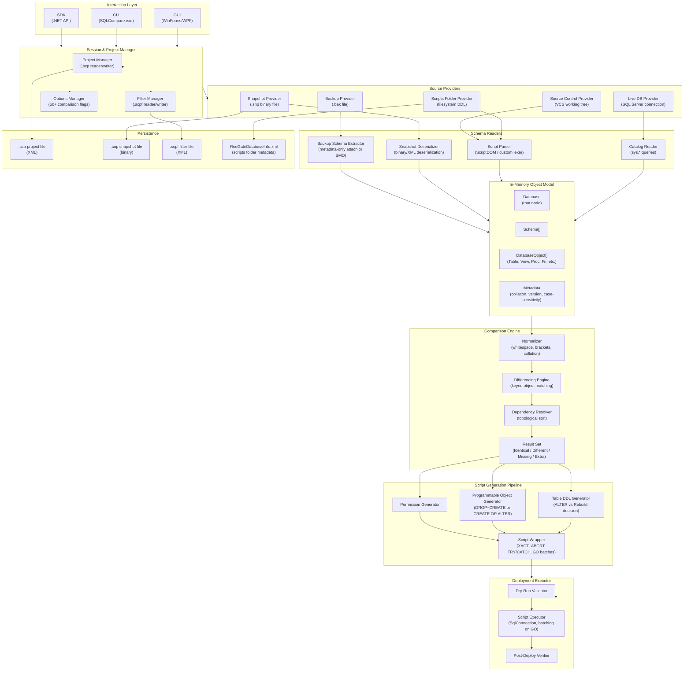
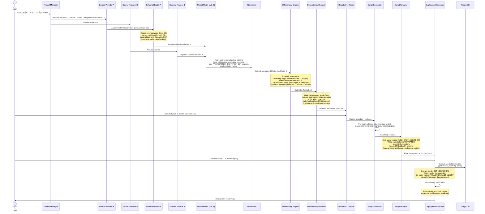
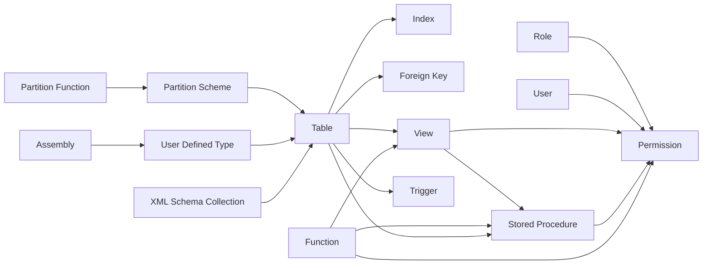

# SQL Compare Clone — Internal Architecture Reference

> **These are research notes about REDGATE SQL Compare, not documentation of
> DbDelta.** They were written before this project had code, by
> reverse-engineering a tool we wanted to match, and they name switches, paths
> and binaries that are Redgate's: `sqlcompare.exe`, `--abort-on-warnings`,
> `RedGate.SQLCompare.Engine.dll`. **Do not build a pipeline from anything
> here.** What DbDelta actually does is at
> <https://gitbakko.github.io/db-delta/>; what is still open is
> `docs/BACKLOG.md`.

> **Purpose**: This document describes the internal architecture of Redgate SQL Compare as reverse-engineered from public documentation, the SQL Comparison SDK, forum disclosures, and first-principles reasoning about how a SQL Server schema-comparison-and-sync tool must be built. Every architectural claim is annotated with its source or the constraint that forces it. This is the primary design reference for building a faithful clone.

---

## Table of Contents

1. [High-Level Architecture](#1-high-level-architecture)
2. [Comparison Pipeline (End-to-End Flow)](#2-comparison-pipeline-end-to-end-flow)
3. [Schema Reader Subsystem](#3-schema-reader-subsystem)
4. [Object Model](#4-object-model)
5. [Dependency Graph and Topological Sort](#5-dependency-graph-and-topological-sort)
6. [Differencing Algorithm](#6-differencing-algorithm)
7. [Script Generation Pipeline](#7-script-generation-pipeline)
8. [Data-Preserving Migrations (Table Rebuild)](#8-data-preserving-migrations-table-rebuild)
9. [Deployment Executor](#9-deployment-executor)
10. [Persistence Formats](#10-persistence-formats)
11. [Extension Points and SDK](#11-extension-points-and-sdk)
12. [Concurrency and Performance](#12-concurrency-and-performance)
13. [Threat Model and Security](#13-threat-model-and-security)
14. [Cross-Cutting Concerns](#14-cross-cutting-concerns)

---

## 1. High-Level Architecture

### 1.1 Component Overview

SQL Compare is a layered .NET desktop application whose engine is also exposed as a redistributable SDK (the SQL Comparison SDK). The product ships three interaction surfaces over one shared engine:

| Surface | Technology | Purpose |
|---|---|---|
| GUI | WinForms (legacy) / WPF overlay | Interactive comparison, object selection, diff viewer, deployment wizard |
| CLI (`SQLCompare.exe`) | Console host | Scriptable comparison, CI/CD integration, automation |
| SDK (`RedGate.SQLCompare.Engine.dll`) | .NET class library | Programmatic access from customer applications |

All three surfaces consume the same comparison engine. This layering is proven by the SDK documentation which states that the SDK gives access to "the functionality of SQL Compare" from any .NET language (https://documentation.red-gate.com/csd11).

The CLI requires Professional Edition or higher and is typically licensed through Flyway Enterprise or SQL Toolbelt. The `.NET Framework 2.0` minimum and `MDAC 2.8` requirements indicate the core engine was written when .NET 2.0 was current and predates the .NET Core split; modern versions have been ported to run on Linux as well, evidenced by the Linux CLI documentation (https://www.red-gate.com/hub/product-learning/sql-compare/comparing-and-deploying-sql-server-databases-using-the-sql-compare-command-line-on-linux-or-windows).

### 1.2 Architecture Diagram



### 1.3 Layer Responsibilities Summary

**Session & Project Manager** — Owns the concept of a "project": which two sources to compare, which options are active, which filters apply, and where output should go. Reads and writes `.scp` files. All three surfaces push their configuration through this layer, ensuring consistent behavior between GUI and CLI.

**Source Providers** — Abstract "where does the schema come from?" Five concrete implementations exist (Live DB, Scripts Folder, Snapshot, Backup, Source Control). The Source Control provider is essentially the Scripts Folder provider pointed at a VCS working-tree path plus a revision identifier.

**Schema Readers** — Provider-specific translation layer that turns raw data (SQL catalog rows, file system DDL text, binary blobs) into the unified in-memory object model. Each reader has deep knowledge of its source format and handles version-specific quirks.

**In-Memory Object Model** — The canonical AST/object graph. All readers must produce this normalized form. This is the central invariant: once in the model, objects are source-agnostic.

**Comparison Engine** — Normalizes two models, matches objects by their comparison key (schema + name by default), and produces a three-state result for each pair.

**Dependency Resolver** — Topo-sorts the diff result so that script sections appear in an order SQL Server can execute without forward-reference errors.

**Script Generation Pipeline** — Turns each diff result into DDL statements, choosing the minimal and safest mutation strategy for each object type.

**Deployment Executor** — Sends the generated script to the target, with optional dry-run validation and post-apply verification.

---

## 2. Comparison Pipeline (End-to-End Flow)



### 2.1 Key Annotations by Step

| Step | Component | Why This Design |
|---|---|---|
| Project load | Project Manager | Separates configuration from execution; enables CLI automation without GUI |
| Schema acquisition | Source Provider + Reader | Strategy pattern: swap the reader without changing downstream logic |
| Normalization before diff | Normalizer | Prevents cosmetic changes (whitespace, bracket style) from producing false positives |
| Key-based matching | Differencing Engine | O(n) lookup instead of O(n²) cross-product comparison |
| Dependency sort after diff | Dependency Resolver | Only sort what will actually be deployed; sorting the full graph is wasteful |
| Script wrapping separate from generation | Script Wrapper | Same raw DDL can be wrapped differently (no-error-handling CLI flag, no-transaction option for memory-optimized objects) |
| Batch splitting on GO | Executor | GO is not T-SQL; it is a client batch terminator. `SqlConnection.ExecuteNonQuery` cannot span a GO; it must be split before sending |

---

## 3. Schema Reader Subsystem

### 3.1 Source Provider Interface Contract

Every source provider must satisfy this contract (expressed as a .NET interface that the clone should implement):

```csharp
public interface ISourceProvider
{
    DatabaseModel Read(ReadOptions options);   // Returns fully-populated model
    bool          SupportsDecryption { get; } // False for snapshots and scripts folders
    bool          IsReadOnly         { get; } // True for snapshots and backups
    SourceKind    Kind               { get; } // LiveDb | ScriptsFolder | Snapshot | Backup | SourceControl
    ServerVersion DetectedVersion    { get; } // SQL Server version discovered at read time
}
```

Redgate confirms: "SQL Compare does not support scripts folders that were not created by SQL Compare or edited by any third-party tool." This is the proprietary format constraint — the scripts folder reader expects files in an exact layout that it controls.

### 3.2 Live Database Reader

**Connection strategy**: Opens a single `SqlConnection` per database. Authentication modes: Windows Integrated, SQL Server login, or Azure Active Directory. The credential is resolved from the project file and/or Windows Credential Manager (v16+).

**Minimum permissions required**: The reader needs `VIEW DEFINITION` on the database and `SELECT` on `sys.sql_expression_dependencies`. Without `VIEW DEFINITION` the engine cannot read stored procedure or view bodies, and without `sys.sql_expression_dependencies` it cannot compute the dependency order. Redgate support confirmed this in the forum thread on dependency order (https://productsupport.red-gate.com/hc/en-us/community/posts/24951925722013).

**System catalog queries** (reconstructed from first principles; SQL Compare does not publish its exact queries but these are the only correct sources):

```sql
-- Object inventory
SELECT o.object_id, o.name, o.type, o.type_desc, s.name AS schema_name,
       o.create_date, o.modify_date
FROM   sys.objects o
JOIN   sys.schemas s ON s.schema_id = o.schema_id
WHERE  o.is_ms_shipped = 0;

-- Table columns
SELECT c.object_id, c.column_id, c.name, t.name AS type_name,
       c.max_length, c.precision, c.scale, c.is_nullable,
       c.is_identity, c.is_computed, c.is_sparse,
       ic.seed_value, ic.increment_value,
       cc.definition AS computed_def,
       c.encryption_type, c.encryption_algorithm_name,
       c.column_encryption_key_id,
       dc.definition AS default_def, dc.name AS default_name
FROM   sys.columns c
JOIN   sys.types   t  ON t.user_type_id = c.user_type_id
LEFT JOIN sys.identity_columns ic ON ic.object_id = c.object_id AND ic.column_id = c.column_id
LEFT JOIN sys.computed_columns cc ON cc.object_id = c.object_id AND cc.column_id = c.column_id
LEFT JOIN sys.default_constraints dc ON dc.parent_object_id = c.object_id AND dc.parent_column_id = c.column_id
WHERE  c.object_id IN (SELECT object_id FROM sys.tables WHERE is_ms_shipped = 0);

-- Indexes
SELECT i.object_id, i.index_id, i.name, i.type_desc, i.is_unique,
       i.is_primary_key, i.is_unique_constraint, i.fill_factor,
       i.filter_definition, i.data_space_id, i.allow_page_locks, i.allow_row_locks,
       i.compression_delay
FROM   sys.indexes i
WHERE  i.object_id IN (SELECT object_id FROM sys.tables WHERE is_ms_shipped = 0)
  AND  i.type > 0;  -- exclude heaps (type 0)

-- Foreign keys
SELECT fk.object_id, fk.name, fk.parent_object_id, fk.referenced_object_id,
       fk.delete_referential_action_desc, fk.update_referential_action_desc,
       fk.is_not_trusted, fk.is_disabled, fk.is_not_for_replication
FROM   sys.foreign_keys fk;

-- Programmable objects (procs, functions, views, triggers)
SELECT o.object_id, m.definition, m.uses_ansi_nulls, m.uses_quoted_identifier,
       m.is_schema_bound, m.execute_as_principal_id
FROM   sys.sql_modules m
JOIN   sys.objects o ON o.object_id = m.object_id
WHERE  o.is_ms_shipped = 0;

-- Dependencies (for topological sort)
SELECT sed.referencing_id, sed.referenced_id,
       sed.referenced_schema_name, sed.referenced_entity_name,
       sed.is_caller_dependent
FROM   sys.sql_expression_dependencies sed
WHERE  sed.referencing_id IN (SELECT object_id FROM sys.objects WHERE is_ms_shipped = 0);
```

**Server version detection**: SQL Compare reads `@@VERSION` or `SERVERPROPERTY('ProductVersion')` on first connection. The major version integer controls which features are available to read and which DDL is valid in generated scripts. SQL Server 2008 introduced `sys.sql_expression_dependencies`; 2016 introduced temporal tables and dynamic data masking; 2019 introduced Always Encrypted with Secure Enclaves. The reader must gate queries by detected version. The `UseCompatibilityLevel` option (`ucl`) is an alternative: use the database's `COMPATIBILITY_LEVEL` rather than the server binary version, important for databases running on 2019 but set to 130 (SQL 2016 compatibility).

**SMO vs direct queries trade-off**: SQL Server Management Objects (SMO) is the official abstraction but it introduces large dependency overhead and some operations (like retrieving encrypted object bodies) require connecting back through a special decryption mechanism. Redgate almost certainly uses **direct catalog queries** rather than SMO for schema reading, because: (a) SMO is slow for large schemas due to excessive round-trips; (b) the SDK ships without SMO dependencies; (c) forum posts confirm SQL Compare uses `sys.sql_expression_dependencies` directly. The clone should do the same.

**WITH ENCRYPTION**: SQL Server 2005 and 2008 allow stored procedures and views to be created `WITH ENCRYPTION`. The encrypted body is stored in `sys.sysobjvalues` but is only accessible via a DAC (Dedicated Admin Connection) or via undocumented DBCC commands. Redgate implements optional decryption using this approach. The `DecryptEncryptedObjects` option controls it. When reading from a scripts folder or snapshot, decryption is unavailable because the original cleartext was captured at snapshot-creation time (https://documentation.red-gate.com/sc10/working-with-other-data-sources/working-with-snapshots).

### 3.3 Scripts Folder Reader

**Directory layout convention** (confirmed by multiple documentation sources):

```
<root>/
├── RedGateDatabaseInfo.xml          ← database-level metadata
├── Tables/
│   ├── dbo.Customers.sql
│   ├── dbo.Orders.sql
│   └── sales.Products.sql           ← schema prefix in filename
├── Views/
│   └── dbo.CustomerSummary.sql
├── Stored Procedures/
│   └── dbo.GetCustomer.sql
├── Functions/
│   ├── Scalar-valued Functions/
│   │   └── dbo.FormatDate.sql
│   └── Table-valued Functions/
│       └── dbo.GetOrderItems.sql
├── Security/
│   ├── Roles/
│   └── Users/
├── Programmability/
│   └── Assemblies/
└── Storage/
    ├── Partition Functions/
    └── Partition Schemes/
```

File naming convention: `<schema>.<objectname>.sql` (e.g., `dbo.Customers.sql`). For objects in the `dbo` schema this double-prefix is retained to avoid ambiguity. Each `.sql` file contains a single CREATE statement (the full DDL for that object).

**RedGateDatabaseInfo.xml** contains at minimum:
- Database collation (critical for case-sensitivity decisions)
- SQL Server version the scripts were generated from
- Object inventory (list of all expected `.sql` files and their types)
- Flag indicating case-sensitivity auto-detection override

The inventory cross-check is why "SQL Compare does not support scripts folders that were not created by SQL Compare or edited by any third-party tool" — if the XML inventory disagrees with the filesystem, behavior is undefined.

**Parsing strategy**: The scripts folder reader must parse T-SQL DDL text to reconstruct the object model. The Microsoft ScriptDOM library (`Microsoft.SqlServer.TransactSql.ScriptDom`, now open source) provides a full T-SQL parser that produces an AST (`TSqlFragment` / `TSqlScript`). The parser is instantiated with the version-specific class (e.g., `TSql150Parser` for SQL Server 2019). The result is walked to extract: column list, data types, constraints, index definitions, computed column expressions, etc. This is the "reification" step — turning flat DDL text into structured in-memory objects.

**Gotcha: multi-statement files**: If a user hand-edits a file and adds a second statement, the reader must handle the parse error or multi-statement gracefully. The `ThrowOnFileParseFailed` / `IgnoreParserErrors` options control whether parsing failures abort the comparison or are silently skipped.

### 3.4 Snapshot Reader

**File format**: Binary (proprietary), not human-readable XML. Version 3–7 snapshots are compatible with later SQL Compare versions with a caveat about WITH ENCRYPTION objects. The binary format almost certainly uses .NET's `BinaryFormatter` or a custom serialization of the in-memory object model — it is "basically an opaque proprietary BLOB" (forum disclosure). Modern versions may have migrated to JSON or compressed XML internally, but the `.snp` extension is still binary from the outside.

**Snapshot creation**: Snapshots can be created from: live databases, backups, scripts folders, and other snapshots. This means the snapshot writer serializes the in-memory object model (post-read, pre-diff) to disk. Creating from a backup means the backup reader runs first, then the resulting model is serialized.

**Schema versioning**: The binary format must include a format version header so that newer SQL Compare versions can read snapshots created by older versions. This is a standard forward/backward compatibility concern.

**Clone recommendation**: Implement snapshots as compressed JSON (`.snp` still, for naming convention, but using `System.Text.Json` + `GZipStream`). Include a format version field in the header, a schema hash for integrity checking, and the full object model as JSON. This avoids the `BinaryFormatter` security issues (.NET 5+ deprecates it).

### 3.5 Backup Reader

**Challenge**: A SQL Server `.bak` file is a proprietary binary format. SQL Compare supports comparing schemas from backup files without a live SQL Server. This implies one of two mechanisms:

1. **Temporary restore to a local SQL Server instance**: Use `RESTORE DATABASE ... WITH NORECOVERY` to a LocalDB or SQL Express instance, read the schema, then drop the temporary database. Redgate's CLI has a `/TempInstance` switch explicitly for this purpose: "Connection string to SQL Server instance for migration script generation", confirming this approach.

2. **Backup header parsing**: SQL Server supports `RESTORE HEADERONLY` and `RESTORE FILELISTONLY` which are metadata-only operations that do not require a full restore. However, these only return file-level metadata, not schema.

The practical conclusion: SQL Compare restores the backup to a SQL Server instance (configured by the user or defaulted to a local instance) to read the schema, then reads the catalog exactly as with a live database. The restore is schema-only or a full restore; after reading, the temporary database is dropped.

**Clone recommendation**: Use a local SQL Server Express or Docker SQL Server for backup schema extraction. Implement `RESTORE DATABASE [temp_guid] FROM DISK = @path WITH MOVE ... RECOVERY` then run the Live DB reader against `temp_guid`, then `DROP DATABASE [temp_guid]`.

### 3.6 Source Control Provider

This is the Scripts Folder provider with two additions:
1. A revision specifier (`/Revision1`, `/Revision2`) that checks out a specific commit/branch/tag before reading
2. Migration script folder support (`/MigrationsFolder`) for ordered migration files alongside the model scripts

The VCS operations (git checkout, SVN update) are executed via the VCS command line, not via native bindings. The result is a scripts folder on the filesystem, which then follows the exact Scripts Folder Reader path.

---

## 4. Object Model

### 4.1 Class Diagram

```mermaid
classDiagram
    class DatabaseModel {
        +string Name
        +CollationInfo Collation
        +ServerVersion Version
        +bool CaseSensitive
        +Dictionary~string,SchemaModel~ Schemas
        +List~DatabaseObject~ AllObjects
        +DatabaseObject FindByKey(ObjectKey key)
    }

    class SchemaModel {
        +string Name
        +string Authorization
        +List~DatabaseObject~ Objects
    }

    class DatabaseObject {
        <<abstract>>
        +ObjectKey Key
        +string Name
        +string Schema
        +ObjectType Type
        +string OriginalDdl
        +string NormalizedDdl
        +bool IsSystemNamed
    }

    class Table {
        +List~Column~ Columns
        +List~Index~ Indexes
        +List~ForeignKey~ ForeignKeys
        +List~CheckConstraint~ CheckConstraints
        +List~DefaultConstraint~ DefaultConstraints
        +PrimaryKey PrimaryKey
        +List~Trigger~ Triggers
        +DataspaceInfo Filegroup
        +PartitionInfo Partition
        +bool IsTemporalHistory
        +Table TemporalHistoryTable
        +bool IsMemoryOptimized
        +bool IsExternal
    }

    class Column {
        +int OrdinalPosition
        +string Name
        +DataType DataType
        +bool IsNullable
        +bool IsIdentity
        +IdentitySpec Identity
        +bool IsComputed
        +string ComputedExpression
        +bool IsPersisted
        +bool IsSparse
        +string DefaultExpression
        +string DefaultConstraintName
        +bool HasAlwaysEncrypted
        +AlwaysEncryptedSpec Encryption
        +string MaskFunction
        +bool IsRowVersion
        +GeneratedAlwaysSpec GeneratedAlways
    }

    class Index {
        +string Name
        +IndexType Type
        +bool IsPrimary
        +bool IsUnique
        +bool IsClustered
        +bool IsFiltered
        +string FilterExpression
        +List~IndexColumn~ Columns
        +List~IndexColumn~ IncludedColumns
        +int FillFactor
        +bool AllowPageLocks
        +bool AllowRowLocks
        +DataCompression Compression
        +bool IsOnline
    }

    class ForeignKey {
        +string Name
        +ObjectKey ReferencedTable
        +List~string~ ParentColumns
        +List~string~ ReferencedColumns
        +ReferentialAction OnDelete
        +ReferentialAction OnUpdate
        +bool IsNotTrusted
        +bool IsDisabled
        +bool NotForReplication
    }

    class ProgrammableObject {
        <<abstract>>
        +string Body
        +string NormalizedBody
        +bool UsesAnsiNulls
        +bool UsesQuotedIdentifier
        +bool IsEncrypted
        +bool IsSchemaBound
    }

    class StoredProcedure {
        +List~ProcParameter~ Parameters
        +ExecuteAs ExecuteAs
        +bool IsNativelyCompiled
    }

    class ScalarFunction {
        +List~ProcParameter~ Parameters
        +DataType ReturnType
    }

    class TableFunction {
        +List~ProcParameter~ Parameters
        +List~Column~ ReturnColumns
    }

    class View {
        +bool IsIndexed
        +bool IsSchemaBound
    }

    class Trigger {
        +TriggerType Type
        +List~TriggerEvent~ Events
        +bool IsInsteadOf
        +bool IsDisabled
        +bool NotForReplication
    }

    class UserDefinedType {
        +TypeKind Kind
        +DataType BaseType
        +bool IsNullable
        +List~Column~ TableTypeColumns
        +List~Index~ TableTypeIndexes
    }

    class Sequence {
        +DataType DataType
        +object StartValue
        +object Increment
        +object MinValue
        +object MaxValue
        +bool IsCycling
        +object Cache
    }

    class Synonym {
        +string BaseObjectServer
        +string BaseObjectDatabase
        +string BaseObjectSchema
        +string BaseObjectName
    }

    class Permission {
        +PermissionType PermType
        +string GranteeName
        +ObjectKey OnObject
        +bool WithGrantOption
    }

    class Assembly {
        +string ClrName
        +PermissionSet PermissionSet
        +byte[] Content
    }

    class PartitionFunction {
        +DataType InputType
        +RangeType RangeType
        +List~object~ BoundaryValues
    }

    class PartitionScheme {
        +string FunctionName
        +List~string~ Filegroups
        +string NextUsedFilegroup
    }

    class XmlSchemaCollection {
        +string SchemaXml
    }

    class ObjectKey {
        +string Schema
        +string Name
        +ObjectType Type
        +bool Equals(ObjectKey other)
        +string ToString()
    }

    DatabaseModel "1" --> "*" SchemaModel
    DatabaseModel "1" --> "*" DatabaseObject : AllObjects
    SchemaModel "1" --> "*" DatabaseObject
    DatabaseObject <|-- Table
    DatabaseObject <|-- ProgrammableObject
    DatabaseObject <|-- UserDefinedType
    DatabaseObject <|-- Sequence
    DatabaseObject <|-- Synonym
    DatabaseObject <|-- Assembly
    DatabaseObject <|-- PartitionFunction
    DatabaseObject <|-- PartitionScheme
    DatabaseObject <|-- XmlSchemaCollection
    ProgrammableObject <|-- StoredProcedure
    ProgrammableObject <|-- ScalarFunction
    ProgrammableObject <|-- TableFunction
    ProgrammableObject <|-- View
    ProgrammableObject <|-- Trigger
    Table "1" --> "*" Column
    Table "1" --> "*" Index
    Table "1" --> "*" ForeignKey
    Table "1" --> "0..1" PrimaryKey
    DatabaseObject --> ObjectKey
```



### 4.2 Complete Object Type Inventory

SQL Compare 16 supports the following object types (https://documentation.red-gate.com/sc/setting-up-the-comparison/which-objects-can-be-compared):

| Type | CLI Token | Notes |
|---|---|---|
| Table | `Table` | Includes indexes, constraints, filegroups |
| View | `View` | |
| Stored Procedure | `StoredProcedure` | |
| Function | `Function` | Scalar, Table-valued, Multi-statement TVF |
| Trigger (DML) | *(part of Table)* | |
| DDL Trigger | `DdlTrigger` | Database/Server scope |
| User | `User` | |
| Role | `Role` | |
| Schema | `Schema` | |
| Assembly | `Assembly` | CLR |
| User Defined Type | `UserDefinedType` | Alias types and table types |
| XML Schema Collection | `XmlSchemaCollection` | |
| Synonym | `Synonym` | |
| Sequence | `Sequence` | SQL Server 2012+ |
| Partition Function | `PartitionFunction` | |
| Partition Scheme | `PartitionScheme` | |
| Full Text Catalog | `FullTextCatalog` | |
| Full Text Stoplist | `FullTextStoplist` | |
| Rule | `Rule` | Legacy; sp_bindrule |
| Default | *(as column constraint)* | |
| Extended Property | `ExtendedProperty` | |
| Certificate | `Certificate` | Comparison only; cannot deploy |
| Asymmetric Key | `AsymmetricKey` | |
| Symmetric Key | `SymmetricKey` | |
| Service Broker: Contract | `Contract` | |
| Service Broker: Message Type | `MessageType` | |
| Service Broker: Queue | `Queue` | |
| Service Broker: Route | `Route` | |
| Service Broker: Service | `Service` | |
| Service Broker: Service Binding | `ServiceBinding` | |
| Event Notification | `EventNotification` | |
| Search Property List | `SearchPropertyList` | |
| Security Policy | `SecurityPolicy` | Row-Level Security |
| External Data Source | `ExternalDataSource` | PolyBase |
| External File Format | `ExternalFileFormat` | PolyBase |
| External Table | *(variant of Table)* | PolyBase |

### 4.3 Model Invariants

1. **Every object has a unique ObjectKey** (`schema` + `name` + `type`). The type is included because SQL Server allows a view and a table with the same name in the same schema (though unusual in practice).

2. **Programmable object bodies are stored twice**: as `OriginalDdl` (verbatim) and `NormalizedDdl` (after whitespace/comment stripping per active options). Comparison uses `NormalizedDdl`; script generation uses `OriginalDdl` (to preserve formatting).

3. **Table columns are ordered by `OrdinalPosition`**. The column order is load-bearing for the `ForceColumnOrder` option and for INSERT...SELECT during table rebuilds.

4. **ForeignKey objects reference the target table by ObjectKey, not by pointer**. This is important: during a comparison, the referenced table may not exist in both models, and the FK resolver must cope gracefully.

5. **The model is source-agnostic after read**. No provider-specific metadata survives into the model. This is enforced to keep the diff engine simple.

---

## 5. Dependency Graph and Topological Sort

### 5.1 Why Dependency Order Matters

SQL Server validates object references at DDL time for some object types (functions, views when schema-bound) and at runtime for others (stored procedures). However, `CREATE TABLE` with a foreign key to a non-existent table fails immediately. Dropping a table that a foreign key references also fails. The script generator must therefore emit DDL in an order where:

- CREATE operations: referenced objects appear before referencing objects
- DROP operations: referencing objects appear before referenced objects
- ALTER TABLE ADD FOREIGN KEY: after both tables exist in their final form

### 5.2 Dependency Graph Construction

The dependency graph is a directed graph `G = (V, E)` where:
- V = all selected database objects (Tables, Views, Procs, Functions, Types, etc.)
- E = directed edge from A to B means "A depends on B" (B must exist before A is created, or A must be dropped before B is dropped)

Edges come from three sources:

1. **sys.sql_expression_dependencies** (SQL Server catalog): covers soft dependencies for programmable objects (views referencing tables, functions calling other functions, procedures using types).

2. **sys.foreign_keys**: hard dependencies between tables. FK parent table depends on referenced table.

3. **Column type references**: if a column uses a User Defined Type or CLR type, the table depends on that type.

4. **Assembly dependencies**: CLR functions depend on their Assembly; the Assembly must be created first.

5. **Partition scheme → partition function**: a partition scheme references its partition function by name.

### 5.3 Topological Sort Algorithm

SQL Compare uses Kahn's algorithm (BFS-based topological sort) rather than DFS-based because cycles are easier to detect and report:

```
1. Compute in-degree for each node in the CREATE-order dependency graph
2. Add all nodes with in-degree = 0 to queue Q
3. While Q is not empty:
   a. Dequeue node N
   b. Append N to sorted output
   c. For each dependent D of N (edges N → D, meaning D references N):
      - Decrement in-degree of D
      - If in-degree of D = 0, enqueue D
4. If sorted output length < |V|, a cycle exists
```

Redgate's own support team confirms: "The internal way that SQL Compare works out dependencies is not something I'm aware of in any detail (it's pretty complex!)" and that "generally gets things in the correct order" (https://productsupport.red-gate.com/hc/en-us/community/posts/24951925722013). The "generally" qualifier is important — edge cases exist.

### 5.4 Standard Object Creation Order

When generating a full CREATE script (e.g., `/empty2` mode, source → empty target), the canonical order is:

```
1.  Schemas
2.  Assemblies (CLR)
3.  Partition Functions
4.  Partition Schemes
5.  XML Schema Collections
6.  User Defined Types (alias types first, then table types)
7.  Tables (body only: columns, computed cols, identity — no FK, no unique constraint FK refs)
8.  Clustered Indexes + Primary Keys (must exist before non-clustered can reference them in some scenarios)
9.  Non-Clustered Indexes
10. Full Text Catalogs
11. Full Text Stoplists
12. Default Constraints (not inline)
13. Check Constraints
14. Unique Constraints
15. Foreign Keys (last, because both parent and referenced tables must exist)
16. Triggers (after tables)
17. Views (after tables; schema-bound views may need tables before them)
18. Functions (may depend on each other; topo-sorted among themselves)
19. Stored Procedures (may depend on functions, views, tables)
20. DDL Triggers
21. Roles
22. Users
23. Permissions / Grants
24. Extended Properties
25. Service Broker objects (Contract, MessageType, Queue, Service, etc.)
26. Synonyms
27. Sequences
28. Statistics
29. Search Property Lists
30. Security Policies (Row-Level Security; reference filter functions)
```



### 5.5 Drop Order

Drop order is the reverse of creation order. Critically:
- Foreign Keys must be dropped before their parent or referenced table
- Indexes on a table must be dropped before the table (though `DROP TABLE` implicitly drops them; this matters when DROP is only partial, e.g., dropping just an index)
- Schema-bound views must be dropped before their referenced tables

### 5.6 Cycle Detection and Breaking

Cycles can occur in practice:
- **Mutual FK references**: Table A has a FK to Table B, and Table B has a FK to Table A (e.g., `Employees.ManagerId` → `Employees` is self-referencing, manageable; but cross-table mutual FK is rare and ill-advised).
- **Cross-schema module cycles**: A view in schema A references a function in schema B that references a view in schema A.

**Breaking strategy**: When a cycle is detected, the resolver:
1. Identifies the weakest edge in the cycle (preferably a FK or a soft dependency, not a type dependency)
2. Removes that edge from the sort
3. Completes the sort
4. Emits the FK or soft-dependency as a deferred statement after both objects exist

For FK cycles, the standard technique is to create tables without the FK, create all tables, then add FKs with `ALTER TABLE ADD CONSTRAINT`.

---

## 6. Differencing Algorithm

### 6.1 Comparison Key

Each object in both databases is indexed by its **comparison key**: the tuple `(schema_name, object_name, object_type)`. By default, comparison is case-insensitive (matching the target database's collation). The `UseCaseSensitiveObjectDefinition` option forces case-sensitive key matching.

The `IgnoreSquareBrackets` option (`isb`) controls whether `[dbo].[MyTable]` and `dbo.MyTable` are treated as the same key. It should always be enabled by default because SQL Server treats them identically.

**Auto-column mapping** (`AutoMapSimilarColumns`, enabled by default): when two columns have different names but compatible types and similar name similarity (Levenshtein distance or substring match), SQL Compare may map them as the same column rather than treating one as deleted and one as added. This is important during table rebuilds — an incorrectly mapped column means the wrong data fills the wrong column in the INSERT...SELECT.

### 6.2 Three-State Output

For each object key that appears in at least one model, the diff produces one of:

| State | Meaning | Default deploy action |
|---|---|---|
| `Identical` | Object exists in both, normalized DDL is equal | Skip (unless `include:Identical` forced) |
| `Different` | Object exists in both, normalized DDL differs | Deploy change |
| `OnlyInSource` / `Missing` | Object exists in source only | CREATE in target |
| `OnlyInTarget` / `Extra` | Object exists in target only | DROP from target |

The CLI `/include` and `/exclude` switches control which states are acted upon.

### 6.3 Normalization Before Diff

The normalizer transforms the DDL bodies of programmable objects (views, procedures, functions, triggers) before comparison. Normalization steps applied per active options:

1. **Whitespace normalization** (`IgnoreWhiteSpace`, on by default): Collapse all runs of whitespace (space, tab, newline, carriage return) to a single space. Trim leading/trailing whitespace.

2. **Comment stripping** (`IgnoreComments`, off by default): Remove single-line (`--`) and block (`/* */`) comments from module bodies before token comparison.

3. **Bracket normalization** (`IgnoreSquareBrackets`, off by default): Strip or canonicalize `[` and `]` around identifiers.

4. **ANSI/QUOTED_IDENTIFIER stripping** (`IgnoreQuotedIdentifiersAndAnsiNullSettings`, off by default): Remove `SET QUOTED_IDENTIFIER ON/OFF` and `SET ANSI_NULLS ON/OFF` from module bodies before comparison, because these are client-session settings that get embedded by SSMS but differ across connection sources.

5. **Collation-aware comparison** (`IgnoreCollations`, on by default): When comparing column definitions, ignore the `COLLATE` clause. Column-level collation differences are not reported unless this option is turned off.

6. **WITH element order** (`IgnoreWithElementOrder`, on by default): The clauses in `WITH (PAD_INDEX = ON, FILLFACTOR = 80)` can appear in any order without semantic difference. Normalize to alphabetical order before comparison.

7. **Synonym server/database normalization** (`IgnoreDatabaseAndServerNameInSynonyms`, on by default): In synonyms like `[production_server].[MyDb].[dbo].[Orders]`, ignore the server and database qualifiers. Two synonyms pointing to the same object in different environments will compare as equal.

### 6.4 Object-Kind Specific Equality

**Tables**: Equality is checked at the column level (column names, types, nullability, identity spec, computed expressions, defaults), then at the index level, then at the constraint level. Column order matters only if `ForceColumnOrder` is active. Two tables with identical columns in different order are `Identical` by default (because reordering columns in SQL Server is impossible without a full rebuild, so SQL Compare avoids flagging cosmetic ordering differences).

**Programmable objects** (Views, Procs, Functions, Triggers): After normalization, comparison is a full-text token comparison of the module body. No semantic analysis is performed — if two procedures are semantically equivalent but textually different (e.g., one uses `1=1` and the other `'A'='A'` in a WHERE), they will be flagged as `Different`.

**Indexes**: Compared field-by-field: column list (with ASC/DESC), include columns, uniqueness, filter expression, fill factor (if `IgnoreFillFactor` is off), filegroup (if `IgnoreFileGroupsPartitionSchemesAndPartitionFunctions` is off).

**Permissions**: Compared by grantee, object, permission type, and GRANT OPTION flag. The `IgnorePermissions` option skips all permission comparison.

**Extended Properties**: Compared by name and value. The `IgnoreExtendedProperties` option skips all.

---

## 7. Script Generation Pipeline

### 7.1 High-Level Decision Tree per Object Diff

For each object in the dependency-sorted diff result set, the script generator applies this logic:

```
IF state == Identical:
    skip (unless include:Identical is forced)

IF state == OnlyInSource (Missing in target):
    emit CREATE <object>

IF state == OnlyInTarget (Extra in target):
    emit DROP <object>

IF state == Different:
    SWITCH ObjectType:
        CASE Table:
            IF changes require rebuild (see §8):
                emit TABLE REBUILD sequence
            ELSE:
                emit ALTER TABLE statements

        CASE View | StoredProcedure | Function | Trigger:
            IF option CreateOrAlterForReRunnableScripts (coa):
                emit CREATE OR ALTER <object>
            ELSE IF option DropAndCreateForReRunnableScripts (dac):
                emit DROP <object> IF EXISTS
                emit CREATE <object>
            ELSE:
                emit ALTER <object>    -- default

        CASE Index:
            emit DROP INDEX IF EXISTS
            emit CREATE INDEX (re-create is always the right move for indexes)

        CASE ForeignKey | CheckConstraint:
            emit ALTER TABLE DROP CONSTRAINT
            emit ALTER TABLE ADD CONSTRAINT

        CASE Permission:
            emit REVOKE (existing) then GRANT (new)

        CASE Sequence | Synonym | UserDefinedType:
            emit DROP ... CREATE ... (most have no ALTER equivalent)

        CASE Assembly:
            IF option DontAlterAssembly:
                rebuild all dependent tables (CLR columns) twice
            ELSE:
                emit ALTER ASSEMBLY ... FROM ...
```

### 7.2 Table DDL: ALTER vs. Rebuild Decision

The generator must choose between `ALTER TABLE ... ALTER COLUMN` and a full table rebuild. A rebuild is forced when any of the following is true (https://documentation.red-gate.com/sc/troubleshooting/common-issues/when-does-the-deployment-process-rebuild-tables):

| Trigger | Reason ALTER Is Impossible |
|---|---|
| Adding a column in the middle when `ForceColumnOrder` is active | SQL Server only supports adding columns at the end of the physical layout |
| Changing or dropping IDENTITY property | `ALTER TABLE` cannot add or remove IDENTITY; it requires recreating the column |
| Changing IDENTITY seed or increment | Same restriction |
| Modifying a PERSISTED computed column (add/alter/drop) | SQL Server requires a rebuild to recompute persisted values |
| Data type change where implicit cast is impossible (e.g., `DECIMAL` → `NVARCHAR`) | SQL Server rejects the cast during ALTER |
| Changing the table's filegroup | Physical relocation requires rebuild |
| Changing the partition column | Partitioning boundary changes require rebuild |
| Adding a non-nullable column with no default | Cannot ADD a required column to a non-empty table without a default (in strict mode; a NULL sentinel can be used as a workaround) |
| Removing a columnstore index while columns still exist in it (Azure SQL edge cases) | Azure SQL has additional restrictions |
| CLR column type change when `DontAlterAssembly` is active | Forces double-rebuild through string conversion |

When a rebuild is **not** required, the generator emits inline `ALTER TABLE` statements:
- `ALTER TABLE ... ADD <column>` — new nullable columns or columns with defaults
- `ALTER TABLE ... ALTER COLUMN <name> <type> [NULL|NOT NULL]` — compatible type changes, nullability changes
- `ALTER TABLE ... DROP COLUMN <name>` — column removal
- `ALTER TABLE ... ADD CONSTRAINT` / `DROP CONSTRAINT` — constraint changes

### 7.3 Programmable Objects: ALTER vs. DROP+CREATE vs. CREATE OR ALTER

SQL Server supports `ALTER PROCEDURE`, `ALTER VIEW`, `ALTER FUNCTION`, `ALTER TRIGGER`. These are semantically identical to `DROP + CREATE` for the body but preserve existing permissions. The tradeoff:

| Approach | Preserves permissions? | Re-runnable? | Supported option |
|---|---|---|---|
| `ALTER` (default) | Yes | If target exists | Default |
| `DROP + CREATE` | No (permissions lost) | Only if idempotent | `dac` flag |
| `CREATE OR ALTER` | Yes | Yes | `coa` flag (SQL 2016+) |

For a clone targeting CI/CD pipelines, `CREATE OR ALTER` is the safest default for SQL 2016+ targets. Emit `DROP IF EXISTS + CREATE` for older targets.

### 7.4 Special Cases in Script Generation

**Always Encrypted columns**: When a column has Always Encrypted metadata (`ENCRYPTED WITH (COLUMN_ENCRYPTION_KEY = ..., ENCRYPTION_TYPE = ..., ALGORITHM = ...)`), the DDL must include the full encryption specification. Cannot use `ALTER TABLE ALTER COLUMN` to add or change encryption — Always Encrypted column changes require a full roundtrip through a client application with the CMK. SQL Compare flags these as warnings in the deployment summary and may refuse to deploy. The clone should emit a warning and skip automatic deployment of Always Encrypted column changes, instead requiring a manual migration.

**Sparse columns**: Sparse columns can be added with `ALTER TABLE ADD ... SPARSE NULL` but cannot be converted to non-sparse with `ALTER COLUMN` (requires rebuild). Track `IsSparse` in the Column model; trigger a rebuild if the `IsSparse` flag changes.

**Temporal tables (System-Versioned)**: A temporal table has a linked history table. To alter a temporal table the system versioning must first be disabled: `ALTER TABLE ... SET (SYSTEM_VERSIONING = OFF)`, make changes, then re-enable: `ALTER TABLE ... SET (SYSTEM_VERSIONING = ON WITH (HISTORY_TABLE = ...))`. The history table itself cannot be altered independently while system versioning is active.

**Computed columns**: Cannot use `ALTER TABLE ALTER COLUMN` on a computed column. Must `DROP COLUMN` and `ADD COLUMN` — but if the computed column is `PERSISTED`, dropping and re-adding also forces a rebuild of the table (see §8).

**Memory-optimized tables** (OLTP): Cannot use standard `ALTER TABLE` DDL. Memory-optimized tables must be dropped and recreated with their data migrated explicitly. Also: `NoTransactions` option is required — memory-optimized objects cannot be created inside a user transaction. The script wrapper must be aware of this.

**Columnstore indexes**: Clustered columnstore indexes are incompatible with most other index types. Dropping and recreating a columnstore is the only option if it changes; there is no ALTER. Filtered columnstore is not supported.

**Replication triggers**: SQL Server creates replication triggers automatically when a table is published. SQL Compare ignores these by default (`IgnoreReplicationTriggers`, on by default).

---

## 8. Data-Preserving Migrations (Table Rebuild)

When a table requires a rebuild (§7.2 triggers), SQL Compare performs the following sequence. This is reconstructed from the documented behavior ("creating a new table, copying all of the data to the new table, and dropping the old table") plus the forum disclosure about the rename strategy:

```sql
-- Step 1: Disable FKs that reference the table being rebuilt
-- (FK references TO this table from OTHER tables must be dropped first to allow rename)
ALTER TABLE [other_schema].[ReferencingTable]
    DROP CONSTRAINT [FK_ReferencingTable_TargetTable];

-- Step 2: Rename the original table to a temporary holding name
-- SQL Compare uses sp_rename because you cannot DROP TABLE with data loss risk
EXEC sp_rename '[schema].[OriginalTable]', 'OriginalTable_SQLCompare_OLD';

-- Step 3: Create the new table with updated structure
CREATE TABLE [schema].[OriginalTable] (
    -- New column definitions, new types, new constraints
    -- Columns WITHOUT the problematic FK constraints initially
);

-- Step 4: Copy data from old table to new table
-- Column mapping uses auto-column-mapping rules
-- IDENTITY_INSERT required if identity column exists and data must be preserved
SET IDENTITY_INSERT [schema].[OriginalTable] ON;

INSERT INTO [schema].[OriginalTable]
    (col1, col2, col3, ...)  -- only columns that exist in both (mapped)
SELECT
    col1, col2, col3, ...    -- from old table; type casts applied if needed
FROM [schema].[OriginalTable_SQLCompare_OLD];

SET IDENTITY_INSERT [schema].[OriginalTable] OFF;

-- Step 5: Recreate indexes on new table
CREATE CLUSTERED INDEX [IX_...] ON [schema].[OriginalTable](...);
CREATE NONCLUSTERED INDEX [IX_...] ON [schema].[OriginalTable](...);

-- Step 6: Recreate primary key
ALTER TABLE [schema].[OriginalTable]
    ADD CONSTRAINT [PK_...] PRIMARY KEY CLUSTERED (...);

-- Step 7: Recreate triggers on new table
CREATE TRIGGER [...] ON [schema].[OriginalTable] ...;

-- Step 8: Recreate FKs from this table to other tables
ALTER TABLE [schema].[OriginalTable]
    ADD CONSTRAINT [FK_...] FOREIGN KEY (...) REFERENCES [...](...)
    ON DELETE NO ACTION ON UPDATE NO ACTION;

-- Step 9: Recreate FKs from other tables TO this table
ALTER TABLE [other_schema].[ReferencingTable]
    ADD CONSTRAINT [FK_ReferencingTable_TargetTable]
    FOREIGN KEY (...) REFERENCES [schema].[OriginalTable](...);

-- Step 10: Drop the old table
DROP TABLE [schema].[OriginalTable_SQLCompare_OLD];
```

### 8.1 Special Cases in Table Rebuild

**Identity preservation**: If the new table still has an IDENTITY column, `SET IDENTITY_INSERT ON` must wrap the INSERT...SELECT. After the INSERT, the identity seed should be reseeded to match the highest value in the copied data: `DBCC CHECKIDENT ('[schema].[OriginalTable]', RESEED)`.

**Computed column preservation**: Computed columns cannot appear in the INSERT...SELECT target column list. They are defined in the CREATE TABLE and are automatically recomputed. The INSERT must exclude computed columns from both the target list and the SELECT list.

**DEFAULT constraints**: If a column has a named DEFAULT constraint that is being preserved, it must be created as part of the new table DDL (or as a post-CREATE `ALTER TABLE ADD CONSTRAINT DEFAULT`). Anonymous defaults (system-named) are fine to recreate as new.

**NULL → NOT NULL column changes**: If a column changes from `NULL` to `NOT NULL` without a default, the INSERT...SELECT will fail if any NULL values exist. SQL Compare should emit a warning and the user must provide a default value or pre-update strategy.

**Trigger preservation**: DML triggers on the original table are scripted and recreated on the new table after the data copy. Triggers that fire DURING INSERT must not cause double-execution of business logic — the `DISABLE TRIGGER` / `ENABLE TRIGGER` pattern should wrap the data copy.

**Multi-table cascades**: When Table A is rebuilt and Table B has a FK referencing Table A, and Table B itself also needs rebuild, the dependency resolver must serialize the rebuilds: rebuild Table A first (since it is referenced), then rebuild Table B. This is handled by the topological sort treating the rebuild operations as atomic blocks.

---

## 9. Deployment Executor

### 9.1 Script Structure Produced by the Wrapper

The deployment script produced by SQL Compare follows a strict template. The following is reconstructed from the SQL Change Automation anatomy document (which uses the same SQL Compare engine) and the CLI option documentation:

```sql
/*
    SQL Compare deployment script
    Source: [source identifier]
    Target: [target identifier]
    Generated: [timestamp]
    Options: [active option list]
*/

-- SqlCmd header (if SqlCmd mode is active)
:on error exit
GO

-- Session settings
SET NUMERIC_ROUNDABORT OFF
GO
SET ANSI_PADDING, ANSI_WARNINGS, CONCAT_NULL_YIELDS_NULL, ARITHABORT,
    QUOTED_IDENTIFIER, ANSI_NULLS ON
GO

-- Abort-on-error guard
IF @@ERROR <> 0 SET NOEXEC ON
GO

-- Transaction start
BEGIN TRANSACTION
GO

-- XACT_ABORT ensures automatic rollback on any runtime error
SET XACT_ABORT ON
GO

-- ==== SECTION: Drop objects that only exist in target ====
PRINT N'Dropping [dbo].[ObsoleteView]'
GO
IF OBJECT_ID('[dbo].[ObsoleteView]', 'V') IS NOT NULL
    DROP VIEW [dbo].[ObsoleteView]
GO

-- ==== SECTION: Alter objects ====
PRINT N'Altering [dbo].[CustomerOrders]'
GO
ALTER VIEW [dbo].[CustomerOrders] ...
GO

-- ==== SECTION: Create objects that only exist in source ====
PRINT N'Creating [dbo].[NewTable]'
GO
CREATE TABLE [dbo].[NewTable] (
    [Id] INT IDENTITY(1,1) NOT NULL,
    CONSTRAINT [PK_NewTable] PRIMARY KEY CLUSTERED ([Id])
)
GO

-- ==== SECTION: Permissions ====
GRANT SELECT ON [dbo].[NewTable] TO [read_role]
GO

-- ==== SECTION: Commit or rollback ====
IF @@ERROR <> 0
BEGIN
    ROLLBACK TRANSACTION
    RAISERROR('Deployment failed.', 16, 1)
END
ELSE
BEGIN
    COMMIT TRANSACTION
    PRINT N'Deployment complete.'
END
GO
```

Key structural properties:
- **`SET XACT_ABORT ON`**: Any runtime error automatically rolls back the open transaction and terminates execution. This is the primary error safety net.
- **`IF @@ERROR <> 0 SET NOEXEC ON`**: After each non-transactional block (DDL that cannot run in a transaction, such as some full-text operations), the NOEXEC guard ensures subsequent batches are skipped.
- **`PRINT N'...'` before each operation**: Provides progress visibility in the deployment log.
- **`IF OBJECT_ID(...) IS NOT NULL`**: Existence checks when `ObjectExistenceChecks` (`oec`) option is active.
- **GO delimiters**: Each logical unit is a separate batch. The executor splits the script on `GO` and sends each batch independently via `SqlCommand.ExecuteNonQuery`.
- **No explicit TRY/CATCH in the main path**: XACT_ABORT + implicit rollback handles this. TRY/CATCH is only needed when the deployer wants to log errors separately before rolling back.

### 9.2 Dry-Run Mode

Dry-run is implemented by prepending `SET NOEXEC ON` at the top of the script. SQL Server parses each batch but does not execute it. Syntax errors are caught; semantic errors (wrong type, missing object) are NOT caught because SQL Server does not validate references during NOEXEC. For more thorough validation, SQL Compare can deploy to a temporary scratch database (`/TempInstance` switch) and then check the result.

### 9.3 Connection Management

- A single `SqlConnection` is used per deployment.
- The connection string respects the `Encrypt=True` / `TrustServerCertificate` settings that were made mandatory defaults in newer Redgate versions (https://documentation.red-gate.com/sc/getting-more-from-sql-compare/forcing-sql-compare-and-sql-data-compare-to-use-an-encrypted-connection).
- Connection timeout should be set high (300s+) for large deployments.
- Each GO-delimited batch is sent as a separate command to the same connection. The connection is not closed between batches.
- For Azure SQL, connection pooling must account for the deployment duration within pool timeout limits.

### 9.4 AbortOnWarnings

The `/AbortOnWarnings` CLI switch causes the executor to refuse to proceed if the pre-deployment analysis produces warnings of severity "serious". Serious warnings include: no rollback possible (e.g., DROP TABLE with data), object rebuild required (data copy might lose data if column mapping is wrong), certificate deployment (comparison only, cannot deploy).

### 9.5 Post-Deploy Verification

After deployment, SQL Compare optionally re-reads both source and target schemas and performs another comparison, asserting zero differences. The `/Assertidentical` switch returns exit code 0 for identical, 79 for differences. This is used in CI/CD pipelines to confirm the deployment fully succeeded.

---

## 10. Persistence Formats

### 10.1 Project File (.scp)

**Format**: XML. The project file format was publicly described as "just XML" (Redgate forum). Contains all configuration information needed to reproduce a comparison session.

**Reconstructed XML structure**:

```xml
<?xml version="1.0" encoding="utf-8"?>
<SqlCompareProject version="16">
  <Source>
    <Type>Database</Type>   <!-- Database | ScriptsFolder | Snapshot | Backup | SourceControl -->
    <Server>localhost</Server>
    <Database>MyDatabase_Dev</Database>
    <UserName>sa</UserName>
    <!-- Password removed in v16; stored in Windows Credential Manager -->
    <UseWindowsAuthentication>false</UseWindowsAuthentication>
    <ConnectionString>optional override</ConnectionString>
    <Encrypt>true</Encrypt>
    <TrustServerCertificate>false</TrustServerCertificate>
  </Source>
  <Target>
    <Type>Database</Type>
    <Server>prod-server</Server>
    <Database>MyDatabase_Prod</Database>
    <UseWindowsAuthentication>true</UseWindowsAuthentication>
  </Target>
  <Options>
    <Option name="IgnoreWhiteSpace" value="true"/>
    <Option name="IgnoreCollations" value="true"/>
    <Option name="IgnoreFillFactor" value="true"/>
    <Option name="ForceColumnOrder" value="false"/>
    <!-- ... all 50+ options ... -->
  </Options>
  <Filter>
    <Include type="Table" schema="dbo" name="*"/>
    <Exclude type="Table" schema="dbo" name="__MigrationLog"/>
    <Include type="StoredProcedure" schema="dbo" name="*"/>
    <!-- Object selection rules as type:schema:name glob patterns -->
  </Filter>
  <MigrationsFolder path="./Migrations"/>
</SqlCompareProject>
```

**Version compatibility**: The `version="16"` attribute allows newer SQL Compare versions to detect and handle project files from older versions, applying migration rules where needed.

**Security change in v16**: Passwords are no longer stored in the project file. Instead they are stored in the Windows Credential Manager under a key derived from the server and database name. If the project file is shared across machines, the password must be re-entered. Earlier versions stored an encrypted password directly in the XML — the encryption was done in a way that was not user-identity-bound (any user could decrypt it), which was a known security weakness.

### 10.2 Snapshot File (.snp)

**Format**: Proprietary binary. Described by Redgate as "basically an opaque proprietary BLOB." The format captures the full in-memory object model at a point in time. It is read-only and cannot be modified.

**Likely internal structure** (first-principles reasoning based on .NET serialization patterns):

```
[Header]
  Magic bytes / signature: 4 bytes ("RGSN" or similar)
  Format version: 2 bytes (major.minor)
  SQL Compare version: string
  Created timestamp: 8 bytes (UTC ticks)
  Source identifier: string
  SQL Server version: string
  Collation: string
  Case sensitive: 1 byte

[Object Model]
  Compressed (GZip/Deflate) serialized DatabaseModel
  Serialization format: BinaryFormatter (older) or custom (newer)

[Checksum]
  CRC32 or SHA256 of the object model bytes
```

**Version compatibility**: Snapshots from SQL Compare versions 3–7 are compatible with version 10 (documented). Each format version increment must be handled with a migration/upgrade path in the deserializer.

**Clone recommendation**: Use `.snp` as an extension for compatibility with user expectations, but implement as `gzip(json(DatabaseModel))` with a small binary header. This avoids `BinaryFormatter` security issues, is human-inspectable when decompressed, and is forward-compatible.

### 10.3 Filter File (.scpf)

**Format**: XML. A filter file externalizes the `<Filter>` section of the project file, allowing the same filter to be shared across multiple projects.

```xml
<?xml version="1.0" encoding="utf-8"?>
<SqlCompareFilter version="1">
  <Rules>
    <Rule action="Exclude" type="Table"   schema="dbo" name="__MigrationLog"/>
    <Rule action="Exclude" type="Table"   schema="dbo" name="__SchemaSnapshot"/>
    <Rule action="Exclude" type="User"    schema=""    name="*"/>
    <Rule action="Include" type="*"       schema="dbo" name="*"/>
  </Rules>
</SqlCompareFilter>
```

Rules are evaluated in order; the first matching rule wins. A wildcard `*` matches any value in that position. The `type="*"` wildcard matches all object types.

### 10.4 RedGateDatabaseInfo.xml (Scripts Folder Metadata)

Located at the root of every scripts folder created by SQL Compare. Contains database-level metadata to allow the scripts folder reader to reconstruct context that would otherwise be lost from the individual DDL files.

**Reconstructed structure**:

```xml
<?xml version="1.0" encoding="utf-8"?>
<RedGateDatabaseInfo>
  <Version>16.0</Version>
  <SqlServerVersion>15.0</SqlServerVersion>  <!-- SQL Server 2019 -->
  <Collation>SQL_Latin1_General_CP1_CI_AS</Collation>
  <CaseSensitive>false</CaseSensitive>
  <CreatedDate>2025-01-15T12:00:00Z</CreatedDate>
  <DatabaseName>MyDatabase</DatabaseName>
  <Objects>
    <Object type="Table" schema="dbo" name="Customers" file="Tables\dbo.Customers.sql"/>
    <Object type="Table" schema="dbo" name="Orders"    file="Tables\dbo.Orders.sql"/>
    <Object type="View"  schema="dbo" name="OrderSummary" file="Views\dbo.OrderSummary.sql"/>
    <!-- One entry per .sql file -->
  </Objects>
</RedGateDatabaseInfo>
```

The `<Objects>` inventory is what makes the scripts folder reader fast and reliable: it does not need to scan the directory tree and guess object types from file contents. It reads the manifest, then reads only the referenced files.

### 10.5 XML Argument File (.xml)

Used with the `/Argfile` CLI switch. Allows all CLI switches to be specified in an XML file for reuse:

```xml
<?xml version="1.0"?>
<commandline>
  <database1>MyDatabase_Dev</database1>
  <server1>localhost</server1>
  <database2>MyDatabase_Prod</database2>
  <server2>prod-server</server2>
  <options>ic,iw,if</options>
  <synchronize/>
  <scriptfile>C:\Deployments\migration.sql</scriptfile>
</commandline>
```

When using `/Argfile`, no other switches except `/verbose` and `/quiet` can be combined on the command line.

---

## 11. Extension Points and SDK

### 11.1 SQL Comparison SDK

The SQL Comparison SDK (`RedGate.SQLCompare.Engine.dll` + `RedGate.SQLDataCompare.Engine.dll`) exposes the full engine to .NET applications (C#, VB.NET, any CLR language). The SDK is/was sold separately and was used by third-party tools including the open-source Advanced RedGate Compare (ARC) project (https://github.com/cgstevens/ARC).

**Core SDK classes** (reconstructed from API documentation references):

```csharp
// 1. Define data sources
var database1 = new Database();
database1.Register(
    new ConnectionProperties { ServerName = "localhost", DatabaseName = "Dev" },
    Options.Default
);
database1.Load();

var database2 = new Database();
database2.Register(
    new ConnectionProperties { ServerName = "prod", DatabaseName = "Prod" },
    Options.Default
);
database2.Load();

// 2. Compare
var differences = database1.CompareWith(database2, Options.Default);

// 3. Select objects
foreach (var diff in differences)
    diff.Selected = diff.Type != DifferenceType.Equal;

// 4. Generate script
var work = new Work();
work.BuildFromDifferences(differences, Options.Default, true);
var scripts = work.ExecutionBlock;
string sql = scripts.GetStatements("\r\nGO\r\n");

// 5. Execute
var executor = new Executor(database2.ConnectionProperties);
executor.ExecuteScript(scripts);
```

The `Database` class encapsulates a source provider + schema reader. The `CompareWith` method runs normalization + diffing. The `Work` class encapsulates script generation + dependency resolution. The `Executor` runs the generated script against a live database.

**SDK-level extension points**:
- Custom `ConnectionProperties` subclasses for non-standard SQL Server variants
- `Options` object overrides for all 50+ comparison flags
- Access to the raw `differences` collection for custom filtering before script generation
- Post-generation script manipulation by operating on the `ExecutionBlock` string

### 11.2 Custom Plugins and Scripting Extensions

SQL Compare does not have a documented plugin architecture for the GUI. However, the CLI's `/Project` flag and the Argfile mechanism allow external tools to compose and drive comparisons programmatically.

For CI/CD integration, SQL Compare exposes:
- PowerShell wrappers (the project recommends PowerShell automation scripts)
- MSBuild task integration via `sqlcompare.exe` invocation
- Native integration with Flyway Desktop (since Flyway acquired Redgate's pipeline tools)

---

## 12. Concurrency and Performance

### 12.1 Schema Reading Parallelism

SQL Compare reads Source A and Source B **in parallel** when both are live databases (or any combination of source types that do not share a resource). This halves the schema-read phase wall-clock time. Each reader gets its own `SqlConnection` (or file handle).

Within a single database read, queries against different object types (tables, indexes, procedures, etc.) can potentially be parallelized across multiple `SqlCommand` instances on separate connections, but the overhead of opening multiple connections to the same database may not justify it for most schemas. SQL Compare likely uses a single connection with sequential queries per source.

### 12.2 Memory Footprint for Large Schemas

A large enterprise database schema may have 5,000–15,000 objects. Each object's model node contains:
- Name / schema strings: ~50 bytes average
- DDL body (for programmable objects): 1 KB – 50 KB
- Normalized DDL body: similar size (kept in memory for diffing)
- Structural data (columns, indexes, etc.): variable

For a 10,000-object database with average 5 KB DDL per programmable object and 500 tables with 50 columns each, the rough memory estimate:
- Programmable objects (3,000 × 5 KB × 2 for original + normalized): ~30 MB
- Table structure data (500 tables × 50 columns × ~100 bytes): ~2.5 MB
- Indexes, constraints, FKs: ~5 MB
- Model B (same again): double
- Diff result set: small (just pairs + state)

Total estimate: ~75 MB for two large schemas. Well within normal desktop application limits.

### 12.3 Diff Algorithm Complexity

For N objects per database:
- Keyed lookup (hash map) for matching: O(N) average
- Per-object body comparison (string compare of normalized DDL): O(L) where L is body length
- Total: O(N × L_avg)

For 10,000 objects with average 2 KB normalized body: 20 MB of string comparison. On modern hardware this is sub-second.

### 12.4 Incremental Compare

SQL Compare does **not** support incremental comparison (comparing only objects that have changed since last run). It always reads and compares the complete schema of both sources. This simplifies the implementation at the cost of comparison time for very large schemas, but schema reading (not diffing) is the bottleneck.

Caching of the schema model between runs would require invalidation logic (detecting catalog changes). SQL Compare avoids this complexity by always doing a full read. The snapshot feature is the user-controlled caching mechanism — you create a snapshot of a stable source and compare against it repeatedly without hitting the live database.

### 12.5 Deployment Script Size

For large migrations, deployment scripts can be hundreds of kilobytes or several megabytes. The executor streams the script to SQL Server batch-by-batch (split on GO), so the full script is never held in the SQL Server server's memory at once. The client-side memory for the script is bounded by the largest single GO-delimited batch.

---

## 13. Threat Model and Security

### 13.1 Credential Storage

**v16 behavior** (documented, https://www.red-gate.com/hub/product-learning/sql-compare/sql-compare-password): Passwords are stored exclusively in the Windows Credential Manager. The project file contains no password. When sharing a `.scp` file, the recipient must enter the password again, which prevents accidental credential leakage through shared project files.

**Pre-v16 behavior**: Passwords were stored in the project file in an encrypted form. However, the encryption was NOT user-identity-bound — any user with the project file could decrypt the password. This was a known weakness. The clone should use the v16 approach: store credentials in the OS credential store (Windows Credential Manager on Windows, the system keyring on Linux/macOS) and never write passwords to project files.

**Connection string security**: The clone must:
1. Force `Encrypt=True` in all connections by default (matches v16 policy change)
2. Require `TrustServerCertificate=False` unless explicitly overridden (certificate validation must be opt-out, not opt-in)
3. Never log connection strings containing passwords
4. Clear credential strings from managed memory after use (use `SecureString` or overwrite char arrays)

### 13.2 Script Injection Protection

The deployment script is generated from metadata (object names, DDL text) that was originally read from a database or file. An attacker who controls the source database could craft objects with names or bodies that inject SQL into the deployment script.

Protection strategy:
1. **Object names**: Always bracket-quote all identifiers using the pattern `QUOTENAME(@name)` or its equivalent inline bracketing. Never concatenate names into SQL strings without quoting.
2. **DDL bodies**: Stored procedure / function / view bodies are taken verbatim from the source. An attacker who can write a malicious procedure to the source database already has DDL-write access to that database, so script injection from DDL bodies is not an additional attack surface for a comparison tool.
3. **Connection strings**: Validate all connection string parameters to prevent injection into the ADO.NET connection string parser.

### 13.3 Least-Privilege Execution

The schema reader only needs read permissions:
- `VIEW DEFINITION` on the database
- `SELECT` on `sys.*` catalog views

The deployment executor needs write permissions:
- `ALTER ANY SCHEMA`, `ALTER ANY TABLE`, `CREATE PROCEDURE`, etc. — or equivalently: `db_ddladmin` role
- For permission deployment: `CONTROL` on the target objects or membership in `db_owner`

The clone should document these requirements clearly and support separate read vs. write credentials for the compare phase vs. the deploy phase.

### 13.4 Backup File Security

Reading a `.bak` file requires access to a SQL Server instance capable of restoring it. The restore temporarily makes the backup's data accessible. The clone should:
- Use a temporary database name with a GUID to prevent naming collisions
- Ensure the temporary database is dropped even on error (wrap in try/finally)
- Restrict access to the temporary database during the read phase

### 13.5 Telemetry and Data Privacy

SQL Compare sends telemetry to Redgate. The telemetry should NOT include: database names, server names, schema content, SQL bodies, or any PII. It may include: product version, OS version, options selected, comparison size (object count). The clone should implement opt-in telemetry only, with a privacy-preserving design.

---

## 14. Cross-Cutting Concerns

### 14.1 Logging

SQL Compare provides a `/LogLevel` switch with levels: `None`, `Error`, `Warning`, `Verbose`. In GUI mode, a separate log window shows operation progress.

Clone implementation:
- Use a structured logging library (Serilog, Microsoft.Extensions.Logging)
- Log levels map to the SQL Compare levels: Error, Warning, Information (=None filtered), Debug (=Verbose)
- Log destinations: file (rolling, with configurable path), console, GUI log window
- Log entries should include: timestamp, level, component, operation name, duration for timed operations
- Sensitive data (passwords, connection strings) must never appear in logs

### 14.2 Error Reporting

SQL Compare generates deployment warnings of varying severity:

| Severity | Examples | Action |
|---|---|---|
| Information | "Object exists in target only, will be dropped" | Always show |
| Warning | "Table rebuild required, data will be preserved via copy" | Show, continue unless `AbortOnWarnings` |
| Serious Warning | "DROP TABLE will destroy data with no recovery" | Show, abort if `AbortOnWarnings` |
| Error | "Cannot deploy certificate; comparison only" | Always abort |

The clone should implement a `WarningCollection` that accumulates warnings during script generation and is reviewed before execution.

### 14.3 Plugin Hosting

SQL Compare does not have a public plugin architecture beyond the SDK. Internally, the product almost certainly uses MEF (Managed Extensibility Framework) or a simple IoC container to register source providers, report generators, and UI panels. The clone should use an IoC container (Microsoft.Extensions.DependencyInjection or Autofac) with interface-based injection to allow future plugin support.

### 14.4 Internationalization

SQL Compare is a developer tool; it is not heavily internationalized. The UI is English-only. However, the engine must correctly handle:
- Non-ASCII identifiers (SQL Server supports Unicode names with `[` `]` quoting)
- Database collations that are case-insensitive and accent-insensitive (CI_AI), binary (BIN), etc.
- Unicode DDL bodies in stored procedures

The clone's comparison engine must treat all identifier strings as Unicode and use `StringComparison.Ordinal` for internal key comparisons, with a separate collation-aware comparator for the identifier-matching layer that can be configured to use CI or CS semantics per the source database's collation.

### 14.5 Versioning and Backward Compatibility

SQL Compare has been in production since the mid-2000s. Project files, snapshot files, and filter files from v3 must be readable by v16. The clone should implement format version migration from day one:
- All persistence formats include a `version` attribute
- A `FileFormatMigrator<T>` service is called on load when the format version is older than the current
- No migration path is needed for newer formats (return error: "upgrade SQL Compare")

### 14.6 Testing Considerations for a Clone

The comparison engine can be tested deterministically:
- **Unit tests**: Individual normalizer functions, each Ignore option, ObjectKey equality, topological sort on known graphs
- **Integration tests**: Two in-process SQLite or LocalDB databases with known schemas; assert diff result matches expected state table
- **Snapshot round-trip tests**: Create snapshot → read snapshot → assert model equality
- **Scripts folder round-trip tests**: Write scripts folder → read scripts folder → assert model equality
- **Deployment tests**: Compare source vs. empty target → generate script → execute → re-compare → assert identical

The tSQLt test framework is the standard for SQL Server unit testing and SQL Compare explicitly supports ignoring tSQLt objects (`IgnoretSQLt` option). The clone should do the same.

---

## Sources Referenced

- https://documentation.red-gate.com/csd11 — SQL Comparison SDK 11 documentation
- https://documentation.red-gate.com/sc/setting-up-the-comparison/which-objects-can-be-compared — Object types
- https://documentation.red-gate.com/sc/using-the-command-line/options-used-in-the-command-line — All comparison options
- https://documentation.red-gate.com/sc11/using-the-command-line/switches-used-in-the-command-line — CLI switches (v11)
- https://documentation.red-gate.com/sc10/working-with-other-data-sources/working-with-snapshots — Snapshot format
- https://documentation.red-gate.com/sc/troubleshooting/common-issues/when-does-the-deployment-process-rebuild-tables — Table rebuild triggers
- https://documentation.red-gate.com/sca/developing-databases/concepts/advanced-concepts/comparison-and-script-generation-options — SCA options (SQL Compare engine)
- https://documentation.red-gate.com/sca/developing-databases/concepts/advanced-concepts/transaction-handling/anatomy-of-transaction-handling-insql-change-automation — Deployment script structure
- https://documentation.red-gate.com/sc/getting-more-from-sql-compare/forcing-sql-compare-and-sql-data-compare-to-use-an-encrypted-connection — Connection encryption
- https://www.red-gate.com/hub/product-learning/sql-compare/sql-compare-password — Password / credential storage
- https://productsupport.red-gate.com/hc/en-us/community/posts/24951925722013-How-does-SQL-Compare-work-out-dependency-order — Dependency order (forum)
- https://documentation.red-gate.com/sc/working-with-other-data-sources/working-with-scripts-folders — Scripts folder behavior
- https://github.com/cgstevens/ARC — Open-source SDK consumer (architectural reference)
- https://www.red-gate.com/blog/introducing-sql-compare-sql-data-compare-v16-more-future-ready-more-secure/ — v16 security changes
