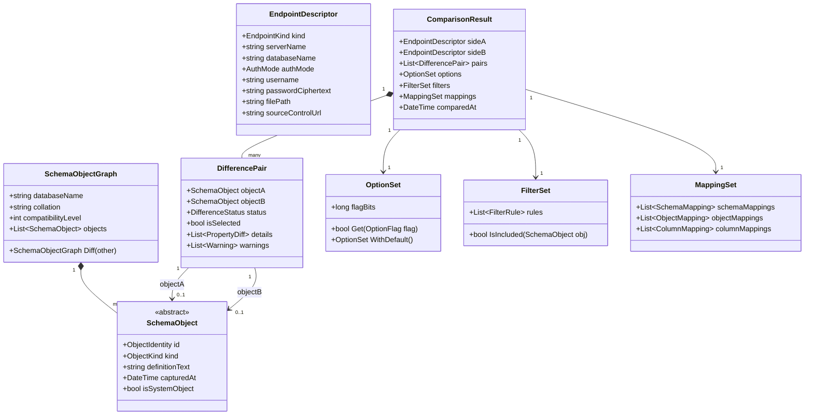
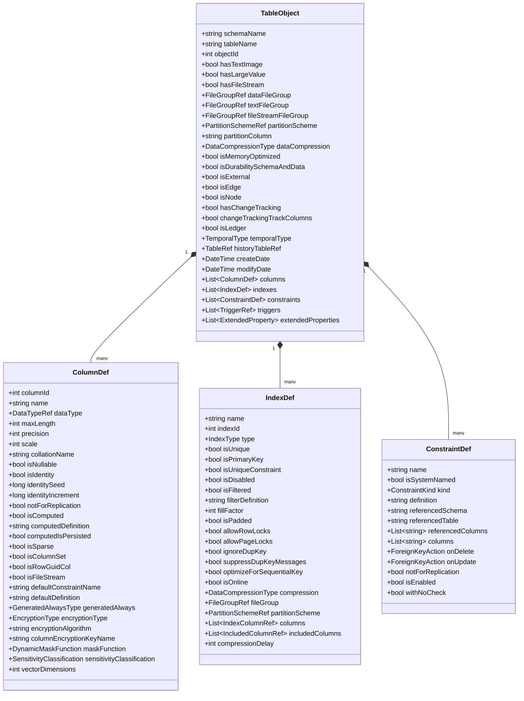
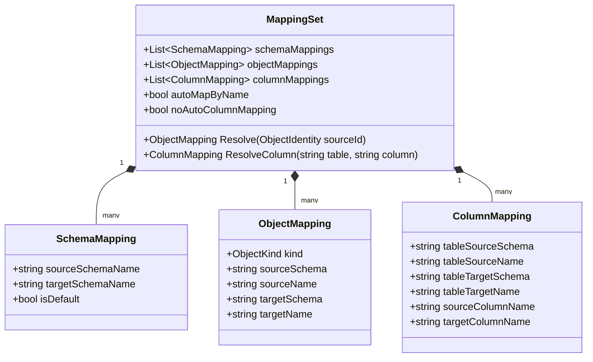

# 02 — Data Models

> **These are research notes about REDGATE SQL Compare, not documentation of
> DbDelta.** They were written before this project had code, by
> reverse-engineering a tool we wanted to match, and they name switches, paths
> and binaries that are Redgate's: `sqlcompare.exe`, `--abort-on-warnings`,
> `RedGate.SQLCompare.Engine.dll`. **Do not build a pipeline from anything
> here.** What DbDelta actually does is at
> <https://gitbakko.github.io/db-delta/>; what is still open is
> `docs/BACKLOG.md`.

**SQL Compare Clone — Authoritative Data Model Specification**
Version: 1.0 | Date: 2026-05-20 | Status: Draft

---

## Table of Contents

1. [Model Taxonomy](#1-model-taxonomy)
2. [Domain Model: Schema Objects](#2-domain-model-schema-objects)
   - 2.1 Table
   - 2.2 View
   - 2.3 Stored Procedure
   - 2.4 User-Defined Function
   - 2.5 Trigger
   - 2.6 User-Defined Type
   - 2.7 User-Defined Aggregate / CLR Aggregate
   - 2.8 Sequence
   - 2.9 Synonym
   - 2.10 Schema
   - 2.11 User / Role / Login Mapping
   - 2.12 Permission
   - 2.13 Assembly (CLR)
   - 2.14 Full-Text Catalog / Index / Stoplist
   - 2.15 XML Schema Collection
   - 2.16 Service Broker Objects
   - 2.17 Partition Function and Scheme
   - 2.18 Filegroup / File
   - 2.19 Database-Level Object
   - 2.20 Additional Objects
3. [Persistent Format: Project File (.scp)](#3-persistent-format-project-file-scp)
4. [Persistent Format: Snapshot (.snp)](#4-persistent-format-snapshot-snp)
5. [Persistent Format: Filter File (.scpf)](#5-persistent-format-filter-file-scpf)
6. [Persistent Format: Scripts Folder](#6-persistent-format-scripts-folder)
7. [Persistent Format: Migration Scripts](#7-persistent-format-migration-scripts)
8. [Comparison Options Bitmap](#8-comparison-options-bitmap)
9. [Comparison Result Model](#9-comparison-result-model)
10. [Mapping Model](#10-mapping-model)
11. [Versioning](#11-versioning)

---

## 1. Model Taxonomy

There are three distinct layers of data that our SQL Compare clone must handle. Each layer has different lifetime, serialization needs, and ownership.

### 1.1 Three-Layer Overview

```
Layer 1: Persistent Formats (on-disk)
  .scp   – project file (XML)
  .snp   – snapshot (binary)
  .scpf  – filter file (XML)
  scripts folder – directory tree of .sql files
  migration scripts – ordered .sql directory with manifest

Layer 2: In-Memory Domain Model
  SchemaObject hierarchy (Table, View, Procedure, …)
  ComparisonResult / DifferencePair graph
  OptionSet / FilterSet / MappingSet
  EndpointDescriptor (live DB | snapshot | scripts folder | backup)

Layer 3: Wire / Intermediate Formats
  Snapshot serialized object graph (embedded in .snp)
  XML argument files for CLI invocation
  Comparison output script (generated T-SQL)
```

### 1.2 Layer Interaction Diagram

```mermaid
flowchart TD
    subgraph Persistent["Layer 1 — Persistent Formats"]
        SCP[".scp Project File"]
        SNP[".snp Snapshot"]
        SCPF[".scpf Filter File"]
        SF["Scripts Folder"]
        MS["Migration Scripts Dir"]
    end

    subgraph Memory["Layer 2 — In-Memory Domain Model"]
        EP["EndpointDescriptor"]
        SO["SchemaObjectGraph"]
        OPT["OptionSet"]
        FLT["FilterSet"]
        MAP["MappingSet"]
        CR["ComparisonResult"]
    end

    subgraph Wire["Layer 3 — Wire / Intermediate"]
        SNP_OBJ["Snapshot Object Graph\n(embedded binary)"]
        XML_ARG["XML Arg File"]
        DEPLOY_SQL["Deployment Script\n(T-SQL output)"]
    end

    SCP -->|deserialize| EP
    SCP -->|deserialize| OPT
    SCP -->|reference| SCPF
    SNP -->|deserialize| SNP_OBJ
    SNP_OBJ -->|inflate| SO
    SF -->|parse .sql files| SO
    EP -->|query sys.*| SO
    SO + OPT + FLT + MAP -->|compare engine| CR
    CR -->|render| DEPLOY_SQL
    SNP_OBJ -.->|embedded in| SNP
    XML_ARG -->|CLI parse| EP & OPT & FLT
```

### 1.3 In-Memory Domain Class Overview



---

## 2. Domain Model: Schema Objects

### 2.1 Table

#### Identity

A table is uniquely identified by `(schema_name, table_name)`. SQL Server enforces uniqueness within a database at this level; `object_id` is the internal surrogate.

**Catalog source:**
```sql
SELECT s.name AS schema_name, t.name AS table_name, t.object_id,
       t.create_date, t.modify_date
FROM sys.tables t
JOIN sys.schemas s ON t.schema_id = s.schema_id
WHERE t.is_ms_shipped = 0;
```

#### Class Diagram



#### Properties Reference

**Table-Level Properties**

| Property | Type | Nullable | Source Catalog View | Notes |
|---|---|---|---|---|
| schemaName | nvarchar(128) | No | sys.schemas | |
| tableName | nvarchar(128) | No | sys.tables | |
| objectId | int | No | sys.tables.object_id | Surrogate; not compared across DBs |
| dataFileGroup | nvarchar(128) | Yes | sys.indexes (index_id=1) | Clustered or heap filegroup |
| textFileGroup | nvarchar(128) | Yes | sys.tables.lob_data_space_id | |
| partitionScheme | nvarchar(128) | Yes | sys.indexes → sys.data_spaces | Type = 'PS' |
| partitionColumn | nvarchar(128) | Yes | sys.index_columns | When partition scheme is set |
| dataCompression | enum | No | sys.partitions.data_compression | NONE/ROW/PAGE/COLUMNSTORE/COLUMNSTORE_ARCHIVE |
| isMemoryOptimized | bit | No | sys.tables.is_memory_optimized | Hekaton; alters DDL generation |
| temporalType | enum | No | sys.tables.temporal_type | 0=NONE,1=HISTORY_TABLE,2=SYSTEM_VERSIONED_TEMPORAL |
| historyTableRef | ObjectRef | Yes | sys.tables.history_table_id | For temporal tables |
| isLedger | bit | No | sys.tables.is_ledger | SQL Server 2022+ |
| isExternal | bit | No | sys.tables.is_external | PolyBase external tables |
| hasChangeTracking | bit | No | sys.change_tracking_tables | |
| createDate | datetime | No | sys.tables.create_date | Not compared (metadata only) |
| modifyDate | datetime | No | sys.tables.modify_date | Not compared |

**Column Properties**

| Property | Type | Nullable | Source Catalog View | Notes |
|---|---|---|---|---|
| columnId | int | No | sys.columns.column_id | Ordinal; compared if ForceColumnOrder |
| name | nvarchar(128) | No | sys.columns.name | |
| systemTypeId | tinyint | No | sys.columns.system_type_id | Maps to sys.types |
| userTypeId | int | No | sys.columns.user_type_id | For UDT references |
| maxLength | smallint | No | sys.columns.max_length | -1 for MAX types |
| precision | tinyint | No | sys.columns.precision | |
| scale | tinyint | No | sys.columns.scale | |
| collationName | sysname | Yes | sys.columns.collation_name | NULL for non-char types |
| isNullable | bit | No | sys.columns.is_nullable | |
| isIdentity | bit | No | sys.columns.is_identity | |
| identitySeed | numeric | Yes | sys.identity_columns.seed_value | |
| identityIncrement | numeric | Yes | sys.identity_columns.increment_value | |
| notForReplication | bit | No | sys.identity_columns.is_not_for_replication | |
| isComputed | bit | No | sys.columns.is_computed | |
| computedDefinition | nvarchar(max) | Yes | sys.computed_columns.definition | |
| computedIsPersisted | bit | Yes | sys.computed_columns.is_persisted | |
| isSparse | bit | No | sys.columns.is_sparse | |
| isColumnSet | bit | No | sys.columns.is_column_set | |
| isFileStream | bit | No | sys.columns.is_filestream | |
| defaultDefinition | nvarchar(max) | Yes | sys.default_constraints.definition | |
| defaultConstraintName | sysname | Yes | sys.default_constraints.name | |
| generatedAlways | tinyint | No | sys.columns.generated_always_type | 0=N/A,1=ROW_START,2=ROW_END |
| encryptionType | int | Yes | sys.columns.encryption_type | Always Encrypted |
| maskFunction | nvarchar(max) | Yes | sys.masked_columns.masking_function | Dynamic Data Masking |

**Index Properties**

| Property | Type | Nullable | Source Catalog View | Notes |
|---|---|---|---|---|
| name | sysname | Yes | sys.indexes.name | NULL for heaps |
| type | tinyint | No | sys.indexes.type | 0=HEAP,1=CLUSTERED,2=NONCLUSTERED,3=XML,4=SPATIAL,5=CCI,6=NCCI |
| isUnique | bit | No | sys.indexes.is_unique | |
| isPrimaryKey | bit | No | sys.indexes.is_primary_key | |
| isUniqueConstraint | bit | No | sys.indexes.is_unique_constraint | |
| fillFactor | tinyint | No | sys.indexes.fill_factor | 0 = server default |
| isPadded | bit | No | sys.indexes.is_padded | |
| allowRowLocks | bit | No | sys.indexes.allow_row_locks | |
| allowPageLocks | bit | No | sys.indexes.allow_page_locks | |
| isFiltered | bit | No | sys.indexes.has_filter | |
| filterDefinition | nvarchar(max) | Yes | sys.indexes.filter_definition | |
| compressionType | tinyint | No | sys.partitions.data_compression | |
| fileGroupOrPartitionScheme | sysname | Yes | sys.data_spaces.name | |
| columnList | List | No | sys.index_columns | ordered by key_ordinal |
| includedColumns | List | No | sys.index_columns (is_included_column=1) | |

**Constraint Properties**

| Kind | Property | Source |
|---|---|---|
| PRIMARY KEY | name, isSystemNamed, columns, isClustered, fillFactor, isDisabled | sys.key_constraints, sys.indexes |
| FOREIGN KEY | name, isSystemNamed, refSchema, refTable, columns, refColumns, onDelete, onUpdate, notForReplication, isEnabled, withNoCheck | sys.foreign_keys, sys.foreign_key_columns |
| UNIQUE | name, isSystemNamed, columns, isClustered, fillFactor, isFiltered, filterDef | sys.key_constraints |
| CHECK | name, isSystemNamed, definition, isEnabled, notForReplication, withNoCheck | sys.check_constraints |
| DEFAULT | name, isSystemNamed, columnName, definition | sys.default_constraints |

#### Comparison Semantics

- **Equal**: all column names, types, nullability, identity settings, constraint definitions, index definitions, filegroup assignments (when not ignored), and compression settings match.
- **Meaningful diff**: any of the above differ. Column re-ordering is a diff only when `ForceColumnOrder` is active.
- **Deployment implication**: any change to a column that requires DROP/recreate (e.g., type change, adding NOT NULL without default, removing identity) generates a warning `POTENTIAL_DATA_LOSS`.

#### Edge Cases

- System-named constraints (e.g., `DF__MyTable__col1__5070F446`) differ across databases even if semantically identical. Use `IgnoreSystemNamedConstraintAndIndexNames` to suppress.
- Collation mismatches are suppressed by `IgnoreCollations`.
- Computed column definition text may have insignificant whitespace differences.
- Identity seed/increment differences are suppressed by `IgnoreIdentitySeedAndIncrementValues`.

---

### 2.2 View

#### Identity

`(schema_name, view_name)`.

**Catalog source:**
```sql
SELECT s.name, v.name, v.object_id, m.definition, v.with_check_option,
       v.is_schema_bound, v.is_date_correlation_view
FROM sys.views v
JOIN sys.schemas s ON v.schema_id = s.schema_id
JOIN sys.sql_modules m ON v.object_id = m.object_id;
```

#### Properties

| Property | Type | Nullable | Notes |
|---|---|---|---|
| schemaName | nvarchar(128) | No | |
| viewName | nvarchar(128) | No | |
| definition | nvarchar(max) | No | Full CREATE VIEW text from sys.sql_modules |
| isSchemaBound | bit | No | sys.views.is_schema_bound |
| withCheckOption | bit | No | sys.views.with_check_option |
| isAnsiNullsOn | bit | No | sys.sql_modules.uses_ansi_nulls |
| isQuotedIdentOn | bit | No | sys.sql_modules.uses_quoted_identifier |
| isEncrypted | bit | No | sys.sql_modules.is_encrypted |
| isIndexed | bit | No | Presence of index on view in sys.indexes |
| columns | List~ViewColumn~ | No | sys.columns (for indexed views) |
| extendedProperties | List | Yes | sys.extended_properties |

#### Comparison Semantics

- Compare definition text after applying whitespace normalization (when `IgnoreWhiteSpace` is on) and comment stripping (when `IgnoreComments` is on).
- `SET ANSI_NULLS` and `SET QUOTED_IDENTIFIER` are compared unless `IgnoreQuotedIdentifiersAndAnsiNullSettings` is on.
- Indexed views have additional constraints: `SCHEMABINDING` is mandatory and checked separately.

#### Edge Cases

- `WITH ENCRYPTION` makes the definition unavailable from standard catalog views; `DecryptPost2KEncryptedObjects` attempts DAC-level decryption.
- Case sensitivity of the definition text is controlled by `UseCaseSensitiveObjectDefinition`.

---

### 2.3 Stored Procedure

#### Identity

`(schema_name, procedure_name)`. Numbered procedures (e.g., `proc;1`, `proc;2`) are not supported.

**Catalog source:**
```sql
SELECT s.name, p.name, p.object_id, m.definition,
       m.uses_ansi_nulls, m.uses_quoted_identifier,
       m.is_encrypted, p.is_auto_executed, p.execute_as_principal_id
FROM sys.procedures p
JOIN sys.schemas s ON p.schema_id = s.schema_id
JOIN sys.sql_modules m ON p.object_id = m.object_id;

-- Parameters:
SELECT par.parameter_id, par.name, TYPE_NAME(par.user_type_id) AS type_name,
       par.max_length, par.precision, par.scale, par.is_output,
       par.is_nullable, par.has_default_value, par.default_value,
       par.is_cursor_ref, par.is_xml_document, par.xml_collection_id
FROM sys.parameters par
WHERE par.object_id = @object_id
ORDER BY par.parameter_id;
```

#### Properties

| Property | Type | Nullable | Notes |
|---|---|---|---|
| schemaName | nvarchar(128) | No | |
| procedureName | nvarchar(128) | No | |
| definition | nvarchar(max) | No | sys.sql_modules.definition |
| parameters | List~ParameterDef~ | No | sys.parameters |
| isEncrypted | bit | No | sys.sql_modules.is_encrypted |
| isAnsiNullsOn | bit | No | sys.sql_modules.uses_ansi_nulls |
| isQuotedIdentOn | bit | No | sys.sql_modules.uses_quoted_identifier |
| executeAsPrincipal | sysname | Yes | sys.procedures.execute_as_principal_id → principal name |
| isAutoExecuted | bit | No | sys.procedures.is_auto_executed (sp_procoption) |
| replicationFilterProc | bit | No | type=RF in sys.objects |
| isNativelyCompiled | bit | No | sys.sql_modules.uses_native_compilation |
| withRecompile | bit | No | Parsed from definition text |

**ParameterDef Properties**

| Property | Type | Nullable | Notes |
|---|---|---|---|
| parameterId | int | No | Ordinal position |
| name | sysname | No | Includes @ prefix |
| typeName | sysname | No | Resolved via sys.types |
| maxLength | smallint | No | |
| precision | tinyint | No | |
| scale | tinyint | No | |
| isOutput | bit | No | |
| isNullable | bit | No | |
| hasDefault | bit | No | |
| defaultValue | sql_variant | Yes | |

#### Comparison Semantics

- Full definition text comparison after normalization.
- Parameter list changes are a structural diff.

---

### 2.4 User-Defined Function

#### Identity

`(schema_name, function_name)`. Note: SQL Server allows overloading by schema but not by parameter signature. All UDF names are unique within schema.

**Catalog source:**
```sql
SELECT s.name, o.name, o.type, o.type_desc, m.definition,
       m.is_encrypted, m.uses_ansi_nulls, m.uses_quoted_identifier,
       m.uses_native_compilation, m.is_schema_bound, m.execute_as_principal_id
FROM sys.objects o
JOIN sys.schemas s ON o.schema_id = s.schema_id
JOIN sys.sql_modules m ON o.object_id = m.object_id
WHERE o.type IN ('FN','IF','TF','FS','FT');
-- FN=Scalar, IF=Inline TVF, TF=Multi-statement TVF, FS=CLR Scalar, FT=CLR TVF
```

#### Properties

| Property | Type | Nullable | Notes |
|---|---|---|---|
| schemaName | nvarchar(128) | No | |
| functionName | nvarchar(128) | No | |
| functionSubtype | enum | No | SCALAR / INLINE_TVF / MULTI_TVF / CLR_SCALAR / CLR_TVF |
| definition | nvarchar(max) | No | From sys.sql_modules; NULL for CLR |
| isSchemaBound | bit | No | |
| isEncrypted | bit | No | |
| isAnsiNullsOn | bit | No | |
| isQuotedIdentOn | bit | No | |
| isNativelyCompiled | bit | No | In-Memory OLTP only |
| parameters | List~ParameterDef~ | No | Input + return table columns for TVF |
| returnType | DataTypeRef | Yes | For scalar functions |
| executeAsPrincipal | sysname | Yes | |
| clrAssemblyName | sysname | Yes | For CLR functions |
| clrClassName | nvarchar(max) | Yes | |
| clrMethodName | nvarchar(max) | Yes | |

#### Comparison Semantics

Same as stored procedure. Return type is structural; definition text normalization applies.

---

### 2.5 Trigger

#### Identity

DML triggers: `(schema_name, table_name, trigger_name)`. DDL triggers: `(database_scope | server_scope, trigger_name)`. Logon triggers: server-scoped.

**Catalog source:**
```sql
-- DML Triggers
SELECT s.name AS schema_name, OBJECT_NAME(tr.parent_id) AS parent_name,
       tr.name, tr.object_id, m.definition,
       tr.is_instead_of_trigger, tr.is_disabled, tr.is_not_for_replication,
       tr.is_ms_shipped, m.uses_ansi_nulls, m.uses_quoted_identifier, m.is_encrypted
FROM sys.triggers tr
JOIN sys.objects po ON tr.parent_id = po.object_id
JOIN sys.schemas s ON po.schema_id = s.schema_id
JOIN sys.sql_modules m ON tr.object_id = m.object_id
WHERE tr.parent_class = 1; -- Object-level (DML)

-- DDL Triggers
SELECT tr.name, tr.object_id, m.definition, tr.is_disabled, tr.parent_class_desc
FROM sys.triggers tr
JOIN sys.sql_modules m ON tr.object_id = m.object_id
WHERE tr.parent_class IN (0); -- Database-scoped DDL
```

#### Properties

| Property | Type | Nullable | Notes |
|---|---|---|---|
| triggerName | nvarchar(128) | No | |
| triggerClass | enum | No | DML / DDL_DATABASE / DDL_SERVER / LOGON |
| parentObjectSchema | sysname | Yes | NULL for DDL/server |
| parentObjectName | sysname | Yes | Table or view name for DML |
| definition | nvarchar(max) | No | |
| isInsteadOf | bit | No | DML only; AFTER vs INSTEAD OF |
| isDisabled | bit | No | |
| isEncrypted | bit | No | |
| isNotForReplication | bit | No | DML only |
| isAnsiNullsOn | bit | No | |
| isQuotedIdentOn | bit | No | |
| insertOrder | enum | Yes | FIRST / LAST / NONE (sys.trigger_events) |
| updateOrder | enum | Yes | |
| deleteOrder | enum | Yes | |
| firesOnInsert | bit | No | sys.trigger_events |
| firesOnUpdate | bit | No | |
| firesOnDelete | bit | No | |
| isReplicationTrigger | bit | No | type=RF or named with replication convention |

#### Comparison Semantics

- Trigger ordering (`FIRST`/`LAST`) is ignored when `IgnoreTriggerOrder` is set.
- `INSTEAD OF` triggers are ignored when `IgnoreInsteadOfTriggers` is set.
- All DML triggers are ignored when `IgnoreTriggers` is set.
- Replication triggers are ignored when `IgnoreReplicationTriggers` is set.

---

### 2.6 User-Defined Type

Three subtypes with distinct semantics.

#### Identity

`(schema_name, type_name)`.

**Catalog source:**
```sql
SELECT s.name AS schema_name, t.name, t.user_type_id, t.system_type_id,
       t.is_user_defined, t.is_assembly_type, t.is_table_type,
       TYPE_NAME(t.system_type_id) AS base_type_name,
       t.max_length, t.precision, t.scale, t.collation_name,
       t.is_nullable, t.is_user_defined, a.name AS assembly_name,
       at.assembly_class
FROM sys.types t
JOIN sys.schemas s ON t.schema_id = s.schema_id
LEFT JOIN sys.assembly_types at ON t.user_type_id = at.user_type_id
LEFT JOIN sys.assemblies a ON at.assembly_id = a.assembly_id
WHERE t.is_user_defined = 1;
```

#### Alias UDT Properties

| Property | Type | Nullable | Notes |
|---|---|---|---|
| schemaName | nvarchar(128) | No | |
| typeName | nvarchar(128) | No | |
| baseTypeName | sysname | No | e.g., varchar, int |
| maxLength | smallint | No | |
| precision | tinyint | No | |
| scale | tinyint | No | |
| collationName | sysname | Yes | |
| isNullable | bit | No | |
| defaultName | sysname | Yes | Bound default via sp_bindefault |
| ruleName | sysname | Yes | Bound rule via sp_bindrule |

#### Table UDT Properties

| Property | Type | Nullable | Notes |
|---|---|---|---|
| schemaName | nvarchar(128) | No | |
| typeName | nvarchar(128) | No | |
| columns | List~ColumnDef~ | No | Same as table column defs |
| constraints | List~ConstraintDef~ | No | |
| indexes | List~IndexDef~ | No | |

#### CLR UDT Properties

| Property | Type | Nullable | Notes |
|---|---|---|---|
| schemaName | nvarchar(128) | No | |
| typeName | nvarchar(128) | No | |
| assemblyName | sysname | No | |
| assemblyClassName | nvarchar(max) | No | |
| isBinaryOrdered | bit | No | |
| isFixedLength | bit | No | |
| maxLength | smallint | No | |

---

### 2.7 User-Defined Aggregate / CLR Aggregate

#### Identity

`(schema_name, aggregate_name)`.

**Catalog source:**
```sql
SELECT s.name, o.name, o.object_id, at.assembly_id, a.name AS assembly_name,
       at.assembly_class, at.execute_as_principal_id
FROM sys.objects o
JOIN sys.schemas s ON o.schema_id = s.schema_id
JOIN sys.assembly_modules at ON o.object_id = at.object_id
JOIN sys.assemblies a ON at.assembly_id = a.assembly_id
WHERE o.type = 'AF';
```

#### Properties

| Property | Type | Nullable | Notes |
|---|---|---|---|
| schemaName | nvarchar(128) | No | |
| aggregateName | nvarchar(128) | No | |
| assemblyName | sysname | No | |
| assemblyClass | nvarchar(max) | No | |
| inputParameter | ParameterDef | No | Single input parameter |
| returnType | DataTypeRef | No | |

---

### 2.8 Sequence

#### Identity

`(schema_name, sequence_name)`.

**Catalog source:**
```sql
SELECT s.name, seq.name, seq.object_id,
       TYPE_NAME(seq.user_type_id) AS data_type,
       seq.start_value, seq.increment, seq.minimum_value, seq.maximum_value,
       seq.is_cycling, seq.is_cached, seq.cache_size, seq.current_value
FROM sys.sequences seq
JOIN sys.schemas s ON seq.schema_id = s.schema_id;
```

#### Properties

| Property | Type | Nullable | Notes |
|---|---|---|---|
| schemaName | nvarchar(128) | No | |
| sequenceName | nvarchar(128) | No | |
| dataType | sysname | No | bigint / int / decimal / numeric / smallint / tinyint |
| startValue | sql_variant | No | |
| increment | sql_variant | No | |
| minimumValue | sql_variant | No | |
| maximumValue | sql_variant | No | |
| isCycling | bit | No | |
| isCached | bit | No | |
| cacheSize | int | Yes | NULL when not cached |
| currentValue | sql_variant | No | Not compared (runtime state) |

#### Comparison Semantics

`currentValue` is runtime state and is never compared. All structural properties are compared.

---

### 2.9 Synonym

#### Identity

`(schema_name, synonym_name)`.

**Catalog source:**
```sql
SELECT s.name, syn.name, syn.object_id, syn.base_object_name
FROM sys.synonyms syn
JOIN sys.schemas s ON syn.schema_id = s.schema_id;
```

#### Properties

| Property | Type | Nullable | Notes |
|---|---|---|---|
| schemaName | nvarchar(128) | No | |
| synonymName | nvarchar(128) | No | |
| baseObjectName | nvarchar(1035) | No | Four-part name: [server].[db].[schema].[object] |

#### Comparison Semantics

Server and database portions of `baseObjectName` are ignored when `IgnoreDatabaseAndServerNameInSynonyms` is on, allowing cross-environment deployment without false positives.

---

### 2.10 Schema

#### Identity

`(schema_name)`.

**Catalog source:**
```sql
SELECT s.name, s.schema_id, p.name AS owner_name
FROM sys.schemas s
JOIN sys.database_principals p ON s.principal_id = p.principal_id
WHERE s.schema_id > 4 -- exclude built-ins (dbo, guest, sys, INFORMATION_SCHEMA)
  AND s.name NOT LIKE 'db_%';
```

#### Properties

| Property | Type | Nullable | Notes |
|---|---|---|---|
| schemaName | nvarchar(128) | No | |
| ownerName | sysname | No | Mapped to principal name |

#### Comparison Semantics

Authorization on schemas is suppressed by `IgnoreSchemaObjectAuthorization`. If that option is not set, the owner principal name must match.

---

### 2.11 User / Role / Login Mapping

SQL Compare operates on **database-level** principals (users and roles), not server-level logins (which are instance-scoped).

#### Identity

User: `(user_name)`. Role: `(role_name)`.

**Catalog source:**
```sql
-- Database Users
SELECT dp.name, dp.type, dp.type_desc, dp.default_schema_name,
       dp.sid, sp.name AS login_name, dp.is_fixed_role
FROM sys.database_principals dp
LEFT JOIN sys.server_principals sp ON dp.sid = sp.sid
WHERE dp.type IN ('S','U','G','C','K','E','X') -- SQL, Windows, Group, Certificate, Key, External, External Group
  AND dp.is_fixed_role = 0
  AND dp.name NOT IN ('dbo','guest','INFORMATION_SCHEMA','sys');

-- Database Roles
SELECT dp.name, dp.type_desc, dp.is_fixed_role
FROM sys.database_principals dp
WHERE dp.type = 'R' AND dp.is_fixed_role = 0;

-- Role Memberships
SELECT r.name AS role_name, m.name AS member_name
FROM sys.database_role_members rm
JOIN sys.database_principals r ON rm.role_principal_id = r.principal_id
JOIN sys.database_principals m ON rm.member_principal_id = m.principal_id;
```

#### User Properties

| Property | Type | Nullable | Notes |
|---|---|---|---|
| userName | sysname | No | |
| userType | enum | No | SQL / WINDOWS / GROUP / CERTIFICATE / KEY / EXTERNAL |
| defaultSchemaName | sysname | Yes | |
| loginName | sysname | Yes | Server principal mapping |
| sid | varbinary(85) | Yes | SID for Windows accounts |
| roleMemberships | List~sysname~ | No | Roles this user belongs to |

#### Role Properties

| Property | Type | Nullable | Notes |
|---|---|---|---|
| roleName | sysname | No | |
| isFixedRole | bit | No | Fixed roles are ignored |
| ownerName | sysname | Yes | |
| members | List~sysname~ | No | |

#### Comparison Semantics

- Users are completely ignored when `IgnoreUsersPermissionsAndRoleMemberships` or `IgnoreUsers` is set.
- User properties (type, default schema, login) are ignored when `IgnoreUserProperties` is set, comparing only the name.

---

### 2.12 Permission

#### Identity

A permission is a triple: `(grantee_principal, securable_object, permission_action)`. There is no single-column surrogate key.

**Catalog source:**
```sql
SELECT dp.class_desc, dp.major_id, dp.minor_id,
       OBJECT_NAME(dp.major_id) AS object_name,
       SCHEMA_NAME(o.schema_id) AS schema_name,
       dp.permission_name, dp.state_desc,
       grantee.name AS grantee_name, grantor.name AS grantor_name
FROM sys.database_permissions dp
JOIN sys.database_principals grantee ON dp.grantee_principal_id = grantee.principal_id
JOIN sys.database_principals grantor ON dp.grantor_principal_id = grantor.principal_id
LEFT JOIN sys.objects o ON dp.major_id = o.object_id
WHERE dp.class IN (0, 1, 3, 6); -- Database, Object/Column, Schema, Type
```

#### Properties

| Property | Type | Nullable | Notes |
|---|---|---|---|
| granteeName | sysname | No | Principal receiving the permission |
| grantorName | sysname | No | Typically 'dbo' |
| permissionName | sysname | No | e.g., SELECT, EXECUTE, ALTER |
| state | enum | No | GRANT / DENY / GRANT_WITH_GRANT_OPTION |
| objectClass | enum | No | DATABASE / OBJECT / SCHEMA / TYPE |
| objectSchema | sysname | Yes | For OBJECT class |
| objectName | sysname | Yes | For OBJECT class |
| columnName | sysname | Yes | For column-level permissions |

#### Comparison Semantics

All permissions are ignored when `IgnorePermissions` is set. User-level permissions are also suppressed by `IgnoreUsersPermissionsAndRoleMemberships` (only role-based permissions are compared in that case).

---

### 2.13 Assembly (CLR)

#### Identity

`(assembly_name)`. Assemblies are database-scoped but not schema-scoped.

**Catalog source:**
```sql
SELECT a.name, a.assembly_id, a.clr_name, a.permission_set_desc,
       a.is_visible, a.create_date, a.modify_date,
       af.name AS file_name, af.content AS binary_content
FROM sys.assemblies a
JOIN sys.assembly_files af ON a.assembly_id = af.assembly_id
WHERE a.is_user_defined = 1;
```

#### Properties

| Property | Type | Nullable | Notes |
|---|---|---|---|
| assemblyName | sysname | No | |
| clrName | nvarchar(4000) | No | Full CLR assembly name |
| permissionSet | enum | No | SAFE / EXTERNAL_ACCESS / UNSAFE |
| isVisible | bit | No | Whether it appears in T-SQL catalog |
| binaryContent | varbinary(max) | No | The compiled DLL bytes |
| files | List~AssemblyFile~ | No | Can have multiple files (resources) |

#### Comparison Semantics

Compare `binaryContent` byte-for-byte unless `DontAlterAssembly` is set (which forces table rebuilds instead of `ALTER ASSEMBLY`). CLR assemblies in the tSQLt framework are excluded when `IgnoretSQLt` is set.

---

### 2.14 Full-Text Catalog / Index / Stoplist

**Catalog source:**
```sql
-- Catalogs
SELECT fc.name, fc.fulltext_catalog_id, fc.is_default, fc.is_accent_sensitivity_on,
       fg.name AS filegroup_name
FROM sys.fulltext_catalogs fc
LEFT JOIN sys.filegroups fg ON fc.data_space_id = fg.data_space_id;

-- Full-Text Indexes
SELECT OBJECT_NAME(fi.object_id) AS table_name, fi.fulltext_catalog_id,
       fi.is_enabled, fi.change_tracking_state_desc, fi.stoplist_id,
       fi.property_list_id
FROM sys.fulltext_indexes fi;

-- Full-Text Index Columns
SELECT fic.object_id, c.name AS column_name, fic.language_id, fic.type_column_id
FROM sys.fulltext_index_columns fic
JOIN sys.columns c ON fic.object_id = c.object_id AND fic.column_id = c.column_id;

-- Stoplists
SELECT sl.stoplist_id, sl.name
FROM sys.fulltext_stoplists sl;
```

#### Catalog Properties

| Property | Type | Nullable | Notes |
|---|---|---|---|
| catalogName | sysname | No | |
| isDefault | bit | No | |
| isAccentSensitive | bit | No | |
| fileGroupName | sysname | Yes | |

#### Full-Text Index Properties

| Property | Type | Nullable | Notes |
|---|---|---|---|
| tableSchema | sysname | No | |
| tableName | sysname | No | |
| catalogName | sysname | No | |
| isEnabled | bit | No | |
| changeTracking | enum | No | OFF / AUTO / MANUAL |
| stoplistName | sysname | Yes | |
| columns | List~FTColumnDef~ | No | |

#### Comparison Semantics

All full-text indexing is ignored when `IgnoreFullTextIndexing` is set.

---

### 2.15 XML Schema Collection

#### Identity

`(schema_name, xml_schema_collection_name)`.

**Catalog source:**
```sql
SELECT s.name, xsc.name, xsc.xml_collection_id,
       xml_schema_namespace(s.name, xsc.name) AS schema_content
FROM sys.xml_schema_collections xsc
JOIN sys.schemas s ON xsc.schema_id = s.schema_id
WHERE xsc.xml_collection_id > 1; -- Exclude sys collection
```

#### Properties

| Property | Type | Nullable | Notes |
|---|---|---|---|
| schemaName | nvarchar(128) | No | |
| collectionName | nvarchar(128) | No | |
| xmlSchemaContent | nvarchar(max) | No | From xml_schema_namespace() |

#### Comparison Semantics

The XML schema content is compared as text with whitespace normalization.

---

### 2.16 Service Broker Objects

Service Broker spans several distinct object types. All are database-scoped.

**Catalog source:**
```sql
-- Message Types
SELECT mt.name, mt.validation_desc
FROM sys.service_message_types mt WHERE mt.is_user_defined = 1;

-- Contracts
SELECT c.name FROM sys.service_contracts c WHERE c.is_user_defined = 1;
SELECT cmt.contract_name, mt.name, cmt.is_sent_by_initiator, cmt.is_sent_by_target
FROM sys.service_contract_message_usages cmt
JOIN sys.service_message_types mt ON cmt.message_type_id = mt.message_type_id;

-- Queues
SELECT q.name, s.name AS schema_name, q.activation_procedure, q.is_activation_enabled,
       q.is_receive_enabled, q.is_enqueue_enabled, q.is_retention_on,
       q.max_readers, q.execute_as_principal_id, q.is_poison_message_handling_enabled
FROM sys.service_queues q JOIN sys.schemas s ON q.schema_id = s.schema_id;

-- Services
SELECT sv.name, sq.name AS queue_name
FROM sys.services sv JOIN sys.service_queues sq ON sv.service_queue_id = sq.object_id;

-- Routes
SELECT r.name, r.remote_service_name, r.broker_instance, r.address, r.mirror_address, r.lifetime
FROM sys.routes r;

-- Remote Service Bindings
SELECT rsb.name, rsb.remote_service_name, p.name AS certificate_principal_name, rsb.is_anonymous
FROM sys.remote_service_bindings rsb
LEFT JOIN sys.database_principals p ON rsb.service_contract_id = p.principal_id;
```

#### Message Type Properties

| Property | Type | Nullable | Notes |
|---|---|---|---|
| name | sysname | No | |
| validationMode | enum | No | NONE / EMPTY / WELL_FORMED_XML / VALID_XML |
| xmlSchemaCollection | sysname | Yes | When validation = VALID_XML |

#### Queue Properties

| Property | Type | Nullable | Notes |
|---|---|---|---|
| schemaName | sysname | No | |
| queueName | sysname | No | |
| isReceiveEnabled | bit | No | |
| isEnqueueEnabled | bit | No | |
| isRetentionOn | bit | No | |
| isActivationEnabled | bit | No | |
| activationProcedure | sysname | Yes | |
| maxReaders | smallint | Yes | |
| executeAsPrincipal | sysname | Yes | |
| isPoisonMessageHandlingEnabled | bit | No | |

#### Service Properties

| Property | Type | Nullable | Notes |
|---|---|---|---|
| serviceName | sysname | No | |
| queueName | sysname | No | |
| contractNames | List~sysname~ | No | sys.service_contract_usages |

#### Comparison Semantics

Event notifications on queues are ignored when `IgnoreEventNotificationsOnQueues` is set.

---

### 2.17 Partition Function and Scheme

#### Identity

Partition function: `(function_name)`. Partition scheme: `(scheme_name)`.

**Catalog source:**
```sql
-- Partition Functions
SELECT pf.name, pf.function_id, pf.type_desc, pf.fanout, pf.boundary_value_on_right,
       prv.boundary_id, prv.value AS boundary_value
FROM sys.partition_functions pf
JOIN sys.partition_range_values prv ON pf.function_id = prv.function_id;

-- Partition Schemes
SELECT ps.name, ps.data_space_id, pf.name AS function_name,
       dds.destination_id, fg.name AS filegroup_name
FROM sys.partition_schemes ps
JOIN sys.partition_functions pf ON ps.function_id = pf.function_id
JOIN sys.destination_data_spaces dds ON ps.data_space_id = dds.partition_scheme_id
JOIN sys.filegroups fg ON dds.data_space_id = fg.data_space_id;
```

#### Partition Function Properties

| Property | Type | Nullable | Notes |
|---|---|---|---|
| functionName | sysname | No | |
| inputParameterType | sysname | No | |
| boundaryType | enum | No | RANGE LEFT / RANGE RIGHT |
| boundaryValues | List~sql_variant~ | No | Ordered list of boundary values |

#### Partition Scheme Properties

| Property | Type | Nullable | Notes |
|---|---|---|---|
| schemeName | sysname | No | |
| functionName | sysname | No | |
| fileGroupMappings | List~sysname~ | No | One per partition + optional NEXT USED |
| nextUsedFileGroup | sysname | Yes | |

#### Comparison Semantics

All partition functions and schemes are ignored when `IgnoreFileGroupsPartitionSchemesAndPartitionFunctions` is set. The "next filegroup" in a partition scheme is optionally compared via `ConsiderNextFilegroupInPartitionSchemes`.

---

### 2.18 Filegroup / File

Filegroups are typically environment-specific and are compared only when `IgnoreFileGroups` is off.

**Catalog source:**
```sql
-- Filegroups
SELECT fg.name, fg.type_desc, fg.is_default, fg.is_read_only
FROM sys.filegroups fg;

-- Files
SELECT df.name, df.physical_name, df.type_desc, df.size, df.max_size, df.growth, df.is_percent_growth
FROM sys.database_files df;
```

#### Filegroup Properties

| Property | Type | Nullable | Notes |
|---|---|---|---|
| fileGroupName | sysname | No | |
| type | enum | No | ROWS_FILEGROUP / FILESTREAM_DATA_FILEGROUP / MEMORY_OPTIMIZED_DATA_FILEGROUP |
| isDefault | bit | No | |
| isReadOnly | bit | No | |

#### Comparison Semantics

In most CI/CD scenarios both `IgnoreFileGroups` and `IgnoreFileGroupsPartitionSchemesAndPartitionFunctions` are enabled. Files themselves are almost never compared cross-environment.

---

### 2.19 Database-Level Object

Database-level properties affect all schema objects and must be captured in the snapshot.

**Catalog source:**
```sql
SELECT d.name, d.collation_name, d.compatibility_level,
       d.is_ansi_nulls_on, d.is_ansi_warnings_on, d.is_ansi_padding_on,
       d.is_ansi_null_default_on, d.is_quoted_identifier_on,
       d.is_recursive_triggers_on, d.is_broker_enabled,
       d.is_read_only, d.is_auto_close_on, d.is_auto_shrink_on,
       d.is_auto_update_statistics_on, d.is_auto_update_statistics_async_on,
       d.is_auto_create_stats_on, d.is_fulltext_enabled,
       d.is_change_data_capture_on, d.is_cdc_enabled,
       d.snapshot_isolation_state_desc, d.is_read_committed_snapshot_on,
       d.recovery_model_desc, d.page_verify_option_desc, d.user_access_desc
FROM sys.databases d
WHERE d.name = DB_NAME();
```

#### Properties

| Property | Type | Nullable | Notes |
|---|---|---|---|
| databaseName | sysname | No | |
| collationName | sysname | No | |
| compatibilityLevel | tinyint | No | |
| isAnsiNullsOn | bit | No | |
| isAnsiWarningsOn | bit | No | |
| isAnsiPaddingOn | bit | No | |
| isQuotedIdentifierOn | bit | No | |
| isRecursiveTriggersOn | bit | No | |
| isBrokerEnabled | bit | No | |
| isAutoUpdateStatisticsOn | bit | No | |
| isAutoCreateStatisticsOn | bit | No | |
| snapshotIsolationState | sysname | No | |
| isReadCommittedSnapshotOn | bit | No | |
| recoveryModel | sysname | No | |

---

### 2.20 Additional Objects

The following objects are modeled with lighter-weight representations.

| Object Kind | sys.* Source | Identity | Key Properties |
|---|---|---|---|
| Default (stand-alone) | sys.objects type=D | (schema, name) | definition |
| Rule (stand-alone) | sys.objects type=R | (schema, name) | definition |
| DDL Trigger (database) | sys.triggers parent_class=0 | (name) | definition, isDisabled, events |
| Security Policy | sys.security_policies | (schema, name) | predicates, isEnabled, schemaBound |
| Search Property List | sys.registered_search_property_lists | (name) | properties list |
| External Data Source | sys.external_data_sources | (name) | type, location, credentials |
| External File Format | sys.external_file_formats | (name) | type, serde properties |
| Extended Property | sys.extended_properties | (class, major_id, minor_id, name) | value |
| Certificate | sys.certificates | (name) | subject, expiry, thumbprint — compared, not deployed |
| Symmetric Key | sys.symmetric_keys | (name) | algorithm, certificate — only permissions deployed |
| Asymmetric Key | sys.asymmetric_keys | (name) | algorithm — only permissions deployed |
| Event Notification | sys.event_notifications | (name) | eventType, brokerService |

---

## 3. Persistent Format: Project File (.scp)

### 3.1 Overview

A project file is an XML document stored with the `.scp` extension. It is the primary user-facing configuration artifact. It contains no schema data itself — it contains pointers to data sources, the set of options to apply, references to filter files, custom mappings, and metadata about what has been explicitly selected by the user.

Default storage location: `%USERPROFILE%\Documents\SQL Compare\Projects\`

### 3.2 Root Structure

```xml
<?xml version="1.0" encoding="utf-8"?>
<project version="3" direction="0">

  <!-- ============================================================
       DATA SOURCES
       type attribute values:
         LiveDatabaseSource   - live SQL Server database
         SnapshotSource       - .snp binary snapshot file
         FolderDataSource     - scripts folder on disk
         BackupDataSource     - SQL Server backup file
         SourceControlSource  - source control provider
  ============================================================ -->

  <DataSource1>
    <type>LiveDatabaseSource</type>
    <ServerName>.\SQLEXPRESS</ServerName>
    <DatabaseName>AdventureWorks</DatabaseName>
    <AuthenticationType>Integrated</AuthenticationType>
    <!-- SQL auth only -->
    <Username />
    <!-- Encrypted with DPAPI; never store plaintext -->
    <PasswordCiphertext>AQAAANCMnd8BFd...</PasswordCiphertext>
    <UseIntegratedSecurity>true</UseIntegratedSecurity>
    <UseEncryptedConnection>false</UseEncryptedConnection>
    <TrustServerCertificate>false</TrustServerCertificate>
    <ApplicationName>SQL Compare</ApplicationName>
    <ConnectTimeout>30</ConnectTimeout>
    <CustomConnectionString />
  </DataSource1>

  <DataSource2>
    <type>SnapshotSource</type>
    <FileName>C:\Snapshots\AdventureWorks_2026-05-20.snp</FileName>
  </DataSource2>

  <!-- Alternative DataSource2 for scripts folder:
  <DataSource2>
    <type>FolderDataSource</type>
    <Path>C:\Repos\MyDB\Schema</Path>
  </DataSource2>
  -->

  <!-- Alternative DataSource2 for backup:
  <DataSource2>
    <type>BackupDataSource</type>
    <BackupSet>
      <BackupSetName>MyBackup_Full</BackupSetName>
      <ServerName>.\SQLEXPRESS</ServerName>
      <DatabaseName>AdventureWorks</DatabaseName>
      <BackupFilePaths>
        <Path>C:\Backups\aw_full.bak</Path>
      </BackupFilePaths>
    </BackupSet>
  </DataSource2>
  -->

  <!-- ============================================================
       COMPARISON OPTIONS
       Comma-separated list of active option flags.
       'Default' keyword applies the standard default set.
       Prefix a flag with '!' to negate it.
  ============================================================ -->
  <Options>Default,IgnoreComments,IgnoreIndexes</Options>

  <!-- ============================================================
       FILTER FILE REFERENCES
       Multiple filter files may be stacked; last-match wins.
  ============================================================ -->
  <Filters>
    <FilterFile>C:\Users\me\Documents\SQL Compare\Filters\ExcludeReporting.scpf</FilterFile>
    <FilterFile>.\Filters\ExcludeSystemObjects.scpf</FilterFile>
  </Filters>

  <!-- ============================================================
       SCHEMA MAPPINGS
       Used when source/target use different schema owners.
  ============================================================ -->
  <SchemaMappings>
    <Mapping>
      <Source>reporting</Source>
      <Target>rpt</Target>
    </Mapping>
  </SchemaMappings>

  <!-- ============================================================
       OBJECT SELECTION
       Stores the objects explicitly included/excluded by the user
       in the comparison results grid. Objects not listed here
       inherit the default (all included).
  ============================================================ -->
  <ObjectSelection>
    <ExcludedObjects>
      <Object type="Table" schema="dbo" name="sysdiagrams" />
      <Object type="Table" schema="dbo" name="__MigrationHistory" />
    </ExcludedObjects>
  </ObjectSelection>

  <!-- ============================================================
       COLUMN MAPPINGS
       Override auto-mapping for renamed columns.
  ============================================================ -->
  <ColumnMappings>
    <ColumnMapping>
      <SourceTable schema="dbo" name="Customer" />
      <SourceColumn>CustomerID</SourceColumn>
      <TargetColumn>CustId</TargetColumn>
    </ColumnMapping>
  </ColumnMappings>

  <!-- ============================================================
       PROJECT METADATA
  ============================================================ -->
  <ProjectMetadata>
    <CreatedBy>DOMAIN\user</CreatedBy>
    <CreatedAt>2026-05-20T09:00:00Z</CreatedAt>
    <ModifiedAt>2026-05-20T14:32:17Z</ModifiedAt>
    <LastComparedAt>2026-05-20T14:30:00Z</LastComparedAt>
    <Description>Nightly production vs staging comparison</Description>
  </ProjectMetadata>

</project>
```

### 3.3 EndpointKind Enum

| Value | Description |
|---|---|
| `LiveDatabaseSource` | Live connection to a SQL Server instance |
| `SnapshotSource` | `.snp` binary file |
| `FolderDataSource` | Scripts folder on disk |
| `BackupDataSource` | SQL Server `.bak` or `.sqb` backup file |
| `SourceControlSource` | Source control provider (TFS, Git via SQL Source Control) |

### 3.4 AuthenticationType Enum

| Value | Description |
|---|---|
| `Integrated` | Windows Authentication (SSPI) |
| `SqlServer` | SQL Server username + password |
| `ActiveDirectoryInteractive` | Azure AD interactive MFA |
| `ActiveDirectoryPassword` | Azure AD username + password |
| `ActiveDirectoryMsi` | Managed Service Identity |

### 3.5 Password Storage

Passwords are encrypted with Windows DPAPI (`ProtectedData.Protect`) scoped to the current user (`DataProtectionScope.CurrentUser`). The ciphertext is stored as a Base64 string in `<PasswordCiphertext>`. This means project files are not portable across user accounts without re-entering credentials.

---

## 4. Persistent Format: Snapshot (.snp)

### 4.1 Overview

A snapshot is a binary file that captures the complete schema of a database at a point in time. It is read-only after creation. Snapshots created in SQL Compare versions 3–7 remain compatible with version 16 (approximately 15 years of backward compatibility). The snapshot format is proprietary and not publicly documented at the binary level; the following describes the logical structure that our implementation must replicate.

### 4.2 Logical File Structure

```
[HEADER BLOCK]           — Magic bytes + version + metadata
[INDEX BLOCK]            — Offset table for fast section lookup
[IDENTITY SECTION]       — Source identification
[SCHEMA OBJECT SECTION]  — Serialized object graph (compressed)
[CHECKSUM BLOCK]         — Integrity verification
```

### 4.3 Header Block

| Field | Type | Size | Notes |
|---|---|---|---|
| magic | bytes | 4 | `\x52\x47\x53\x4E` ("RGSN") — Redgate Snapshot |
| formatVersion | uint16 | 2 | Incremented on breaking changes |
| minReaderVersion | uint16 | 2 | Minimum tool version to read this file |
| flags | uint32 | 4 | Bit 0 = compressed; Bit 1 = signed |
| headerLength | uint32 | 4 | Total header block size in bytes |
| createdAt | int64 | 8 | Unix epoch milliseconds |
| capturedByUser | utf8str | var | Login name of the capturing user |
| toolVersion | utf8str | var | SQL Compare version string |

### 4.4 Identity Section

| Field | Type | Notes |
|---|---|---|
| serverName | string | Source SQL Server instance name |
| databaseName | string | Source database name |
| collationName | string | Database collation at capture time |
| compatibilityLevel | int | SQL Server compatibility level |
| sqlServerVersion | string | Full SQL Server version string |
| captureOptions | uint32 | Bit flags for what was captured (encryption decryption, etc.) |

### 4.5 Schema Object Section

The object section contains the serialized `SchemaObjectGraph` compressed with Deflate (zlib). The serialization format is a structured binary record stream. Each record:

```
[uint32 recordType] [uint32 recordLength] [bytes payload]
```

Record types correspond to object kinds (Table=1, View=2, Procedure=3, ...). The payload is a version-tagged binary blob that matches the domain model properties documented in section 2.

### 4.6 Compression

The schema object section is compressed using `System.IO.Compression.DeflateStream` with `CompressionLevel.Optimal`. The compressed block is preceded by the uncompressed length (uint64) to allow pre-allocation during decompression.

### 4.7 Versioning and Backward Compatibility

| Snapshot Format Version | SQL Compare Versions | Notes |
|---|---|---|
| 1–3 | 3.x | Uncompressed; limited object types |
| 4–5 | 4.x–5.x | Compression introduced |
| 6 | 6.x–7.x | Service Broker objects added |
| 7–8 | 8.x–10.x | CLR types, XML schema collections |
| 9–10 | 11.x–13.x | Temporal tables, sequences |
| 11–12 | 14.x–16.x | Always Encrypted, ledger tables |

**Forward compatibility rule:** Our implementation must write the current format version and reject files where `minReaderVersion` exceeds the running tool version, with a clear error message directing the user to upgrade.

**Backward compatibility rule:** Our implementation must maintain a reader for every format version back to version 6 (SQL Compare 6). Older formats are read-only; we never write to them.

### 4.8 Representative Pseudo-Structure (our implementation)

```csharp
// Logical structure our code will produce:
struct SnapshotFile {
    SnapshotHeader header;       // Fixed-size; always uncompressed
    SnapshotIdentity identity;   // Source DB metadata; always uncompressed
    byte[] objectSectionData;    // Deflate-compressed SchemaObjectGraph
    uint32 crc32Checksum;        // CRC32 of everything preceding this field
}
```

---

## 5. Persistent Format: Filter File (.scpf)

### 5.1 Overview

A filter file is an XML document that specifies which objects are included in or excluded from a comparison. The default behavior when no filter is applied is to include everything ("Nothing Excluded"). Filter files can be shared across projects and across compatible Redgate products (SQL Source Control, Flyway, DLM Dashboard).

Default storage: `%USERPROFILE%\Documents\SQL Compare\Filters\`

### 5.2 Full XML Schema

```xml
<?xml version="1.0" encoding="utf-8"?>
<filter version="1"
        xmlns="http://schemas.red-gate.com/sqlcompare/filter">

  <!--
    Each <object> element applies a rule to one object type.
    If no <object> element exists for a type, the default is Include.

    Attributes:
      type     - object type name (see section 5.3 for valid values)
      include  - "true" to include matching objects, "false" to exclude
                 (applied when expression evaluates true, or when expression is absent)

    Child elements:
      <where>  - optional filtering expression using @NAME and @SCHEMA tokens
                 Operators: =, !=, LIKE, NOT LIKE, AND, OR, NOT
                 Wildcards in LIKE: % (any chars), _ (one char), [] (range), [^] (negated range)
  -->

  <!-- Exclude all tables whose names begin with 'tmp' or 'temp' -->
  <object type="Table" include="false">
    <where>(@NAME LIKE 'tmp%') OR (@NAME LIKE 'temp%')</where>
  </object>

  <!-- Include ONLY tables in the 'dbo' or 'sales' schema -->
  <object type="Table" include="true">
    <where>(@SCHEMA = 'dbo') OR (@SCHEMA = 'sales')</where>
  </object>

  <!-- Exclude all objects in the 'audit' schema regardless of type -->
  <object type="*" include="false">
    <where>@SCHEMA = 'audit'</where>
  </object>

  <!-- Exclude a specific stored procedure by exact name -->
  <object type="StoredProcedure" include="false">
    <where>@NAME = 'sp_LegacyMigration'</where>
  </object>

  <!-- Exclude all Users entirely (no expression = applies to all) -->
  <object type="User" include="false" />

  <!-- Exclude all DDLTriggers -->
  <object type="DDLTrigger" include="false" />

  <!-- Exclude tSQLt framework objects -->
  <object type="Schema" include="false">
    <where>(@NAME = 'tSQLt') OR (@NAME LIKE 'tSQLt%')</where>
  </object>
  <object type="Assembly" include="false">
    <where>(@NAME LIKE 'tSQLt%')</where>
  </object>

</filter>
```

### 5.3 Valid Object Type Names

| type attribute | SQL Compare Object |
|---|---|
| `Table` | User tables |
| `View` | Views |
| `StoredProcedure` | Stored procedures |
| `Function` | User-defined functions (all subtypes) |
| `Trigger` | DML triggers |
| `DDLTrigger` | DDL triggers |
| `User` | Database users |
| `Role` | Database roles |
| `Schema` | Schemas |
| `Sequence` | Sequences |
| `Synonym` | Synonyms |
| `UserDefinedDataType` | Alias UDTs |
| `UserDefinedTableType` | Table-valued UDTs |
| `UserDefinedType` | CLR UDTs |
| `Aggregate` | CLR aggregates |
| `Assembly` | CLR assemblies |
| `FullTextCatalog` | Full-text catalogs |
| `FullTextIndex` | Full-text indexes |
| `FullTextStoplist` | Full-text stoplists |
| `XMLSchemaCollection` | XML schema collections |
| `PartitionFunction` | Partition functions |
| `PartitionScheme` | Partition schemes |
| `Queue` | Service Broker queues |
| `Service` | Service Broker services |
| `Contract` | Service Broker contracts |
| `MessageType` | Service Broker message types |
| `Route` | Service Broker routes |
| `ServiceBinding` | Remote service bindings |
| `Default` | Stand-alone defaults |
| `Rule` | Stand-alone rules |
| `Certificate` | Certificates |
| `SymmetricKey` | Symmetric keys |
| `AsymmetricKey` | Asymmetric keys |
| `SecurityPolicy` | Row-level security policies |
| `ExtendedProperty` | Extended properties |
| `SearchPropertyList` | Full-text search property lists |
| `ExternalDataSource` | PolyBase external data sources |
| `ExternalFileFormat` | PolyBase external file formats |
| `ExternalTable` | PolyBase external tables |
| `EventNotification` | Event notifications |
| `*` | Wildcard: applies to all types |

### 5.4 Expression Language

| Token | Meaning |
|---|---|
| `@NAME` | The object name (without schema) |
| `@SCHEMA` | The schema name (empty string for schema-less objects) |

| Operator | Semantics |
|---|---|
| `=` | Exact match; case-insensitive by default |
| `!=` | Not equal |
| `LIKE` | T-SQL LIKE semantics: `%` (any), `_` (one), `[ac]` (char class), `[^a]` (negation) |
| `NOT LIKE` | Negated LIKE |
| `AND` | Logical conjunction |
| `OR` | Logical disjunction |
| `NOT` | Logical negation |

### 5.5 Precedence Rules

1. If no filter file is loaded: all objects are included.
2. Rules are evaluated in document order; last matching rule wins.
3. When `type="*"` and specific type rules also exist, the more specific type rule takes precedence over the wildcard if it appears later in the document.
4. The default result (no matching rule) is `include=true`.
5. Multiple filter files are stacked: they are merged in load order; conflicts resolve by last-file-wins.

---

## 6. Persistent Format: Scripts Folder

### 6.1 Overview

A scripts folder is a directory tree containing one `.sql` file per database object. SQL Compare uses scripts folders as a lightweight "database stored in source control." Our implementation must both read scripts folders created by SQL Compare and write them in a compatible format.

**Critical constraint:** SQL Compare does not support scripts folders created or modified by third-party tools. However, the format is well-understood and stable enough to replicate.

### 6.2 Directory Layout

```
<RootFolder>/
├── RedGateDatabaseInfo.xml          ← Database-level metadata (config)
├── schema.sql                       ← Optional: database-level ALTER DATABASE
│
├── Schemas/
│   └── dbo.sql
│
├── Tables/
│   ├── dbo.Customer.sql
│   ├── dbo.Order.sql
│   └── sales.SalesTerritory.sql
│
├── Views/
│   └── dbo.vwActiveCustomers.sql
│
├── Stored Procedures/
│   └── dbo.usp_GetCustomer.sql
│
├── Functions/
│   ├── dbo.fn_FormatDate.sql
│   └── dbo.tvf_GetOrders.sql
│
├── Triggers/
│   └── dbo.trg_CustomerAudit.sql
│
├── Types/
│   └── dbo.PhoneNumber.sql
│
├── Sequences/
│   └── dbo.OrderSeq.sql
│
├── Synonyms/
│   └── dbo.RemoteOrders.sql
│
├── Assemblies/
│   └── MyClrAssembly.sql
│
├── Full Text Catalogs/
│   └── ftCatalog_Products.sql
│
├── Full Text Indexes/
│   └── dbo.Product_ftIdx.sql
│
├── Full Text Stoplists/
│   └── myStoplist.sql
│
├── XML Schema Collections/
│   └── dbo.ProductSchema.sql
│
├── Queues/
│   └── dbo.OrderProcessingQueue.sql
│
├── Services/
│   └── OrderService.sql
│
├── Contracts/
│   └── OrderContract.sql
│
├── Message Types/
│   └── OrderRequest.sql
│
├── Routes/
│   └── OrderRoute.sql
│
├── Partition Functions/
│   └── pfMonth.sql
│
├── Partition Schemes/
│   └── psMonth.sql
│
├── Roles/
│   └── db_readonly.sql
│
├── Users/
│   └── appuser.sql
│
└── Security Policies/
    └── dbo.RowLevelPolicy.sql
```

### 6.3 RedGateDatabaseInfo.xml

```xml
<?xml version="1.0" encoding="utf-8"?>
<DatabaseInfo>
  <ServerVersion>16.0.4003</ServerVersion>
  <Collation>SQL_Latin1_General_CP1_CI_AS</Collation>
  <DatabaseCompatibilityLevel>160</DatabaseCompatibilityLevel>
  <Entity>
    <Server>PROD-SQL-01</Server>
    <Database>AdventureWorks</Database>
  </Entity>
  <CreatedBy>SQL Compare 16.0.12</CreatedBy>
  <CreatedAt>2026-05-20T14:00:00Z</CreatedAt>
</DatabaseInfo>
```

### 6.4 File Naming Convention

| Rule | Detail |
|---|---|
| Schema-scoped objects | `{schema}.{objectname}.sql` |
| Schema-less objects (assemblies, queues, routes, message types, contracts, services, partition functions/schemes) | `{objectname}.sql` |
| Special chars in names | Replace `/`, `\`, `:`, `*`, `?`, `"`, `<`, `>`, `|` with `_` |
| Length | If the full `{schema}.{name}.sql` exceeds 260 chars, truncate name and append `_{hash4}.sql` |
| Case | Preserve original case from SQL Server; rely on the database collation, not the filesystem |

### 6.5 Individual Object File Structure

```sql
-- =============================================================================
-- SQL Compare generated object creation script
-- Source: PROD-SQL-01.AdventureWorks
-- Object: [dbo].[Customer] (TABLE)
-- Captured: 2026-05-20 14:00:00 UTC
-- SQL Compare 16.0.12 | https://www.red-gate.com/products/sql-development/sql-compare/
-- =============================================================================

SET ANSI_NULLS ON
SET QUOTED_IDENTIFIER ON
GO

CREATE TABLE [dbo].[Customer] (
    [CustomerID]    INT             NOT NULL IDENTITY(1, 1),
    [CustomerName]  NVARCHAR(100)   NOT NULL,
    [Email]         NVARCHAR(255)   NULL,
    [CreatedAt]     DATETIME2(7)    NOT NULL CONSTRAINT [DF_Customer_CreatedAt] DEFAULT (GETUTCDATE()),
    CONSTRAINT [PK_Customer] PRIMARY KEY CLUSTERED ([CustomerID] ASC)
        WITH (PAD_INDEX = OFF, STATISTICS_NORECOMPUTE = OFF, FILLFACTOR = 100)
) ON [PRIMARY]
GO
```

### 6.6 Encoding

| Property | Value |
|---|---|
| File encoding | UTF-8 with BOM (`\xEF\xBB\xBF`) |
| Line endings | CRLF (`\r\n`) on Windows; our tool must normalize to CRLF on write |
| GO batch separator | Always present between object statements |
| Header comment | Present by default; suppressed by `DoNotOutputCommentHeader` option |

### 6.7 Dependency Handling

Scripts folders do NOT encode dependency order in the filesystem. The comparison engine must perform a topological sort of `SchemaObject` nodes based on reference resolution (e.g., a view that references a table must be deployed after the table). Dependency discovery is performed at parse time by analyzing object definitions.

### 6.8 Case-Insensitive Filesystem Handling

On Windows (NTFS, case-insensitive by default), two objects differing only in case (e.g., `dbo.Order` and `dbo.order`) would collide in the scripts folder. Resolution strategy:

1. Detect collisions before writing.
2. For the colliding names, append a case-discriminator suffix: `dbo.Order.sql` vs `dbo.order_lc.sql`.
3. Track the mapping in a sidecar file `_case_map.json` in the root.

---

## 7. Persistent Format: Migration Scripts

### 7.1 Overview

Migration scripts represent ordered, imperative SQL changes intended to be applied sequentially rather than the declarative "desired state" model of the main schema comparison. SQL Compare can incorporate migration scripts into a deployment.

### 7.2 Directory Layout

```
<ScriptsFolderRoot>/
├── RedGateDatabaseInfo.xml
├── Migrations/
│   ├── 001_AddCustomerEmailIndex.sql
│   ├── 002_RenameOrderTable.sql
│   ├── 003_AddAuditColumns.sql
│   └── _manifest.xml               ← optional ordering/metadata manifest
└── ... (schema object folders)
```

### 7.3 Manifest File

```xml
<?xml version="1.0" encoding="utf-8"?>
<MigrationManifest version="1">
  <Scripts>
    <Script order="1" file="001_AddCustomerEmailIndex.sql" id="a1b2c3d4-..." />
    <Script order="2" file="002_RenameOrderTable.sql"      id="e5f6g7h8-..." />
    <Script order="3" file="003_AddAuditColumns.sql"       id="i9j0k1l2-..." />
  </Scripts>
  <AppliedMarkerTable>
    <Schema>dbo</Schema>
    <Table>__MigrationHistory</Table>
  </AppliedMarkerTable>
</MigrationManifest>
```

### 7.4 Script File Header Convention

```sql
-- Migration Script: 002_RenameOrderTable.sql
-- ID: e5f6g7h8-...
-- Created: 2026-05-15T10:00:00Z
-- Description: Rename Orders to SalesOrder (aligns with new domain model)
-- WarningLevel: DATA_LOSS_POSSIBLE
-- =============================================================================

EXEC sp_rename 'dbo.Orders', 'SalesOrder';
GO
```

### 7.5 Ordering Rules

- Scripts execute in filename lexicographic order if no manifest exists.
- When a manifest exists, the `order` attribute governs execution sequence.
- Each migration script is idempotent-checked via the `__MigrationHistory` marker table (or equivalent).
- SQL Compare ignores migration scripts during schema comparison when `IgnoreMigrationScripts` is set.

---

## 8. Comparison Options Bitmap

Options are stored as a bitmask (int64) internally and serialized as a comma-separated name list in project files and command-line arguments.

### 8.1 Default-On Options

These options are active in the default configuration. Our implementation must apply them unless explicitly overridden.

| Option Name | CLI Alias | Default | Effect |
|---|---|---|---|
| `ConsiderNextFilegroupInPartitionSchemes` | `cfgps` | ON | Includes the NEXT USED filegroup in partition scheme comparisons |
| `DecryptPost2KEncryptedObjects` | `dp2k` | ON | Attempts DAC-level decryption of WITH ENCRYPTION objects for SQL Server 2005+ |
| `IgnoreCollations` | `ic` | ON | Suppresses collation differences on columns and databases |
| `IgnoreDatabaseAndServerNameInSynonyms` | `idsn` | ON | Strips server/db prefix from synonym base object names before comparing |
| `IgnoreDataCompression` | `idc` | ON | Ignores ROW/PAGE/COLUMNSTORE compression settings |
| `IgnoreFileGroupsPartitionSchemesAndPartitionFunctions` | `ifg` | ON | Ignores all filegroup, partition scheme, and partition function differences |
| `IgnoreFillFactor` | `if` | ON | Ignores fill factor and PADINDEX on indexes and primary keys |
| `IgnoreNotForReplication` | `infr` | ON | Ignores NOT FOR REPLICATION on FKs, identities, check constraints, triggers |
| `IgnoreReplicationTriggers` | `irpt` | ON | Excludes replication-generated triggers from comparison |
| `IgnoreStatistics` | `ist` | ON | Excludes statistics objects from comparison and deployment |
| `IgnoretSQLt` | `itst` | ON | Excludes tSQLt schema, tests, and related assemblies |
| `IgnoreUserProperties` | `iup` | ON | Compares only the user's name, not type, default schema, or login mapping |
| `IgnoreUsers` | `iu` | ON | Completely ignores database users |
| `IgnoreWhiteSpace` | `iw` | ON | Normalizes whitespace in object definitions before text comparison |
| `IgnoreWithElementOrder` | `iweo` | ON | Ignores order of WITH ENCRYPTION, SCHEMABINDING, etc. in WITH clauses |
| `IgnoreWithNocheck` | `iwn` | ON | Ignores WITH NOCHECK on foreign key constraints |
| `IncludeDependencies` | `incd` | ON | Automatically adds dependent objects to deployment scripts |
| `ThrowOnFileParseFailed` | `tofpf` | ON | Throws exception when a scripts folder .sql file fails to parse |

### 8.2 Default-Off Options (full enumeration)

| Option Name | CLI Alias | Type | Effect | Typical Use Case |
|---|---|---|---|---|
| `AddDatabaseUseStatement` | `adus` | bool | Adds `USE [DatabaseName]` at top of deployment script | Running deployment script outside SSMS context |
| `AddNoPopulation` | `anp` | bool | Adds `WITH NO POPULATION` to new full-text indexes | Defer full-text population to scheduled crawl |
| `AddWithEncryption` | `we` | bool | Applies `WITH ENCRYPTION` to procedures, functions, views, triggers in deployment | Obfuscating deployed code |
| `CreateOrAlterForReRunnableScripts` | `coa` | bool | Uses `CREATE OR ALTER` instead of `DROP/CREATE` | Idempotent scripts that preserve permissions |
| `DisableAndReenableDdlTriggers` | `drd` | bool | Wraps deployment in `DISABLE TRIGGER`/`ENABLE TRIGGER` for DDL triggers | Preventing audit triggers from firing during deployment |
| `DoNotOutputCommentHeader` | `nc` | bool | Omits the SQL Compare comment header from output scripts | Clean scripts for version control diffs |
| `DontAlterAssembly` | `daa` | bool | Forces table rebuild instead of `ALTER ASSEMBLY` for CLR changes | Avoiding CLR ALTER restrictions |
| `DropAndCreateForReRunnableScripts` | `dac` | bool | Replaces `ALTER` with `DROP/CREATE` for views, procedures, etc. | Ensuring scripts are truly rerunnable (requires `ObjectExistenceChecks`) |
| `ForceColumnOrder` | `f` | bool | Rebuilds table so deployed column order matches source order | When column ordinal position matters for downstream tools |
| `IgnoreBindings` | `ib` | bool | Ignores sp_bindrule/sp_bindefault bindings | Databases still using legacy binding mechanism |
| `IgnoreCertificatesAndCryptoKeys` | `icc` | bool | Deploys only permissions on certificates/keys, not the objects themselves | Crypto objects managed separately |
| `IgnoreChangeTracking` | `ict` | bool | Ignores CHANGE_TRACKING settings on tables and database | Environments where change tracking is managed outside schema compare |
| `IgnoreCheckConstraints` | `ich` | bool | Ignores CHECK constraints entirely | Legacy databases with disabled/unreliable checks |
| `IgnoreComments` | `icm` | bool | Strips comments before text comparison | Preventing documentation-only changes from triggering deployment |
| `IgnoreConstraintAndIndexNames` | `icn` | bool | Ignores names of indexes, FKs, PKs, unique constraints | Cross-database where constraint names differ but structure matches |
| `IgnoreDynamicDataMasking` | `iddm` | bool | Ignores MASKED WITH clauses on columns | Environments with different masking policies |
| `IgnoreEventNotificationsOnQueues` | `iqen` | bool | Ignores event notifications attached to Service Broker queues | SB environments managed separately |
| `IgnoreExtendedProperties` | `ie` | bool | Ignores extended properties (ms_description, etc.) | Documentation stored separately |
| `IgnoreForeignKeys` | `ifk` | bool | Ignores all foreign key constraints | Partial-schema deployments, data migration scenarios |
| `IgnoreFullTextIndexing` | `ift` | bool | Ignores full-text catalogs and indexes | FTS managed by separate team or process |
| `IgnoreIdentityPropertiesOnColumns` | `iip` | bool | Ignores whether a column is IDENTITY | Migrating from IDENTITY to SEQUENCE |
| `IgnoreIdentitySeedAndIncrementValues` | `isi` | bool | Ignores SEED and INCREMENT values | Prevents noise when databases have diverged identity counters |
| `IgnoreIndexes` | `ii` | bool | Ignores indexes, unique constraints, and PKs | Performance tuning done separately |
| `IgnoreInsteadOfTriggers` | `iit` | bool | Ignores INSTEAD OF triggers | View-based data access patterns managed separately |
| `IgnoreLockPropertiesOfIndexes` | `ilpi` | bool | Ignores ALLOW_ROW_LOCKS/ALLOW_PAGE_LOCKS | Fine-grained lock tuning done separately |
| `IgnoreMigrationScripts` | `ims` | bool | Excludes migration script folder from comparison | Pure schema compare without migration awareness |
| `IgnoreNocheckAndWithNocheck` | `inwn` | bool | Always applies constraints regardless of NOCHECK state | Ensuring constraints are properly active |
| `IgnoreNullability` | `in` | bool | Ignores column nullability | Permissive comparisons for exploratory analysis |
| `IgnorePerformanceIndexes` | `ipi` | bool | Ignores non-PK/unique indexes | Comparing logical schema without performance tuning |
| `IgnorePermissions` | `ip` | bool | Ignores all GRANT/DENY/REVOKE statements | Security managed via separate process |
| `IgnoreQuotedIdentifiersAndAnsiNullSettings` | `iq` | bool | Ignores SET ANSI_NULLS/QUOTED_IDENTIFIER preamble | Legacy databases with mixed settings |
| `IgnoreSchemaObjectAuthorization` | `isoa` | bool | Ignores AUTHORIZATION clause on schemas | Cross-environment where schema owners differ |
| `IgnoreSensitivityClassification` | `isc` | bool | Ignores data sensitivity/classification labels | Classification managed in separate tool |
| `IgnoreSquareBrackets` | `isb` | bool | Treats `[Name]` and `Name` as equivalent | Comparing scripts-folder output against live DB |
| `IgnoreStatisticsIncremental` | `isinc` | bool | Ignores STATISTICS_INCREMENTAL property on indexes | Partitioned tables managed separately |
| `IgnoreStatisticsNorecompute` | `isn` | bool | Ignores STATISTICS_NORECOMPUTE on indexes | Fine-grained statistics management |
| `IgnoreSystemNamedConstraintAndIndexNames` | `iscn` | bool | Ignores system-generated names like `DF__Table__Col__5070F446` | Cross-database where system-named objects differ |
| `IgnoreTriggerOrder` | `ito` | bool | Ignores FIRST/LAST ordering for DML triggers | Most deployments; trigger order is rarely meaningful |
| `IgnoreTriggers` | `it` | bool | Ignores all DML triggers | Trigger-heavy databases where triggers are managed separately |
| `IgnoreUsersPermissionsAndRoleMemberships` | `iupr` | bool | Compares/deploys role-level permissions only, not user-specific | Environments where users are managed by Active Directory |
| `IgnoreWithEncryption` | `iwe` | bool | Ignores WITH ENCRYPTION on procedures, functions, views, triggers | Comparing encrypted production against unencrypted dev |
| `NoAutoColumnMapping` | `nacm` | bool | Restricts column mapping to identical names only | Prevents false auto-mapping of similarly-named columns |
| `NoDeploymentLogging` | `ndl` | bool | Disables SQL Monitor deployment logging | Environments without SQL Monitor |
| `NoErrorHandling` | `neh` | bool | Removes TRY/CATCH and error handling from deployment script | Debugging deployment failures |
| `NoTransactions` | `nt` | bool | Removes transaction wrappers from deployment script | Large deployments where transaction log size is a concern |
| `ObjectExistenceChecks` | `oec` | bool | Adds IF EXISTS/IF NOT EXISTS guards | Multi-run scripts; CI pipelines that may run multiple times |
| `OnlineIndexBuild` | `oib` | bool | Adds `WITH (ONLINE=ON)` to index CREATE/REBUILD | Enterprise edition; avoiding lock contention during deployment |
| `UseCompatibilityLevel` | `ucl` | bool | Uses DB compatibility level rather than SQL Server version for syntax generation | Azure SQL where server version != compat level |
| `UseCaseSensitiveObjectDefinition` | `cs` | bool | Treats object names as case-sensitive (for binary collation databases) | Case-sensitive SQL Server installations |

### 8.3 Options Enum Internal Representation

```csharp
[Flags]
public enum OptionFlags : long
{
    None                                        = 0L,
    AddDatabaseUseStatement                     = 1L << 0,
    AddNoPopulation                             = 1L << 1,
    AddWithEncryption                           = 1L << 2,
    ConsiderNextFilegroupInPartitionSchemes     = 1L << 3,
    CreateOrAlterForReRunnableScripts           = 1L << 4,
    DecryptPost2KEncryptedObjects               = 1L << 5,
    DisableAndReenableDdlTriggers               = 1L << 6,
    DoNotOutputCommentHeader                    = 1L << 7,
    DontAlterAssembly                           = 1L << 8,
    DropAndCreateForReRunnableScripts           = 1L << 9,
    ForceColumnOrder                            = 1L << 10,
    IgnoreBindings                              = 1L << 11,
    IgnoreCertificatesAndCryptoKeys             = 1L << 12,
    IgnoreChangeTracking                        = 1L << 13,
    IgnoreCheckConstraints                      = 1L << 14,
    IgnoreCollations                            = 1L << 15,
    IgnoreComments                              = 1L << 16,
    IgnoreConstraintAndIndexNames               = 1L << 17,
    IgnoreDatabaseAndServerNameInSynonyms       = 1L << 18,
    IgnoreDataCompression                       = 1L << 19,
    IgnoreDynamicDataMasking                    = 1L << 20,
    IgnoreEventNotificationsOnQueues            = 1L << 21,
    IgnoreExtendedProperties                    = 1L << 22,
    IgnoreFileGroupsPartitionSchemesAndFunctions= 1L << 23,
    IgnoreFillFactor                            = 1L << 24,
    IgnoreForeignKeys                           = 1L << 25,
    IgnoreFullTextIndexing                      = 1L << 26,
    IgnoreIdentityPropertiesOnColumns           = 1L << 27,
    IgnoreIdentitySeedAndIncrementValues        = 1L << 28,
    IgnoreIndexes                               = 1L << 29,
    IgnoreInsteadOfTriggers                     = 1L << 30,
    IgnoreLockPropertiesOfIndexes               = 1L << 31,
    IgnoreMigrationScripts                      = 1L << 32,
    IgnoreNocheckAndWithNocheck                 = 1L << 33,
    IgnoreNotForReplication                     = 1L << 34,
    IgnoreNullability                           = 1L << 35,
    IgnorePerformanceIndexes                    = 1L << 36,
    IgnorePermissions                           = 1L << 37,
    IgnoreQuotedIdentifiersAndAnsiNullSettings  = 1L << 38,
    IgnoreReplicationTriggers                   = 1L << 39,
    IgnoreSchemaObjectAuthorization             = 1L << 40,
    IgnoreSensitivityClassification             = 1L << 41,
    IgnoreSquareBrackets                        = 1L << 42,
    IgnoreStatistics                            = 1L << 43,
    IgnoreStatisticsIncremental                 = 1L << 44,
    IgnoreStatisticsNorecompute                 = 1L << 45,
    IgnoreSystemNamedConstraintAndIndexNames    = 1L << 46,
    IgnoretSQLt                                 = 1L << 47,
    IgnoreTriggerOrder                          = 1L << 48,
    IgnoreTriggers                              = 1L << 49,
    IgnoreUserProperties                        = 1L << 50,
    IgnoreUsers                                 = 1L << 51,
    IgnoreUsersPermissionsAndRoleMemberships    = 1L << 52,
    IgnoreWithElementOrder                      = 1L << 53,
    IgnoreWithEncryption                        = 1L << 54,
    IgnoreWithNocheck                           = 1L << 55,
    IncludeDependencies                         = 1L << 56,
    NoAutoColumnMapping                         = 1L << 57,
    NoDeploymentLogging                         = 1L << 58,
    NoErrorHandling                             = 1L << 59,
    NoTransactions                              = 1L << 60,
    ObjectExistenceChecks                       = 1L << 61,
    OnlineIndexBuild                            = 1L << 62,
    // Next flags require second long word:
    ThrowOnFileParseFailed                      = 1L << 0,  // word 2
    UseCompatibilityLevel                       = 1L << 1,  // word 2
    UseCaseSensitiveObjectDefinition            = 1L << 2,  // word 2
    ForceColumnOrder2                           = 1L << 3,  // word 2 (alias)
}

// Default set (applied when Options = "Default"):
public static readonly OptionFlags DefaultOptions =
    OptionFlags.ConsiderNextFilegroupInPartitionSchemes |
    OptionFlags.DecryptPost2KEncryptedObjects           |
    OptionFlags.IgnoreCollations                        |
    OptionFlags.IgnoreDatabaseAndServerNameInSynonyms   |
    OptionFlags.IgnoreDataCompression                   |
    OptionFlags.IgnoreFileGroupsPartitionSchemesAndFunctions |
    OptionFlags.IgnoreFillFactor                        |
    OptionFlags.IgnoreNotForReplication                 |
    OptionFlags.IgnoreReplicationTriggers               |
    OptionFlags.IgnoreStatistics                        |
    OptionFlags.IgnoretSQLt                             |
    OptionFlags.IgnoreUserProperties                    |
    OptionFlags.IgnoreUsers                             |
    OptionFlags.IgnoreWhiteSpace                        |
    OptionFlags.IgnoreWithElementOrder                  |
    OptionFlags.IgnoreWithNocheck                       |
    OptionFlags.IncludeDependencies                     |
    OptionFlags.ThrowOnFileParseFailed;
```

---

## 9. Comparison Result Model

### 9.1 Overview

The comparison result is the in-memory output of running the comparison engine against two `SchemaObjectGraph` instances. It is never persisted directly; instead, parts of it (selected object state) are saved back to the project file.

### 9.2 Class Diagram

```mermaid
classDiagram
    class ComparisonResult {
        +Guid sessionId
        +DateTime comparedAt
        +EndpointDescriptor sideA
        +EndpointDescriptor sideB
        +OptionSet options
        +FilterSet filters
        +MappingSet mappings
        +List~DifferencePair~ pairs
        +ComparisonSummary summary
        +List~ComparisonWarning~ globalWarnings
        +bool isComplete
    }

    class DifferencePair {
        +Guid pairId
        +ObjectKind objectKind
        +string objectLabel
        +SchemaObject objectA
        +SchemaObject objectB
        +DifferenceStatus status
        +bool isSelected
        +List~PropertyDiff~ propertyDiffs
        +List~LineDiff~ definitionDiffs
        +List~PairWarning~ warnings
        +DeploymentAction suggestedAction
    }

    class DifferenceStatus {
        <<enumeration>>
        Identical
        Different
        OnlyInA
        OnlyInB
    }

    class DeploymentAction {
        <<enumeration>>
        None
        CreateOnTarget
        DropFromTarget
        AlterOnTarget
        DropAndRecreateOnTarget
        DataLossWarning
        ManualInterventionRequired
    }

    class PropertyDiff {
        +string propertyPath
        +string valueA
        +string valueB
        +bool isMeaningful
        +DiffSeverity severity
    }

    class LineDiff {
        +int lineNumberA
        +int lineNumberB
        +LineDiffKind kind
        +string textA
        +string textB
    }

    class LineDiffKind {
        <<enumeration>>
        Equal
        Added
        Removed
        Modified
    }

    class PairWarning {
        +WarningCode code
        +string message
        +WarningSeverity severity
    }

    class WarningCode {
        <<enumeration>>
        PotentialDataLoss
        ColumnDropped
        TableRebuildRequired
        ForeignKeyViolationPossible
        EncryptedObjectCannotCompare
        CircularDependency
        ManualScriptRequired
        IncompatibleTypes
        PrivilegeEscalation
    }

    class ComparisonSummary {
        +int totalObjects
        +int identicalCount
        +int differentCount
        +int onlyInACount
        +int onlyInBCount
        +int selectedCount
        +int warningCount
        +int dataLossWarningCount
    }

    ComparisonResult "1" *-- "many" DifferencePair
    ComparisonResult "1" *-- "1" ComparisonSummary
    DifferencePair "1" *-- "many" PropertyDiff
    DifferencePair "1" *-- "many" LineDiff
    DifferencePair "1" *-- "many" PairWarning
    DifferencePair --> DifferenceStatus
    DifferencePair --> DeploymentAction
```



### 9.3 Status Semantics

| Status | objectA | objectB | Meaning |
|---|---|---|---|
| `Identical` | present | present | Objects exist in both and are structurally equal under active options |
| `Different` | present | present | Objects exist in both but differ in one or more compared properties |
| `OnlyInA` | present | null | Object exists in source (A) but not in target (B) |
| `OnlyInB` | null | present | Object exists in target (B) but not in source (A) |

### 9.4 Selection State

Each `DifferencePair` carries an `isSelected` boolean that records whether the user has checked that object for inclusion in the deployment script. Defaults:

- `Identical` objects: `isSelected = false` (no deployment action needed).
- `Different`, `OnlyInA`, `OnlyInB` objects: `isSelected = true` (user wants to synchronize).

The user may override individual selections. The project file stores only the non-default selections (explicit inclusions of Identical objects, or explicit exclusions of Different/OnlyInA/OnlyInB objects).

### 9.5 Property Diff Detail

For structured objects (tables), the comparison engine produces property-level diffs rather than line diffs:

```
PropertyDiff: propertyPath="columns[1].dataType", valueA="nvarchar(50)", valueB="nvarchar(100)"
PropertyDiff: propertyPath="columns[1].isNullable", valueA="false", valueB="true"
PropertyDiff: propertyPath="indexes[0].fillFactor", valueA="80", valueB="0"
```

For definition-based objects (views, procedures, functions), the engine produces line-level diffs using the Myers diff algorithm after text normalization.

### 9.6 Warning Codes

| Code | Trigger | Severity |
|---|---|---|
| `PotentialDataLoss` | Column width reduced, type narrowed, NOT NULL added without default | HIGH |
| `ColumnDropped` | Column exists in target but not in source; deployment will DROP COLUMN | HIGH |
| `TableRebuildRequired` | Column type change or ForceColumnOrder requires table rebuild | MEDIUM |
| `ForeignKeyViolationPossible` | FK added but existing data may violate constraint | MEDIUM |
| `EncryptedObjectCannotCompare` | Object has WITH ENCRYPTION and decryption failed/disabled | LOW |
| `CircularDependency` | Dependency graph contains a cycle; script ordering cannot resolve | HIGH |
| `ManualScriptRequired` | Object type change (e.g., table to view) requires manual intervention | HIGH |
| `IncompatibleTypes` | Mapped column data types are incompatible | HIGH |
| `PrivilegeEscalation` | Permission change grants elevated privileges | MEDIUM |

---

## 10. Mapping Model

### 10.1 Overview

Mappings allow the comparison engine to correlate objects across the two endpoints even when they have different names. Without a mapping, the engine uses name matching (modulo schema mapping).

### 10.2 Schema Mappings



### 10.3 Schema Mapping Rules

| Rule | Behavior |
|---|---|
| Default (no mapping) | Source schema `X` maps to target schema `X` (identity mapping) |
| Explicit mapping | Source schema `reporting` maps to target schema `rpt` |
| Unmapped schemas | Objects in unmapped schemas appear as `OnlyInA` or `OnlyInB` |
| Multiple mappings | Multiple entries allowed; each source schema maps to exactly one target schema |

### 10.4 Object Mapping Rules

Object mappings override the schema-based name matching for individual objects:

- If an explicit `ObjectMapping` exists for a source object, the named target object is the comparison partner.
- If no explicit mapping exists, name matching applies: `sourceSchema`→`targetSchema` (via schema mapping) + `sourceName`→`targetName` (identity).
- Circular mappings (A→B, B→A) are an error and fail validation at project load time.

### 10.5 Column Mapping Rules

| Rule | Behavior |
|---|---|
| Default (auto-map) | Columns with the same name in mapped tables are automatically mapped |
| Explicit column mapping | Source column `CustomerID` maps to target column `CustId` |
| `NoAutoColumnMapping` option ON | Only explicitly mapped columns are compared; unmatched columns are `OnlyInA`/`OnlyInB` |
| Type compatibility | Compatible-but-different types (e.g., `int` vs `bigint`) produce a `Different` pair, not a mapping error |

### 10.6 Default Mapping Algorithm

```
function resolveMappings(objectGraphA, objectGraphB, mappingSet):
  pairs = []
  for each object in objectGraphA:
    targetSchema = mappingSet.resolveSchema(object.schema)
    targetName   = mappingSet.resolveObjectName(object) ?? object.name
    partner = objectGraphB.find(kind=object.kind, schema=targetSchema, name=targetName)
    if partner != null:
      pairs.add(DifferencePair(objectA=object, objectB=partner))
      mark partner as matched
    else:
      pairs.add(DifferencePair(objectA=object, objectB=null, status=OnlyInA))

  for each unmatched object in objectGraphB:
    pairs.add(DifferencePair(objectA=null, objectB=object, status=OnlyInB))

  return pairs
```

---

## 11. Versioning

### 11.1 Project File (.scp) Versioning

The root `<project version="N">` attribute tracks the schema version.

| Version | Changes |
|---|---|
| 1 | Initial format. LiveDatabaseSource only. |
| 2 | Added SnapshotSource, FolderDataSource. Added Filters element. |
| 3 | Added SchemaMappings, ColumnMappings. Added ProjectMetadata. BackupDataSource added. Passwords changed to DPAPI ciphertext. |
| 4 (planned) | SourceControlSource formalized. Azure AD auth modes added. |

**Forward compatibility:** If a reader encounters `version > maxKnownVersion`, it must warn the user and attempt to read what it understands, ignoring unknown elements (lenient XML parsing).

**Backward compatibility:** A writer for version 3 may write version 2 files on request (e.g., for sharing with older SQL Compare installations), but must omit version-3-only elements.

### 11.2 Snapshot (.snp) Versioning

See section 4.7. The `formatVersion` and `minReaderVersion` fields in the header govern compatibility.

**Policy:** Our tool will read snapshots with `formatVersion` 6–12. It will write snapshots with `formatVersion` 12 and `minReaderVersion` 9 (meaning SQL Compare 11+ is required to read our snapshots, which is a reasonable baseline for the current decade).

### 11.3 Filter File (.scpf) Versioning

The root `<filter version="N">` attribute tracks the schema version. Currently only version 1 exists in the wild. New element types added in future versions are silently ignored by readers of lower version, preserving forward compatibility.

### 11.4 Scripts Folder Versioning

There is no explicit version field. Versioning is implicit in the `<ServerVersion>` field in `RedGateDatabaseInfo.xml`. Our implementation must handle the following historical layouts:

| SQL Compare Era | Layout Differences |
|---|---|
| v6–v8 | No `RedGateDatabaseInfo.xml`; uses `DatabaseInfo.xml` |
| v8–v10 | `RedGateDatabaseInfo.xml` introduced; subfolders use English names only |
| v11–v14 | `Sequences/` and `Security Policies/` folders added |
| v15–v16 | `External Data Sources/`, `External File Formats/`, `External Tables/` folders added |

**Migration rule:** When reading an older format, our tool maps old folder names to current names and writes in the current format.

### 11.5 Comparison Options Versioning

New options are added in minor releases. The serialized name list in project files is forward-compatible: unknown option names are silently ignored on load, preserving the project for older readers. Our implementation must maintain a stable mapping from option name string to bit position.

### 11.6 Breaking Change Policy

| Format | Breaking Change Policy |
|---|---|
| `.scp` | Never remove or repurpose existing XML elements. Add new elements only. Increment version on any structural addition. |
| `.snp` | New format version on any structural change. Maintain reader for N-2 format versions minimum. |
| `.scpf` | Never change the meaning of existing `type` attribute values. Deprecate with a `deprecated="true"` attribute before removing. |
| Scripts folder | Never change folder names in use. Add new folders for new object types. |
| Domain model | Properties may be added. Removal requires a major version bump. Property semantics must remain stable within a major version. |

---

*End of 02_data_models.md*
