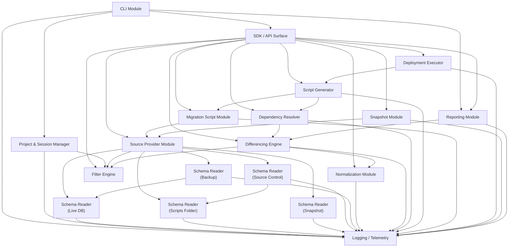

# Core Modules — SQL Compare Clone

> **These are research notes about REDGATE SQL Compare, not documentation of
> DbDelta.** They were written before this project had code, by
> reverse-engineering a tool we wanted to match, and they name switches, paths
> and binaries that are Redgate's: `sqlcompare.exe`, `--abort-on-warnings`,
> `RedGate.SQLCompare.Engine.dll`. **Do not build a pipeline from anything
> here.** What DbDelta actually does is at
> <https://gitbakko.github.io/db-delta/>; what is still open is
> `docs/BACKLOG.md`.

**Document version**: 1.0  
**Date**: 2026-05-20  
**Scope**: Logical component specification for every module that makes up the SQL Compare clone engine and host shells.

---

## Table of Contents

1. [Source Provider Module](#1-source-provider-module)
2. [Schema Reader — Live Database](#2-schema-reader-module--live-database)
3. [Schema Reader — Scripts Folder](#3-schema-reader-module--scripts-folder)
4. [Schema Reader — Snapshot](#4-schema-reader-module--snapshot)
5. [Schema Reader — Source Control](#5-schema-reader-module--source-control)
6. [Schema Reader — Backup](#6-schema-reader-module--backup)
7. [Normalization Module](#7-normalization-module)
8. [Differencing Engine](#8-differencing-engine)
9. [Dependency Resolver](#9-dependency-resolver)
10. [Script Generator](#10-script-generator)
11. [Migration Script Module](#11-migration-script-module)
12. [Deployment Executor](#12-deployment-executor)
13. [Project and Session Manager](#13-project-and-session-manager)
14. [Filter Engine](#14-filter-engine)
15. [Snapshot Module](#15-snapshot-module)
16. [CLI Module](#16-cli-module)
17. [SDK / API Surface](#17-sdk--api-surface)
18. [Reporting Module](#18-reporting-module)
19. [Logging, Telemetry, and Error Reporting](#19-logging-telemetry-and-error-reporting)
20. [Module Dependency Graph](#20-module-dependency-graph)

---

## 1. Source Provider Module

### Responsibility

The Source Provider Module is the single point of abstraction that presents all five supported schema source kinds — live database, scripts folder, snapshot file, source control revision, and database backup — behind a uniform `ISchemaSource` interface. Consumers of the engine never branch on source kind; they call `Load()` and receive a populated `ObjectModel`. The module also owns the provider registry, capability negotiation, and connection lifecycle for live sources.

### Public API

```csharp
namespace SqlCompare.Engine.Sources
{
    /// <summary>
    /// Capability flags that describe what a provider can do beyond read-only schema load.
    /// </summary>
    [Flags]
    public enum SourceCapabilities
    {
        None              = 0,
        ReadSchema        = 1 << 0,   // mandatory for all providers
        WriteSchema       = 1 << 1,   // can accept a generated script and execute it
        SupportsDeploy    = 1 << 2,   // can be used as a deployment target
        SupportsSnapshot  = 1 << 3,   // can produce a snapshot from itself
        SupportsMakeScripts = 1 << 4, // can produce a scripts folder from itself
        SupportsMigrations = 1 << 5,  // Custom Scripts subdirectory is applicable
        CaseSensitive     = 1 << 6,   // source has case-sensitive object names
    }

    /// <summary>
    /// Load options threaded through to every provider.
    /// </summary>
    public sealed class LoadOptions
    {
        public ComparisonOptions Options { get; init; } = ComparisonOptions.Default;
        public ObjectFilter?     Filter  { get; init; }
        public CancellationToken Cancel  { get; init; }
        public IProgress<LoadProgress>? Progress { get; init; }
    }

    public readonly record struct LoadProgress(string Phase, int Percent);

    /// <summary>
    /// Core abstraction — every provider implements this.
    /// </summary>
    public interface ISchemaSource : IAsyncDisposable
    {
        /// <summary>Unique display name for UI and logging.</summary>
        string DisplayName { get; }

        SourceCapabilities Capabilities { get; }

        /// <summary>
        /// Load the full schema model. May be called once per source instance.
        /// Implementations must be thread-safe with respect to the returned model.
        /// </summary>
        Task<ObjectModel> LoadAsync(LoadOptions options);

        /// <summary>
        /// True once LoadAsync completed successfully.
        /// </summary>
        bool IsLoaded { get; }

        /// <summary>
        /// The server version/compatibility level discovered during load.
        /// Available only after LoadAsync completes.
        /// </summary>
        SqlServerVersion? ServerVersion { get; }
    }

    /// <summary>
    /// Factory + registry. Call Register() at startup for each provider assembly.
    /// </summary>
    public interface ISourceProviderRegistry
    {
        void Register<TProvider>(string kindToken) where TProvider : ISchemaSource;

        /// <summary>Build a source from a strongly-typed descriptor.</summary>
        ISchemaSource Create(SourceDescriptor descriptor);

        IReadOnlyList<string> RegisteredKinds { get; }
    }

    /// <summary>
    /// Discriminated union written as an abstract base with concrete subtypes.
    /// Serializable for project files.
    /// </summary>
    public abstract record SourceDescriptor
    {
        public sealed record LiveDatabase(
            string Server, string Database,
            AuthMode Auth, string? UserName, string? Password,
            bool TrustServerCertificate = false,
            int ConnectTimeoutSeconds   = 30) : SourceDescriptor;

        public sealed record ScriptsFolder(
            string RootPath,
            bool   IgnoreCaseSensitivity = false) : SourceDescriptor;

        public sealed record SnapshotFile(string FilePath) : SourceDescriptor;

        public sealed record SourceControl(
            string RepositoryXmlPath,
            string? Revision,
            string? VcUserName, string? VcPassword) : SourceDescriptor;

        public sealed record BackupFile(
            string[] FilePaths,          // multi-file backup sets
            string[]? Passwords,         // decryption passwords tried in order
            int? BackupSetOrdinal)        // which set in a multi-set media
            : SourceDescriptor;

        public sealed record EmptyDatabase : SourceDescriptor;    // /empty2
    }
}
```

### Inputs

- A `SourceDescriptor` subtype specifying connectivity parameters.
- `LoadOptions` with comparison flags, object filter, cancellation, and progress sink.

### Outputs

- An `ObjectModel` — the canonical in-memory domain graph of all schema objects.
- `ServerVersion` discoverable after load for version-feature gating downstream.

### Internal Design

**Provider Registry**  
A static dictionary `Dictionary<string, Func<SourceDescriptor, ISchemaSource>>` maps kind tokens (`"LiveDatabase"`, `"ScriptsFolder"`, etc.) to factory lambdas. Each provider assembly registers itself via `ISourceProviderRegistry.Register<T>()` called from its module initializer. No reflection-based auto-discovery: every provider must be explicitly registered at host startup to keep startup time deterministic.

**Connection Pooling for Live Database**  
The `LiveDatabaseSource` maintains a single `SqlConnection` per source instance (not per-query). The connection is opened lazily during `LoadAsync` and closed in `DisposeAsync`. Schema-reading queries reuse the same connection. If the caller needs the source for a deployment step later, they hold the instance alive and the connection is kept open. For parallelized batch reads, the reader spawns additional short-lived connections from the same `SqlConnectionStringBuilder`.

**Capability Negotiation**  
Before calling `LoadAsync`, consumers may inspect `Capabilities` to branch behavior (e.g., the Deployment Executor checks `SupportsDeploy` before treating a source as a target). The provider sets capabilities in its constructor based on the descriptor — `ScriptsFolderSource` is read-only unless the caller also holds a live deployment target.

### Edge Cases

| Scenario | Handling |
|---|---|
| Cross-version compatibility (e.g., load a SQL 2008 DB into SQL 2022 engine) | `ServerVersion` is discovered during load; Normalization Module gates feature-specific objects by version. Provider exposes `ServerVersion` so downstream modules can skip 2012+ catalog columns. |
| Permission deficit — `VIEW DEFINITION` missing | `LiveDatabaseSource` runs a pre-flight permission check against `fn_my_permissions` and `HAS_PERMS_BY_NAME`. Missing `VIEW DEFINITION` is surfaced as `LoadWarning.InsufficientPermission`; the partial model is still returned with affected objects flagged `DefinitionUnavailable`. |
| Encrypted objects (WITH ENCRYPTION) | If `DecryptEncryptedObjects` option is set, the live reader calls `OBJECT_DEFINITION()` which returns NULL for encrypted objects without the DAC; the provider then attempts DAC fallback and, if that also fails, marks the object `DefinitionEncrypted`. The `DecryptPost2KEncryptedObjects` option is the default and uses an internal decryption path that requires sysadmin. |
| Partial load (filter applied) | The `ObjectFilter` passed via `LoadOptions` is pushed down into catalog queries (WHERE predicates) where possible for performance. Objects excluded by the filter are never instantiated in the model. |
| Network interruption mid-load | `SqlException` during a batch read is caught; the reader retries once with exponential back-off (200 ms, 400 ms) then rethrows wrapped in `SourceLoadException`. |

### Test Strategy

- Unit tests: mock `IDbConnection` + `IDbCommand` via an interface seam; verify that each provider issues the correct catalog queries and maps rows to domain objects.
- Integration tests: use SQL Server LocalDB instances at each supported version (2014, 2016, 2017, 2019, 2022) with a fixture database containing one object of every supported type.
- Contract test: all providers must return an `ObjectModel` that passes `ObjectModelValidator.AssertConsistent()` (no dangling references, no duplicate identity tuples).

---

## 2. Schema Reader Module — Live Database

### Responsibility

Reads the schema of a live SQL Server instance (any edition from 2008 through Azure SQL) by issuing direct catalog queries. Returns structured data that the Source Provider wraps as a provider-agnostic load result. This module does NOT use SMO — it issues raw T-SQL against the `sys.*` catalog views for speed and fine-grained control over what is fetched and in what order.

### Why Not SMO

SMO's object model is convenient but has serious performance drawbacks at scale. SMO fetches each object's properties lazily, generating one round-trip per property access when iterating a collection naively. For a database with 2,000 stored procedures, SMO can issue tens of thousands of round-trips. Direct catalog queries against `sys.sql_modules`, `sys.objects`, `sys.columns`, etc. allow a schema reader to retrieve the entire stored-procedure set — definitions included — in a handful of batch queries using a single `SqlDataReader` stream. Additionally, SMO wraps some catalog views in ways that hide information (e.g., SMO does not expose `sys.system_internals_partitions`). Direct queries give complete control over the SQL Server version-feature gate as well: a 2008-era query path never references `sys.security_policies` (added in 2016).

### Catalog Query Strategy

The reader operates in three phases:

**Phase 1 — Metadata skeleton (parallel batches, one connection per kind group)**  
Objects are fetched by kind in parallel batches. The concurrency level defaults to `min(objectKindCount, 8)` parallel connections. Each batch issues a single set-based query that returns all objects of that kind in one result set.

```sql
-- Example: tables batch
SELECT
    t.object_id,
    s.name          AS schema_name,
    t.name          AS table_name,
    t.type,
    t.create_date,
    t.modify_date,
    OBJECTPROPERTY(t.object_id, 'TableHasIdentity')    AS has_identity,
    OBJECTPROPERTY(t.object_id, 'TableHasRowGuidCol')  AS has_rowguidcol,
    t.is_ms_shipped,
    t.is_replicated
FROM sys.tables t
JOIN sys.schemas s ON s.schema_id = t.schema_id
WHERE t.is_ms_shipped = 0  -- pushed-down filter example
```

Object kind groups and their primary catalog views:

| Kind Group | Primary Catalog View(s) |
|---|---|
| Tables | `sys.tables`, `sys.columns`, `sys.computed_columns`, `sys.identity_columns` |
| Indexes | `sys.indexes`, `sys.index_columns`, `sys.stats` |
| Constraints | `sys.check_constraints`, `sys.default_constraints`, `sys.key_constraints`, `sys.foreign_keys`, `sys.foreign_key_columns` |
| Views | `sys.views`, `sys.sql_modules` |
| Programmability | `sys.procedures`, `sys.triggers`, `sys.sql_modules`, `sys.assembly_modules` |
| Functions | `sys.objects` (FN/IF/TF types), `sys.sql_modules` |
| Types | `sys.types`, `sys.table_types`, `sys.assembly_types` |
| Schemas | `sys.schemas` |
| Security | `sys.database_principals`, `sys.database_permissions`, `sys.database_role_members` |
| Extended Properties | `sys.extended_properties` |
| Full-Text | `sys.fulltext_catalogs`, `sys.fulltext_indexes`, `sys.fulltext_index_columns` |
| Partitioning | `sys.partition_functions`, `sys.partition_schemes`, `sys.partition_range_values` |
| Service Broker | `sys.service_queues`, `sys.services`, `sys.contracts`, `sys.routes` |
| Synonyms | `sys.synonyms` |
| Sequences | `sys.sequences` (2012+) |
| Security Policies | `sys.security_policies`, `sys.security_predicates` (2016+) |
| Temporal | `sys.periods` (2016+) |

**Phase 2 — DDL retrieval for module objects**  
For views, stored procedures, functions, triggers, and DML event notifications, the reader fetches full definitions. Preference order:

1. `sys.sql_modules.definition` — single query, returns full definition, does NOT split at 4000 chars (unlike `sp_helptext`). This is the preferred path.
2. `OBJECT_DEFINITION(object_id)` — equivalent for most objects; used as a cross-check or when `sys.sql_modules` is unavailable (e.g., some Azure tiers).
3. `sp_helptext` — never used; it fragments output into 255-char rows and requires re-joining with off-by-one risk. It remains listed here only to document the rejection decision.

```sql
SELECT m.object_id, m.definition, m.uses_ansi_nulls, m.uses_quoted_identifier
FROM sys.sql_modules m
JOIN sys.objects o ON o.object_id = m.object_id
WHERE o.type IN ('P','V','FN','IF','TF','TR','RF')
  AND o.is_ms_shipped = 0
```

**Phase 3 — Permissions resolution**  
Permissions are fetched from `sys.database_permissions` joined with `sys.database_principals` and `sys.objects`. The query is version-gated: on Azure SQL, some `class_desc` values differ and `sys.server_principals` is unavailable.

### Version-Feature Gating

```csharp
internal sealed class VersionGate
{
    public bool Supports(SqlServerVersion v, ServerFeature feature) => feature switch
    {
        ServerFeature.Sequences          => v >= SqlServerVersion.Sql2012,
        ServerFeature.TemporalTables     => v >= SqlServerVersion.Sql2016,
        ServerFeature.SecurityPolicies   => v >= SqlServerVersion.Sql2016,
        ServerFeature.DynamicDataMasking => v >= SqlServerVersion.Sql2016,
        ServerFeature.SensitivityClassification => v >= SqlServerVersion.Sql2019,
        ServerFeature.LedgerTables       => v >= SqlServerVersion.Sql2022,
        _ => throw new ArgumentOutOfRangeException(nameof(feature))
    };
}
```

Queries that reference version-gated catalog views are conditionally appended to the batch based on the gate result. The version is determined in a pre-flight query: `SELECT SERVERPROPERTY('ProductMajorVersion'), SERVERPROPERTY('EngineEdition')`.

### Special Schema Elements

**Computed Columns**  
`sys.computed_columns` provides `definition`, `is_persisted`, `is_nullable`. The reader also checks `sys.columns` for the same `column_id` to capture storage properties on persisted computed columns.

**Partitioning and Filegroups**  
Partition functions, schemes, and the physical filegroup allocation are read from `sys.partition_functions`, `sys.partition_range_values`, `sys.partition_schemes`, and `sys.destination_data_spaces`. The `IgnoreFileGroups` option controls whether this data is materialized into the domain model or discarded.

**Sparse Columns and Column Sets**  
`sys.columns.is_sparse`, `sys.columns.is_column_set` are read in the columns batch.

**Temporal (System-Versioned) Tables**  
`sys.periods` provides `period_type`, `start_column_id`, `end_column_id`. The history table is discovered via `sys.tables.history_table_id` (2016+). Both the current table and its history table are loaded; the differencing engine treats them as a pair.

### Edge Cases

| Scenario | Handling |
|---|---|
| DENY CREATE on the login but VIEW DEFINITION granted | Pre-flight checks `HAS_PERMS_BY_NAME(NULL,'DATABASE','VIEW DEFINITION')`. If false, marks each object as `DefinitionUnavailable` and continues skeleton load. |
| Orphaned objects — object exists in `sys.objects` but `sys.sql_modules.definition` is NULL | Logged as `LoadWarning.OrphanedObject`. Object is included in model with `IsOrphaned = true`; the differencing engine will surface it. |
| Corrupted metadata (internal inconsistency, rare after DBCC repair) | Any exception during row mapping is caught per-object. The bad row is skipped, logged, and a `LoadWarning.MetadataReadFailure` is emitted with the `object_id`. |
| Cross-database references in view/procedure definitions | Noted but not resolved at read time. The Dependency Resolver handles cross-db references as `ExternalReference` nodes (unresolvable). |

### Test Strategy

- Use embedded SQL Server LocalDB at versions 2014–2022 with a fixture database seeded by a reference script.
- Assert that the object count from catalog matches object count in the returned `ObjectModel`.
- Test version gating by creating a reader against a mocked `SqlServerVersion` and verifying that version-gated queries are included or excluded correctly.
- Test encrypted object handling with a procedure created `WITH ENCRYPTION`.

---

## 3. Schema Reader Module — Scripts Folder

### Responsibility

Walks a directory tree that follows the scripts-folder convention (one `.sql` file per database object, organized into per-type subdirectories) and produces an `ObjectModel` equivalent to what the Live Database reader would produce for the same schema. It is the primary "offline" source for schema comparison in CI pipelines.

### Directory Layout

A scripts folder produced by SQL Compare follows this structure:

```
<root>/
  _SchemaFolder.xml          # Metadata: tool version, DB name, creation date
  Custom Scripts/
    Pre-Deployment/
      001_pre_deploy.sql
    Post-Deployment/
      001_post_deploy.sql
  Schemas/
    dbo.sql
    sales.sql
  Tables/
    dbo.Customers.sql
    dbo.Orders.sql
  Views/
    dbo.CustomerSummary.sql
  Stored Procedures/
    dbo.usp_GetCustomer.sql
  Functions/
    dbo.fn_CalcTax.sql
  Triggers/
    dbo.trg_AuditInsert.sql
  Indexes/                    # separate files only when ForceColumnOrder rebuilds
  Constraints/
  Types/
    User Defined Data Types/
    XML Schema Collections/
  Security/
    Schemas/
    Users/
    Roles/
  Sequences/
  Synonyms/
  Full-Text Catalogs/
  Assemblies/
```

The `_SchemaFolder.xml` metadata file contains:

```xml
<SchemaFolder version="16.0" createdBy="SQLCompare" databaseName="MyDB"
              serverVersion="16" collation="SQL_Latin1_General_CP1_CI_AS"
              caseSensitive="false" />
```

### Walker

```csharp
internal sealed class ScriptsFolderWalker
{
    /// <summary>
    /// Returns ordered enumeration of (objectKind, filePath) pairs.
    /// Ordering: Schemas → Types → Tables → Constraints → Indexes →
    ///           Views → Programmability → Permissions → Extensions.
    /// Within each kind: alphabetical by file name (schema.name.sql).
    /// </summary>
    IEnumerable<(ObjectKind Kind, string FilePath)> Walk(string rootPath);
}
```

**File ordering matters** because some parsers rely on it to assign schema membership. The walker uses the hard-coded dependency-safe ordering above so that schemas exist before tables, tables before views, etc. When a file does not match any known subdirectory name, it is reported as `LoadWarning.UnrecognizedScriptFile` and skipped.

**Encoding detection**  
Files are opened with `StreamReader` using `detectEncodingFromByteOrderMarks: true`. If a BOM is present, it is honored. If no BOM, UTF-8 is assumed. Files with a `\0` byte in the first 512 bytes are treated as binary and skipped with a warning.

**Case-insensitive file systems**  
On Windows (NTFS, case-insensitive by default), object name collisions that differ only in case are impossible at the FS level. On Linux (ext4, case-sensitive by default), two files `dbo.Customer.sql` and `dbo.customer.sql` can coexist. The walker detects this by computing a case-folded name set; any collision emits `LoadWarning.CaseCollision` and uses the first file in lexicographic order.

### Parser

Each `.sql` file is parsed with `Microsoft.SqlServer.TransactSql.ScriptDom` (ScriptDOM), the open-source Microsoft T-SQL parser. ScriptDOM is version-aware: the parser is instantiated as `TSql160Parser(initialQuotedIdentifiers: true)` by default, but callers may specify a lower version parser if the metadata file declares an older `serverVersion`.

```csharp
internal sealed class ScriptFileParser
{
    private readonly TSqlParser _parser;

    public ScriptParseResult Parse(string filePath, string content)
    {
        using var reader = new StringReader(content);
        var fragment = _parser.Parse(reader, out IList<ParseError> errors);

        if (errors.Count > 0 && !_options.IgnoreParserErrors)
            throw new ScriptParseException(filePath, errors);

        var visitor = new CreateStatementVisitor();
        fragment.Accept(visitor);

        return new ScriptParseResult(visitor.ExtractedObjects, errors);
    }
}

internal sealed class CreateStatementVisitor : TSqlFragmentVisitor
{
    public override void Visit(CreateTableStatement node)    => ExtractTable(node);
    public override void Visit(CreateViewStatement node)     => ExtractView(node);
    public override void Visit(CreateProcedureStatement node)=> ExtractProcedure(node);
    // ... one override per CREATE statement type
}
```

**Header parsing**  
SQL Compare sometimes emits a comment header at the top of generated scripts with metadata:

```sql
/*
    Object: StoredProcedure [dbo].[usp_GetCustomer]
    Date: 2025-01-15
*/
```

The parser extracts this header (if present) to validate that the file name matches the declared object. Mismatches emit `LoadWarning.FileObjectNameMismatch`.

**Numbered stored procedures**  
Files containing numbered stored procedures (`CREATE PROCEDURE foo;1`) are not supported. If encountered, the file is skipped with `LoadWarning.NumberedProcedureUnsupported`.

**CLR assemblies**  
`CREATE ASSEMBLY` statements with an inline `FROM 0x...` hex blob are parsed. The hex blob is decoded and stored as a `byte[]` in the domain model.

**Certificates, symmetric keys, asymmetric keys**  
Not supported in scripts folders. Files generating these objects in `Security/` are logged as `LoadWarning.UnsupportedObjectType` and skipped.

### Edge Cases

| Scenario | Handling |
|---|---|
| Malformed T-SQL (e.g., truncated file) | ScriptDOM parse errors are collected; `IgnoreParserErrors` option swallows them and returns partial model; otherwise `ScriptParseException` is thrown (CLI exit code 62). |
| Dialect drift — SQL 2022 syntax in a file consumed with SQL 2016 parser | The parser version is set from `_SchemaFolder.xml`; if the file contains new syntax, ScriptDOM parse errors are raised. The reader falls back to `TSql160Parser` when the metadata version is absent. |
| BOM / mixed line endings (CRLF vs LF) | `StreamReader` normalizes line endings. BOM is stripped before parse. |
| Third-party tool-generated scripts folder | `_SchemaFolder.xml` absent or `createdBy` != `"SQLCompare"`: a `LoadWarning.UnrecognizedScriptsFolderFormat` is emitted but load continues. |

### Test Strategy

- Golden-file tests: produce a scripts folder from a known database, load it with this reader, and assert the `ObjectModel` equals the model produced by the Live DB reader on the same database.
- Malformed-file tests: inject corrupted SQL files and verify warnings are emitted rather than exceptions when `IgnoreParserErrors` is set.
- Encoding tests: BOM UTF-8, UTF-16LE, UTF-16BE, no-BOM UTF-8.

---

## 4. Schema Reader Module — Snapshot

### Responsibility

Deserializes a `.snp` snapshot file written by the Snapshot Module back into an `ObjectModel`. Snapshots are a point-in-time, read-only, offline representation of a database schema — they contain no live connectivity and cannot be used as a deployment target.

### File Format

A snapshot is a compressed binary container (internally a ZIP/deflate stream) that wraps an XML document. The outer shell stores:

- A format version number (integer, monotonically increasing across product versions).
- A CRC-32 checksum of the inner XML payload for corruption detection.
- The compressed XML body.

The XML body follows a schema that mirrors the `ObjectModel` structure: one XML element per domain object, with attributes for properties and nested elements for child collections (columns under tables, parameters under procedures, etc.).

```xml
<Snapshot version="16" databaseName="MyDB" serverVersion="15"
          collation="SQL_Latin1_General_CP1_CI_AS"
          createdAt="2026-01-15T09:30:00Z"
          toolVersion="16.0.5.12345">
  <Tables>
    <Table schema="dbo" name="Customers" objectId="00000001">
      <Columns>
        <Column name="CustomerID" dataType="int" isNullable="false"
                isIdentity="true" identitySeed="1" identityIncrement="1" />
        <Column name="Name" dataType="nvarchar" maxLength="200" isNullable="false" />
      </Columns>
      <PrimaryKey name="PK_Customers" ... />
    </Table>
  </Tables>
  <StoredProcedures>
    <StoredProcedure schema="dbo" name="usp_GetCustomer">
      <Definition><![CDATA[CREATE PROCEDURE [dbo].[usp_GetCustomer] ...]]></Definition>
    </StoredProcedure>
  </StoredProcedures>
</Snapshot>
```

### Version Negotiation

```csharp
internal sealed class SnapshotDeserializer
{
    public ObjectModel Deserialize(string filePath)
    {
        using var zip = OpenZipStream(filePath);         // decompress
        VerifyChecksum(zip);                              // CRC check
        var doc = XDocument.Load(zip.XmlStream);

        int formatVersion = (int)doc.Root!.Attribute("version")!;

        if (formatVersion > CurrentFormatVersion)
            throw new SnapshotVersionException(
                $"Snapshot version {formatVersion} requires a newer tool " +
                $"(current max: {CurrentFormatVersion}).");

        // Route to the correct deserializer for the format version.
        ISnapshotVersionDeserializer vd = formatVersion switch
        {
            <= 12 => new SnapshotDeserializerV12(),
            <= 14 => new SnapshotDeserializerV14(),
            _     => new SnapshotDeserializerV16(),
        };

        return vd.Deserialize(doc);
    }
}
```

Each versioned deserializer handles the XML shape for that product generation. Backward compatibility is maintained indefinitely (old snapshots always load); forward compatibility is not guaranteed (snapshots from newer product versions raise `SnapshotVersionException`).

### Edge Cases

| Scenario | Handling |
|---|---|
| Snapshot from a newer tool version | `SnapshotVersionException` with a clear upgrade message. Exit code 65. |
| Corrupted file (CRC mismatch) | `SnapshotCorruptedException` after CRC verification. |
| Truncated file (incomplete download) | ZIP decompression failure is caught and rethrown as `SnapshotCorruptedException`. |
| Missing fields in older snapshot format | Versioned deserializers apply default values for fields introduced after their era. |

### Test Strategy

- Roundtrip test: `Live DB → Snapshot Module → write → SnapshotReader → ObjectModel` — assert model equality.
- Corruption test: flip random bytes in the compressed payload; assert `SnapshotCorruptedException`.
- Version compat test: load snapshots from version fixtures 12, 14, and 16.

---

## 5. Schema Reader Module — Source Control

### Responsibility

Provides schema from a specific revision of a source-controlled scripts folder without requiring the user to manually check out that revision. The module supports TFS (TFVC), Subversion (SVN), and Git working trees. Under the hood, it either shells out to the VCS client or uses a native library to materialize the scripts folder at the requested revision into a temp directory, then delegates to the Scripts Folder Reader.

### Architecture Decision: Delegate to Scripts Folder Reader

Rather than implement a parallel object-loading path, the Source Control reader materializes the scripts into a temp directory and invokes `ScriptsFolderReader`. This keeps the parsing logic in one place and ensures both sources produce identical `ObjectModel` shapes.

```
SourceControlSource.LoadAsync()
  │
  ├─ VcsClient.Checkout(revision, tempDir)   // shells out or uses libgit2sharp
  │
  └─ ScriptsFolderReader.LoadAsync(tempDir, options)
       (temp directory cleaned up in DisposeAsync)
```

### VCS Clients

```csharp
internal interface IVcsClient : IDisposable
{
    /// <summary>
    /// Materialize the scripts folder at the given revision into destDir.
    /// Revision formats: HEAD, trunk/branch, r12345 (SVN), 40-char SHA (Git).
    /// </summary>
    Task CheckoutAsync(string repoXmlPath, string revision,
                       string destDir, VcsCredentials? creds,
                       CancellationToken ct);
}

internal sealed class GitVcsClient : IVcsClient     // uses LibGit2Sharp
internal sealed class SvnVcsClient : IVcsClient     // shells out to svn.exe
internal sealed class TfsVcsClient : IVcsClient     // uses TF.exe or TFS client SDK
```

**Git specifics**: `LibGit2Sharp` is used for Git to avoid a dependency on the `git` binary. The operation is `Repository.Checkout(revision, destDir)` — a sparse checkout of the subfolder if the repo root differs from the scripts folder root.

**SVN/TFS specifics**: CLI delegation (`svn export`) is acceptable because these VCS types are less common in modern pipelines.

### Edge Cases

| Scenario | Handling |
|---|---|
| Dirty working tree (unstaged changes) | The materialization always uses the explicit `revision` parameter. A `HEAD` revision with unstaged changes will include them if a working-tree checkout is done. The CLI switch `/Revision1:HEAD` therefore means the committed HEAD, not the working tree — a new `WorkingTree` pseudo-revision is defined for that case. |
| Merge markers in files (`<<<<<<< HEAD`) | ScriptDOM will fail to parse the file. `ScriptParseException` or `LoadWarning.MergeMarkerDetected` is emitted. |
| Mixed line endings across platforms | Handled by the Scripts Folder Reader's encoding normalization. |
| VCS credentials stored in `_ScriptsFolderXML` file | Credentials are read from the XML file path referenced by `/ScriptsFolderXML` CLI switch. Passwords are never stored in the project file in clear text (AES-encrypted at rest). |

### Test Strategy

- Integration test: use an in-process Git repository (LibGit2Sharp + temp directory) with a known commit graph; verify the correct revision is loaded.
- Working-tree dirty test: assert `HEAD` revision loads the committed version, not the modified working copy.

---

## 6. Schema Reader Module — Backup

### Responsibility

Extracts the schema of a database from a SQL Server backup file (`.bak` or `.sqb`) without performing a full restore. This is the most technically complex source kind because SQL Server does not offer a native API for schema extraction from a backup stream — a full or partial restore is normally required.

### Approach Options and Trade-off Analysis

**Option A — Full restore to a temporary database (chosen approach for correctness)**  
The reader restores the backup to a dedicated `[SqlCompare_Temp_<guid>]` database on a user-specified or auto-discovered SQL Server instance, then delegates to the Live Database Reader, then drops the temp database.

- **Pros**: 100% fidelity — every object type is available. No custom backup-stream parsing.
- **Cons**: Requires a SQL Server instance with sufficient disk space and `CREATE DATABASE` permission. The restore can be slow for large databases.
- **Mitigation**: The reader issues `RESTORE DATABASE ... WITH NORECOVERY, STATS=5` for progress reporting, and cleans up the temp DB in `DisposeAsync` even if `LoadAsync` throws.

**Option B — Metadata-only virtual restore (partial, best-effort)**  
Some third-party products (e.g., Redgate SQL Virtual Restore) implement a virtual restore that mounts a backup read-only without writing data files. The schema can then be read via normal catalog queries against the mounted VDB.  
If such a driver is available and registered, `BackupSource` will prefer it. This avoids disk space cost and is faster.

**Option C — Backup stream parsing (not implemented)**  
Parsing `.bak` files requires understanding the Microsoft Tape Format (MTF) used by SQL Server native backups. The VDI (Virtual Device Interface) SDK provides a documented C/C++ API for reading backup streams, but it is not available from .NET without P/Invoke and is notoriously underdocumented. This path is explicitly deferred.

```csharp
internal sealed class BackupSchemaReader
{
    public async Task<ObjectModel> LoadAsync(
        string[] backupFilePaths, string[]? passwords,
        int? backupSetOrdinal, LoadOptions options)
    {
        string tempDbName = $"SqlCompare_Temp_{Guid.NewGuid():N}";
        string restoreServer = _config.TempRestoreServer
                              ?? await DiscoverLocalInstanceAsync();

        try
        {
            await RestoreTempDatabaseAsync(
                restoreServer, tempDbName,
                backupFilePaths, passwords, backupSetOrdinal,
                options.Cancel, options.Progress);

            var liveConn = new SourceDescriptor.LiveDatabase(
                restoreServer, tempDbName,
                AuthMode.IntegratedSecurity, null, null);

            using var liveSource = _registry.Create(liveConn);
            return await liveSource.LoadAsync(options);
        }
        finally
        {
            await DropTempDatabaseAsync(restoreServer, tempDbName);
        }
    }

    private async Task RestoreTempDatabaseAsync(...)
    {
        // Build RESTORE DATABASE statement with MOVE clauses
        // to redirect data/log files to the temp folder.
        // Use RESTORE FILELISTONLY first to discover logical names.
        // RESTORE DATABASE [tempDbName]
        //   FROM DISK = N'path' [, DISK = N'path2' ...]
        //   WITH MOVE N'LogicalData' TO N'C:\Temp\<guid>.mdf',
        //        MOVE N'LogicalLog'  TO N'C:\Temp\<guid>.ldf',
        //        NORECOVERY, STATS = 5, REPLACE
        // followed by RESTORE DATABASE [tempDbName] WITH RECOVERY
    }
}
```

**Metadata pre-read**  
Before committing to a full restore, the reader issues `RESTORE HEADERONLY` and `RESTORE FILELISTONLY` to:
- Confirm the backup is readable and report its creation timestamp.
- Discover the logical file names needed for MOVE clauses.
- Identify the backup set ordinal when the media contains multiple sets.
- Detect encryption (header flag `HasEncryptedMetadata`) and prompt for a password.
- Verify compressed backups (Redgate `.sqb` format requires `SqlBackupAndFTP.dll` or the SQL Backup COM interop; native `.bak` compression is handled by SQL Server transparently).

### Edge Cases

| Scenario | Handling |
|---|---|
| Compressed backup (native SQL Server backup compression) | Transparent to the restore command — SQL Server handles it. `RESTORE HEADERONLY` will report `Compressed = 1`. |
| Encrypted backup (TDE or Redgate encryption) | `RESTORE HEADERONLY` reports `EncryptorType`. TDE-encrypted databases require the certificate to be present on the restore target. Redgate-encrypted `.sqb` files require the password from `/BackupPasswords1`. |
| Multi-file backup sets | All files are passed to `FROM DISK = N'file1', DISK = N'file2'`. `RESTORE FILELISTONLY` is run against all files together. |
| Partial backups | `RESTORE HEADERONLY` `DatabaseBackupLSN` = 0 implies a full backup. Differential or log backups cannot be used alone — a `BackupInsufficientException` is raised. |
| Backup set selection | `RESTORE HEADERONLY` may return multiple rows. The reader selects `BackupSetOrdinal` as specified, defaulting to the most recent full backup in the media set. |
| Temp DB cleanup failure | Logged at Error level. A background cleanup task is registered for retry on next startup. The temp DB name is recorded in a local registry so orphaned DBs can be found. |

### Test Strategy

- Integration tests: create backups of fixture databases, load via BackupSource, assert model equality with LiveDatabaseSource.
- Encryption test: use a password-protected backup; assert failure on wrong password, success on correct.
- Multi-file test: strip a backup across two files; assert both files required.

---

## 7. Normalization Module

### Responsibility

Transforms the raw `ObjectModel` produced by any provider into a canonical form that is stable across representational differences. Two schemas that are semantically identical but textually different (bracket quoting vs. no brackets, different default-value parenthesization, inherited vs. explicit collation) must normalize to the same canonical form so the Differencing Engine reports no difference.

### Normalizations Applied

**1. Identifier quoting normalization**  
All identifiers are stored in two forms: `RawName` (as found in the source) and `NormalizedName` (unquoted, unescaped). Comparison uses `NormalizedName`. The `IgnoreSquareBrackets` option controls whether `[dbo]` and `dbo` are considered identical (default: yes).

```csharp
internal static class IdentifierNormalizer
{
    public static string Normalize(string identifier, bool stripBrackets = true)
    {
        if (stripBrackets && identifier.StartsWith('[') && identifier.EndsWith(']'))
            return identifier[1..^1].Replace("]]", "]");  // unescape doubled brackets
        if (identifier.StartsWith('"') && identifier.EndsWith('"'))
            return identifier[1..^1].Replace("\"\"", "\"");
        return identifier;
    }
}
```

**2. Default value normalization**  
SQL Server stores default constraint values inconsistently:
- A literal integer default `42` may appear as `(42)` or `42` depending on how it was created.
- A string default `'hello'` may appear as `('hello')`.
- A function call default `getdate()` may appear as `(getdate())` or `(GETDATE())`.

The normalizer:
1. Strips the outermost parentheses if present (SQL Server adds them on retrieval from `sys.default_constraints`).
2. Uppercases all T-SQL keywords (configurable; relevant when `IgnoreWhiteSpace` is set).
3. Collapses whitespace to single spaces.
4. Strips line comments (`--`) and block comments (`/* */`) when `IgnoreComments` option is set.

```csharp
internal sealed class DefaultValueNormalizer
{
    public string Normalize(string raw)
    {
        var s = raw.Trim();
        // Strip outermost parens added by SQL Server catalog layer
        if (s.StartsWith('(') && s.EndsWith(')') && IsBalanced(s[1..^1]))
            s = s[1..^1].Trim();
        if (_options.IgnoreWhiteSpace)
            s = CollapseWhitespace(s);
        if (_options.IgnoreComments)
            s = StripComments(s);
        return s;
    }
}
```

**3. Collation resolution**  
A column without an explicit `COLLATE` clause inherits the database collation. Both representations (explicit `COLLATE SQL_Latin1_General_CP1_CI_AS` and absent collation on a DB with that collation) must compare as equal. Normalization sets `EffectiveCollation` on every character column. If `IgnoreCollations` is set, the field is cleared to `null` before comparison.

**4. Whitespace and comment stripping in module bodies**  
When `IgnoreWhiteSpace` is set, the definition text of views, procedures, functions, and triggers is normalized by the ScriptDOM formatter: the AST is re-serialized with a canonical formatter (`SqlScriptGenerator`) with all whitespace standardized. This is more reliable than regex-based stripping because it respects string literals and quoted identifiers.

**5. WITH ELEMENT ORDER normalization**  
`IgnoreWithElementOrder` causes the normalizer to sort the WITH clause options of procedures and functions alphabetically before comparison. For example, `WITH EXECUTE AS CALLER, RECOMPILE` vs. `WITH RECOMPILE, EXECUTE AS CALLER` compares as equal.

**6. Computed column normalization**  
`is_persisted = false` is the default; explicit `NOT PERSISTED` in DDL is equivalent to the absence of the keyword. The normalizer stores `IsPersisted` as a `bool` and treats absent and explicit-false as the same.

**7. User property normalization**  
When `IgnoreUserProperties` is set, authorization and owner information is cleared from schemas, stored procedures, and other schema-owning objects. Only the unqualified name is retained for matching.

### Inputs

- Raw `ObjectModel` from any provider.
- `ComparisonOptions` (determines which normalizations apply).

### Outputs

- Normalized `ObjectModel` with `NormalizedName`, `EffectiveCollation`, `NormalizedDefinition`, etc. fields populated.

### Algorithms

Normalization is a single-pass transformation over the object graph. For module bodies (views, procs, etc.), the ScriptDOM re-serialization is the most expensive step — approximately O(n × d) where n is the number of modules and d is the average definition length. The formatter call is parallelized across object kinds with `Parallel.ForEach` using a degree equal to `Environment.ProcessorCount / 2`.

### Edge Cases

| Scenario | Handling |
|---|---|
| Collation inherited but DB collations differ | `EffectiveCollation` is set from each source's own database-level collation. If the two sources have different DB collations, columns without explicit `COLLATE` will differ in `EffectiveCollation` — this is a legitimate difference, not a false positive. `IgnoreCollations` can suppress it. |
| Default value refers to an inline function not in standard forms | The normalizer does not evaluate default expressions; it normalizes syntactically. If two defaults are semantically equivalent but syntactically different in a non-trivial way, they will be reported as different. This is a known limitation. |

---

## 8. Differencing Engine

### Responsibility

Compares two normalized `ObjectModel` instances (source and target) and produces a `ComparisonResult` listing every object that is present in one source but not the other (Missing/Additional), or present in both but with different properties (Different). Objects that are identical in both sources are listed as Identical.

### Pairing Algorithm

Objects are paired by a **normalized identity tuple**: `(schema, name, objectKind)`. Lookup is O(1) via `Dictionary<ObjectIdentity, DomainObject>` keyed by the normalized identity, built once per model load.

```csharp
internal sealed class ObjectIdentity : IEquatable<ObjectIdentity>
{
    public string NormalizedSchema { get; }
    public string NormalizedName   { get; }
    public ObjectKind Kind         { get; }

    // Equality uses OrdinalIgnoreCase by default.
    // When UseCaseSensitiveObjectDefinition option is set, Ordinal is used.
}
```

For paired objects, property-level comparison is delegated to per-kind comparators:

```csharp
internal interface IObjectComparator
{
    ObjectKind AppliesTo { get; }
    DifferenceDetail Compare(DomainObject source, DomainObject target,
                             ComparisonOptions options);
}
```

Each comparator returns a `DifferenceDetail` with a list of `PropertyDifference` records: `(PropertyName, SourceValue, TargetValue)`.

**Property comparison per kind (examples)**:

- **Table**: column list (including order when `ForceColumnOrder` is set), check constraints, indexes, foreign keys, triggers, temporal period columns, ledger type.
- **Stored Procedure**: normalized definition text, `EXECUTE AS`, `WITH RECOMPILE`, parameter list.
- **Index**: column list, included columns, `ONLINE`, `FILL FACTOR`, `WHERE` predicate (filtered index), `ONLINE` flag.
- **Foreign Key**: referenced table, column mapping, `ON DELETE`/`ON UPDATE` actions, `WITH NOCHECK` flag.

### Three-Way Diff

Three-way diff for source-control merges is **not implemented**. SQL Compare is a two-source tool. Source-control merge conflicts are resolved by the VCS tool before SQL Compare sees the result. This is a deliberate scope decision.

### Output

```csharp
public sealed class ComparisonResult
{
    public IReadOnlyList<DifferenceItem> Items { get; }

    // Convenience projections
    public IEnumerable<DifferenceItem> Different   => Items.Where(i => i.Status == DifferenceStatus.Different);
    public IEnumerable<DifferenceItem> Missing      => Items.Where(i => i.Status == DifferenceStatus.MissingInTarget);
    public IEnumerable<DifferenceItem> Additional   => Items.Where(i => i.Status == DifferenceStatus.MissingInSource);
    public IEnumerable<DifferenceItem> Identical    => Items.Where(i => i.Status == DifferenceStatus.Identical);

    public ComparisonSummary Summary { get; }  // counts per status per kind
}

public sealed class DifferenceItem
{
    public ObjectIdentity   Identity      { get; }
    public DifferenceStatus Status        { get; }
    public DomainObject?    Source        { get; }
    public DomainObject?    Target        { get; }
    public DifferenceDetail? Detail       { get; }  // null for Missing/Additional
    public bool             IsSelected    { get; set; }  // user selection for deployment
}
```

### Performance

Given a typical enterprise schema of 5,000 objects:
- Dictionary build: O(n), negligible.
- Pairing pass: O(n) — one lookup per source object, one scan of target dict for unpaired objects.
- Property comparison: O(n × p) where p is average property count per kind. For tables, p ≈ column count × column-property count. This is the dominant cost for large schemas.

The property comparison for module bodies (procedures, views) involves a string comparison of `NormalizedDefinition`. This is O(m) per object where m is definition length. Total complexity is O(n × m_avg), handled in under 1 second for typical schemas when running on a modern CPU.

### Edge Cases

| Scenario | Handling |
|---|---|
| Rename detection | Not supported. A renamed object appears as one Missing and one Additional item. Rename detection would require edit-distance matching across all unmatched items, which is expensive and error-prone. |
| Case-only name differences | When `UseCaseSensitiveObjectDefinition` is off, `[dbo].[Customer]` and `[dbo].[customer]` are the same object. When on, they are different. |
| Encoding-only definition differences | After `NormalizedDefinition` normalization (ScriptDOM re-serialization), encoding differences in the stored text are eliminated. |
| Object in source but orphaned in target (e.g., procedure with NULL definition) | `IsOrphaned = true` objects compare as Different from their non-orphaned counterparts. |

### Test Strategy

- Property-based tests: generate random pairs of object models with known differences; assert the difference set matches expectations.
- Performance benchmark: 10,000-object model, assert comparison completes in under 2 seconds.
- Case sensitivity tests: toggle `UseCaseSensitiveObjectDefinition` and assert correct grouping.

---

## 9. Dependency Resolver

### Responsibility

Given a set of `DifferenceItem` objects selected for deployment, computes the safe execution order such that every referenced object exists before the referencing object is created or altered. Outputs an ordered list of `DeploymentAction` objects.

### Dependency Graph Construction

The resolver builds a directed acyclic graph (DAG) where each node is a domain object and each directed edge `A → B` means "A must be deployed before B" (A is a dependency of B; B references A).

Edge sources:

| Dependency Type | Source |
|---|---|
| Foreign key | `sys.foreign_keys` — target table before FK-owning table (in terms of CREATE order: base table before FK constraint) |
| View schemabinding | `sys.sql_expression_dependencies` (class 1) — base tables/functions before schemabinding views |
| Function schemabinding | `sys.sql_expression_dependencies` (class 1) — referenced types/tables before schemabinding function |
| Computed column referencing UDF | `sys.computed_columns.definition` parsed for function references |
| Default constraint using scalar function | `sys.default_constraints.definition` parsed for function references |
| Type hierarchy | User-defined types referencing base types |
| Synonym target | Synonyms reference their base objects |
| Table type referencing CLR type | `sys.table_types` → `sys.assembly_types` |
| Trigger on table | Table before trigger |

The dependency data is read from `sys.sql_expression_dependencies` during the Live DB schema load phase and stored on each domain object as `IReadOnlyList<ObjectReference>`. For scripts-folder and snapshot sources, dependencies are derived by re-parsing definition text with ScriptDOM and extracting referenced names.

### Topological Sort

A stable Kahn's algorithm implementation is used:

```csharp
internal sealed class DependencyResolver
{
    public IReadOnlyList<DeploymentAction> Resolve(
        IEnumerable<DifferenceItem> selected,
        ComparisonResult comparison)
    {
        var graph = BuildDag(selected, comparison);
        return KahnSort(graph);
    }

    private static IReadOnlyList<DeploymentAction> KahnSort(DependencyGraph graph)
    {
        var inDegree = graph.Nodes.ToDictionary(n => n, n => 0);
        foreach (var edge in graph.Edges)
            inDegree[edge.To]++;

        // Priority queue: stable ordering within the same in-degree level
        // sorts by (ObjectKind priority, schema, name) to produce deterministic output.
        var queue = new SortedSet<DagNode>(ObjectKindDeploymentOrderComparer.Instance);
        foreach (var (node, degree) in inDegree.Where(kv => kv.Value == 0))
            queue.Add(node);

        var result = new List<DeploymentAction>();
        while (queue.Count > 0)
        {
            var node = queue.Min!;
            queue.Remove(node);
            result.Add(node.ToDeploymentAction());
            foreach (var dependent in graph.Dependents(node))
            {
                inDegree[dependent]--;
                if (inDegree[dependent] == 0)
                    queue.Add(dependent);
            }
        }

        if (result.Count != graph.Nodes.Count)
            throw new CircularDependencyException(DetectCycle(graph));

        return result;
    }
}
```

**Object kind deployment order** (stable base ordering when no explicit edges dictate order):

1. Schemas  
2. User-defined types (CLR and T-SQL)  
3. XML Schema Collections  
4. Partition functions and schemes  
5. Sequence objects  
6. Assemblies  
7. Tables (columns, check constraints — NO FK yet)  
8. Primary keys and unique constraints  
9. Views (non-schemabinding)  
10. Scalar and table-valued functions (non-schemabinding)  
11. Schemabinding views and functions  
12. Stored procedures  
13. Foreign keys (after all tables exist)  
14. Triggers  
15. Synonyms  
16. Security (users, roles, permissions, policies)  
17. Full-text catalogs and indexes  
18. Extended properties  

**Cycle breaking**  
True cycles in SQL Server object dependencies are possible in a few cases:
- Two tables with FK constraints referencing each other: resolved by creating both tables first (without FKs), then adding both FK constraints after. FKs are always deployed as a post-table pass.
- Mutually referencing views (rare; requires no schemabinding): the resolver detects this cycle, breaks it by dropping one view first, then recreating both.

Cycle detection uses DFS with a gray/black node coloring.

### Dependency Inclusion

When the `IncludeDependencies` option is set (default), the resolver automatically adds Missing dependencies of selected objects to the deployment set, even if the user did not select them. This ensures a selected view that references an unselected table is deployable.

### Edge Cases

| Scenario | Handling |
|---|---|
| Cross-database references | Nodes in `sys.sql_expression_dependencies` with `referenced_database_name IS NOT NULL` are treated as `ExternalReference` — not deployable, not tracked in the DAG. A `DeploymentWarning.CrossDatabaseReference` is emitted. |
| Dynamic SQL references (string building) | Unresolvable; not tracked. Dynamic SQL cannot be statically analyzed. |
| Deferred name resolution (objects referenced but not yet existing) | SQL Server creates the reference as unresolved in `sys.sql_expression_dependencies` (`is_ambiguous = 1`). These are logged as `LoadWarning.AmbiguousReference` and excluded from DAG edges. |
| `sys.sql_expression_dependencies` not accessible | Falls back to parsing `sys.sql_modules.definition` with ScriptDOM to extract referenced names heuristically. |

### Test Strategy

- Unit test topological sort with synthetic DAGs including cycles.
- Integration test: deploy a schema with complex FK cross-references and assert no constraint violation during deployment.
- Cross-database reference test: assert `DeploymentWarning` is emitted and external refs are excluded from DAG.

---

## 10. Script Generator

### Responsibility

Given an ordered list of `DeploymentAction` objects from the Dependency Resolver, generates a complete T-SQL deployment script as a string (or streamed `TextWriter`). Each action maps to one or more DDL statements. The generator is structured as a registry of per-kind emitters.

### Emitter Registry

```csharp
internal interface IDdlEmitter
{
    ObjectKind AppliesTo { get; }

    void EmitCreate(DomainObject obj,    ScriptContext ctx, ScriptWriter writer);
    void EmitDrop  (DomainObject obj,    ScriptContext ctx, ScriptWriter writer);
    void EmitAlter (DifferenceItem diff, ScriptContext ctx, ScriptWriter writer);
}

internal sealed class EmitterRegistry
{
    private readonly Dictionary<ObjectKind, IDdlEmitter> _emitters = new();
    public void Register(IDdlEmitter emitter) => _emitters[emitter.AppliesTo] = emitter;
    public IDdlEmitter Get(ObjectKind kind)   => _emitters[kind];
}
```

### Per-Kind Emitter Behavior

**Tables**  
- Column additions: `ALTER TABLE ... ADD column_def` — no rebuild required.
- Column type changes, column drops, column reorder (`ForceColumnOrder`): triggers the **table rebuild pattern**.
- Computed column changes: rebuild pattern.
- Nullable → not-nullable: rebuild pattern (data truncation risk → `DeploymentWarning.DataLoss`).

**Table Rebuild Pattern**  
When a structural change cannot be expressed as a single `ALTER TABLE`:

```sql
-- Step 1: Rename old table
EXEC sp_rename N'[dbo].[Customers]', N'[dbo].[Customers_old]';
GO
-- Step 2: Create new table with desired schema
CREATE TABLE [dbo].[Customers] ( ... );
GO
-- Step 3: Copy data
SET IDENTITY_INSERT [dbo].[Customers] ON;
INSERT INTO [dbo].[Customers] (col1, col2, ...)
SELECT col1, col2, ...
FROM [dbo].[Customers_old];
SET IDENTITY_INSERT [dbo].[Customers] OFF;
GO
-- Step 4: Drop old table
DROP TABLE [dbo].[Customers_old];
GO
```

This is issued within a transaction so it is atomic. The identity insert step is included only when the table has an identity column. A `DeploymentWarning.TableRebuild` is emitted to alert the user of the data-copy overhead.

**Views, Stored Procedures, Functions, Triggers**  
When the object exists in both source and target but the definition differs:
- If `DropAndCreateForReRunnableScripts` option: `DROP ... ; CREATE ...`.
- If `CreateOrAlterForReRunnableScripts` option (default for new development): `CREATE OR ALTER ...` (SQL Server 2016+). Not used below 2016.
- Otherwise: `ALTER VIEW/PROCEDURE/FUNCTION/TRIGGER ...`.

**Indexes**  
- New index: `CREATE [UNIQUE] [CLUSTERED] INDEX ... ON ... (cols) INCLUDE (cols) WHERE ...`.
- `ONLINE = ON` added when `OnlineIndexBuild` option is set.
- Index drop: `DROP INDEX ... ON ...`.
- Changed index (property change): drop then recreate (indexes cannot be altered in-place for most property changes).

**Foreign Keys**  
- Create: `ALTER TABLE ... ADD CONSTRAINT ... FOREIGN KEY ... REFERENCES ... ON DELETE ...`.
- Drop: `ALTER TABLE ... DROP CONSTRAINT ...`.
- `WITH NOCHECK` appended when `IgnoreNocheckAndWithNocheck` is NOT set and the target has existing data.

**Permissions**  
- `GRANT|DENY|REVOKE permission ON object TO principal`.
- Ordered after the target object exists.

### Script Structure

A complete generated script has the following sections:

```sql
/*=======================================================
  SQL Compare Deployment Script
  Source:  [SourceServer].[SourceDB]
  Target:  [TargetServer].[TargetDB]
  Generated: 2026-05-20 09:00:00Z
  Tool:    SqlCompare 1.0
=======================================================*/

USE [TargetDB];
SET NUMERIC_ROUNDABORT OFF;
SET ANSI_NULLS, ANSI_PADDING, ANSI_WARNINGS, ARITHABORT,
    CONCAT_NULL_YIELDS_NULL, QUOTED_IDENTIFIER ON;
SET XACT_ABORT ON;
GO

/* ---- Pre-deployment migration scripts (if any) ---- */
...
GO

/* ---- Schema DDL ---- */
BEGIN TRANSACTION;

-- CREATE / ALTER / DROP statements in dependency order
...

COMMIT TRANSACTION;
GO

/* ---- Post-deployment migration scripts (if any) ---- */
...
GO

/* ---- Verification queries (if ObjectExistenceChecks option) ---- */
IF NOT EXISTS (SELECT 1 FROM sys.objects WHERE ...)
    PRINT 'WARNING: [dbo].[Customers] not found after deployment';
GO
```

**`SET XACT_ABORT ON`** is always included. This ensures that if any statement fails, the transaction auto-rolls back rather than leaving the target in a half-deployed state.

**`GO` batch separator** is inserted:
- After the SET block.
- After each DDL statement that cannot be combined in a batch (e.g., `CREATE SCHEMA` must be the first statement in a batch).
- At the end of each migration script block.

**`AddDatabaseUseStatement`** option prepends `USE [TargetDB];` as the first statement.

**`ObjectExistenceChecks`** option adds `IF OBJECT_ID(...)` guard wrappers around each DDL operation for idempotent re-run behavior.

### Edge Cases

| Scenario | Handling |
|---|---|
| Object body contains `GO` keyword | The emitter scans definition text for bare `GO` lines (line containing only `GO`, optionally with trailing space). If found, the definition is split into multiple batches. |
| Table has active replication | A `DeploymentWarning.ReplicationTable` is emitted; the emitter does not generate DROP TABLE for replicated tables. |
| Schema-bound view referencing a table being rebuilt | The view must be dropped before the table rebuild and recreated after. The Dependency Resolver handles ordering; the emitter handles the DROP/CREATE pair. |
| Encrypted object with `DecryptEncryptedObjects` off | The emitter skips the object and emits a comment explaining the skip. |

### Test Strategy

- Golden-file tests: for each object kind, assert generated DDL matches a known-good reference script.
- Roundtrip test: apply generated script to empty database, load, compare against source — assert no differences.
- Batch splitting test: definition containing bare `GO` lines — assert correct batch structure.

---

## 11. Migration Script Module

### Responsibility

Manages user-authored T-SQL migration scripts that override or supplement the auto-generated DDL for specific schema transitions. Migrations run in place of (or in addition to) the engine-generated script for targeted objects. This mechanism exists in the `Custom Scripts/` subdirectory of a scripts folder.

### Migration Types

**Pre-Deployment Scripts** (`Custom Scripts/Pre-Deployment/`)  
Executed before the main DDL transaction block. Typical uses: copy data out of a table before a destructive column change; drop application-level locks; disable CDC/replication temporarily.

**Post-Deployment Scripts** (`Custom Scripts/Post-Deployment/`)  
Executed after the main DDL transaction block. Typical uses: back-fill data into a new column; re-enable CDC; update lookup data.

**Constraint**: pre- and post-deployment scripts run **outside** the main transaction. They are responsible for their own error handling and rollback logic.

### Discovery and Applicability

```csharp
internal sealed class MigrationScriptResolver
{
    /// <summary>
    /// Returns the ordered list of migration scripts applicable to the current comparison.
    /// When the source is a scripts folder, Custom Scripts/ is read from the folder root.
    /// When the source is a live database, the option IgnoreMigrationScripts must be false.
    /// </summary>
    public MigrationPlan Resolve(
        ISchemaSource source,
        ComparisonResult comparison,
        ComparisonOptions options)
    {
        if (options.HasFlag(ComparisonOptions.IgnoreMigrationScripts))
            return MigrationPlan.Empty;

        var customScriptsPath = LocateCustomScripts(source);
        if (customScriptsPath is null)
            return MigrationPlan.Empty;

        var preScripts  = LoadOrdered(Path.Combine(customScriptsPath, "Pre-Deployment"));
        var postScripts = LoadOrdered(Path.Combine(customScriptsPath, "Post-Deployment"));

        return new MigrationPlan(preScripts, postScripts);
    }

    private static IReadOnlyList<MigrationScript> LoadOrdered(string dir)
    {
        if (!Directory.Exists(dir))
            return Array.Empty<MigrationScript>();

        return Directory
            .GetFiles(dir, "*.sql")
            .OrderBy(f => f, StringComparer.OrdinalIgnoreCase)
            .Select(f => new MigrationScript(f, File.ReadAllText(f, Encoding.UTF8)))
            .ToList();
    }
}
```

**Ordering**: files are sorted lexicographically by file name. Naming convention `001_description.sql`, `002_description.sql`, etc. is recommended but not enforced.

**Applicability tracking**: the module does not automatically determine which migrations apply to which detected differences (unlike Flyway-style versioned migrations). All scripts in the folder are always run when a deployment is executed from that source. This is a deliberate simplicity choice consistent with SQL Compare's behavior.

### Edge Cases

| Scenario | Handling |
|---|---|
| Migration script missing for a detected change | The auto-generated DDL is used. There is no explicit migration registration system — migrations are run unconditionally alongside the DDL. |
| Migration script file is syntactically invalid | Parsed at load time by ScriptDOM; `ScriptParseException` raised if parsing fails and `ThrowOnFileParseFailed` option is set. |
| Migration script runs but target state is wrong after deployment | Post-deployment verification (if `ObjectExistenceChecks` is on) will catch object-level issues, but logical data correctness is the developer's responsibility. |
| Only one migration type present (pre only, or post only) | Handled — each subdirectory is checked independently. Missing directory means no scripts of that type. |

### Test Strategy

- Unit test: resolver finds and orders scripts from a mock filesystem.
- Integration test: deploy a table change that requires a pre-migration data copy and verify data integrity after deployment.

---

## 12. Deployment Executor

### Responsibility

Applies a generated deployment script to the target SQL Server instance. Handles connection management, batch splitting on `GO`, optional transaction wrapping, progress reporting, dry-run mode, and graceful cancellation.

### Public API

```csharp
public interface IDeploymentExecutor
{
    /// <summary>
    /// Executes the deployment plan against the target source.
    /// </summary>
    Task<DeploymentResult> ExecuteAsync(
        DeploymentPlan plan,
        ISchemaSource target,
        DeploymentOptions options,
        IProgress<DeploymentProgress>? progress = null,
        CancellationToken ct = default);
}

public sealed class DeploymentOptions
{
    public bool     DryRun                  { get; init; } = false;
    public bool     NoTransactions          { get; init; } = false;
    public bool     NoErrorHandling         { get; init; } = false;
    public bool     DisableAndReenableDdlTriggers { get; init; } = true;
    public bool     NoDeploymentLogging     { get; init; } = false;
    public TransactionIsolationLevel IsolationLevel { get; init; }
        = TransactionIsolationLevel.ReadCommitted;
    public TimeSpan CommandTimeout          { get; init; } = TimeSpan.FromMinutes(30);
    public int      AbortOnWarnings         { get; init; } // 0=None,1=High,2=Medium
}

public sealed class DeploymentProgress
{
    public string   CurrentBatch   { get; init; }
    public int      BatchIndex     { get; init; }
    public int      TotalBatches   { get; init; }
    public TimeSpan Elapsed        { get; init; }
}

public sealed class DeploymentResult
{
    public bool     Succeeded      { get; init; }
    public int      BatchesExecuted { get; init; }
    public int      RowsAffected   { get; init; }
    public TimeSpan Duration       { get; init; }
    public IReadOnlyList<DeploymentWarning> Warnings { get; init; }
    public Exception? Error        { get; init; }
}
```

### Execution Flow

```
1. Pre-flight checks
   ├─ Verify target has SupportsDeploy capability
   ├─ Evaluate deployment warnings from plan
   │    └─ If AbortOnWarnings threshold exceeded → abort (exit code 61)
   └─ If DdlTriggers present and DisableAndReenableDdlTriggers → DISABLE ALL TRIGGERS

2. Open dedicated deployment connection
   └─ SET XACT_ABORT ON; SET QUOTED_IDENTIFIER ON; SET ANSI_NULLS ON;

3. Execute pre-deployment migration scripts (outside transaction)
   └─ For each script: split on GO → execute each batch sequentially

4. Begin main transaction (unless NoTransactions)
   └─ SET TRANSACTION ISOLATION LEVEL <level>
   └─ BEGIN TRANSACTION

5. Execute DDL batches in order
   └─ For each batch:
       ├─ If DryRun: parse batch (ScriptDOM), report, skip execute
       ├─ Else: ExecuteNonQueryAsync with CommandTimeout
       ├─ On SqlException: log, rollback transaction, throw DeploymentException
       └─ Report progress

6. Commit transaction (unless NoTransactions or error)

7. Execute post-deployment migration scripts (outside transaction)

8. Re-enable DDL triggers if they were disabled

9. Return DeploymentResult
```

### Batch Splitting

The script is split into batches on bare `GO` tokens using a state-machine scanner (not a regex) that correctly handles `GO` inside string literals and comments:

```csharp
internal static class BatchSplitter
{
    public static IReadOnlyList<string> Split(string script)
    {
        // State machine tracks:
        //   - Inside single-quoted string
        //   - Inside block comment (nested level)
        //   - Beginning of line (to detect bare GO)
        // A "bare GO" is a line matching /^\s*GO\s*(--.*)?$/i
        // excluding occurrences within strings or block comments.
    }
}
```

### Warning Classification

Deployment warnings are classified by the Dependency Resolver and Script Generator and attached to the `DeploymentPlan`. The executor checks them against `AbortOnWarnings`:

| Warning | Level |
|---|---|
| DataLoss (column drop, type narrowing) | High |
| TableRebuild (large table) | Medium |
| CrossDatabaseReference | Medium |
| ReplicationTable | High |
| EncryptedObject skipped | Low |
| TableHasNoClusteredIndex after change | Low |

### Dry-Run Mode

In dry-run mode, each batch is parsed by ScriptDOM for syntax validation only. No database connection is opened. Syntax errors are reported as `DeploymentResult.Error`. This allows CI pipelines to validate a generated script without a target instance.

### Cancellation

`CancellationToken` is checked between batches. The current batch is allowed to complete naturally (SQL Server does not cleanly cancel a running DDL statement). If cancelled during a batch, the transaction is rolled back and `OperationCanceledException` is propagated.

### Edge Cases

| Scenario | Handling |
|---|---|
| Long-running table rebuild blocking production | `DeploymentWarning.TableRebuild` is emitted pre-execution. The user is expected to schedule deployment in a maintenance window. No built-in wait/retry loop is provided. |
| Lock blocking (another session holds a lock) | `SqlException` with error 1205 (deadlock) or timeout (error 1222) is caught; surfaced as `DeploymentException.LockTimeout`. |
| ONLINE index build not supported (pre-2012 or Standard edition) | If `OnlineIndexBuild` option is set but the server does not support it, a pre-flight check removes `ONLINE = ON` from index DDL and emits `DeploymentWarning.OnlineIndexNotSupported`. |
| DDL trigger firing during deployment | `DisableAndReenableDdlTriggers` option controls this. When enabled, `DISABLE TRIGGER ALL ON DATABASE` is executed before the main block and `ENABLE TRIGGER ALL ON DATABASE` after. |

### Test Strategy

- Unit tests: batch splitter with edge cases (GO in strings, block comments, inline comments).
- Integration tests: apply scripts to LocalDB instances; verify final state with LiveDatabaseSource.
- Rollback test: inject a failing batch mid-script; assert target DB matches pre-deployment state.
- Cancellation test: cancel mid-deployment; assert rollback and clean state.

---

## 13. Project and Session Manager

### Responsibility

Manages the lifecycle of comparison projects (persisted configuration) and in-memory sessions (runtime state). A project is a named, saved collection of source descriptors, options, and filters. A session is the transient state for a single tool invocation: loaded sources, last comparison result, user selections.

### Project Lifecycle

```csharp
public interface IProjectManager
{
    Task<Project>     CreateAsync(string name);
    Task<Project>     OpenAsync(string filePath);
    Task              SaveAsync(Project project, string filePath);
    Task<Project>     SaveAsAsync(Project project, string newFilePath);
    void              Close(Project project);

    IReadOnlyList<string> RecentFiles { get; }
    void AddToRecent(string filePath);
}

public sealed class Project
{
    public string           Name        { get; set; }
    public SourceDescriptor Source1     { get; set; }
    public SourceDescriptor Source2     { get; set; }
    public ComparisonOptions Options    { get; set; }
    public ObjectFilter?    Filter      { get; set; }
    public string?          FilePath    { get; private set; }
    public bool             IsDirty     { get; }
}
```

### Project File Format (.scp)

Projects are persisted as XML files:

```xml
<?xml version="1.0" encoding="utf-8"?>
<SQLCompareProject version="16">
  <DataSources>
    <DataSource type="LiveDatabase" role="Source">
      <Server>MyServer</Server>
      <Database>MyDB</Database>
      <Auth>Integrated</Auth>
    </DataSource>
    <DataSource type="ScriptsFolder" role="Target">
      <Path>C:\Repos\MyDB\Schema</Path>
    </DataSource>
  </DataSources>
  <Options>
    IgnoreWhiteSpace,IgnoreFillFactor,IncludeDependencies
  </Options>
  <Filter path="C:\Filters\my_filter.scpf" />
</SQLCompareProject>
```

Passwords, when present, are AES-256 encrypted using a machine-specific key (DPAPI on Windows, a fallback key derivation on Linux). The encrypted bytes are base64-encoded into the XML. Projects containing passwords are flagged as not shareable across machines.

### Session State

```csharp
public sealed class Session : IDisposable
{
    public Project          Project         { get; }
    public ISchemaSource?   Source1         { get; private set; }
    public ISchemaSource?   Source2         { get; private set; }
    public ComparisonResult? LastResult     { get; private set; }
    public ObjectFilter?    ActiveFilter    { get; set; }

    public async Task LoadSourcesAsync(CancellationToken ct = default);
    public async Task<ComparisonResult> CompareAsync(CancellationToken ct = default);
    public void SelectAll();
    public void SelectNone();
    public void SelectByFilter(Func<DifferenceItem, bool> predicate);
}
```

### Settings Persistence

Two scopes:
- **Per-user settings** (`%APPDATA%\SqlCompare\user.settings.json`): window layout, theme, default options, recent files list.
- **Per-project settings** (embedded in `.scp` file): source descriptors, options, filter path.

Settings are serialized as JSON using `System.Text.Json`. On upgrade, a settings migrator reads the old format and writes the new.

### Edge Cases

| Scenario | Handling |
|---|---|
| Project file references a path that no longer exists | Loaded with a `ProjectWarning.PathNotFound`; the source descriptor is marked invalid but the project opens. |
| Concurrent save (two users saving the same project file) | Last-write-wins. A file-modified check before save can warn the user. |
| Corrupted project file | XML parse failure surfaces as `ProjectLoadException` with the file path and parse error. |
| Recent files list contains deleted files | Stale entries are removed silently on access. |

---

## 14. Filter Engine

### Responsibility

Evaluates per-object include/exclude rules to determine which objects participate in a comparison. Filters are composed of typed rules operating on object name, schema, and kind. The engine is invoked by the Source Provider (to push down filters into catalog queries where possible) and by the Differencing Engine (to exclude objects from the result set post-load).

### Filter Rule Model

```csharp
public abstract record FilterRule
{
    public sealed record IncludeByKind(ObjectKind Kind) : FilterRule;
    public sealed record ExcludeByKind(ObjectKind Kind) : FilterRule;
    public sealed record IncludeByName(ObjectKind Kind, string Pattern, bool IsRegex) : FilterRule;
    public sealed record ExcludeByName(ObjectKind Kind, string Pattern, bool IsRegex) : FilterRule;
}

public sealed class ObjectFilter
{
    public IReadOnlyList<FilterRule> Rules { get; }
    public bool CaseSensitive { get; }

    /// <summary>
    /// Evaluate the filter for a given object identity.
    /// Exclude rules take priority over include rules when both match.
    /// Returns true if the object should be included.
    /// </summary>
    public bool Evaluate(ObjectIdentity identity)
    {
        bool included = _defaultInclude;
        foreach (var rule in Rules)
        {
            if (Matches(rule, identity))
            {
                included = rule is FilterRule.IncludeByKind or FilterRule.IncludeByName;
                // Exclude rules break early because they take priority
                if (!included) return false;
            }
        }
        return included;
    }
}
```

**Priority rule**: `Exclude` always wins over `Include` when both match. This matches Redgate SQL Compare's documented behavior: `/exclude` takes priority over `/include`.

### Filter File Format (.scpf)

```xml
<?xml version="1.0" encoding="utf-8"?>
<NamedFilter version="1" type="DifferenceFilter">
  <FilterName>Exclude_tSQLt</FilterName>
  <Filter type="DifferenceFilter">
    <FilterCaseSensitive>false</FilterCaseSensitive>
    <Filters>
      <Schema Include="true" Expression="" />
      <Table Include="true" Expression="" />
      <View Include="true" Expression="" />
      <StoredProcedure Include="false" Expression="^tSQLt\." />
      <Function Include="true" Expression="" />
      <!-- one element per ObjectKind; empty Expression = match all -->
    </Filters>
  </Filter>
</NamedFilter>
```

`Expression` is a .NET regular expression applied to `schema.name`. An empty expression matches all objects of that kind.

### Built-in Filters

| Filter | Effect |
|---|---|
| `IgnoreMicrosoftShippedObjects` | Excludes all objects with `is_ms_shipped = 1` |
| `IgnoretSQLt` | Excludes schema `tSQLt`, `SQLCop`, all objects whose name matches `^tSQLt\.` |

### CLI Integration

The `/include:<type>:<regex>` and `/exclude:<type>:<regex>` switches build an in-memory `ObjectFilter` equivalent to a `.scpf` file without requiring a file on disk. The `/Filter` switch loads a `.scpf` file and cannot be combined with `/include` or `/exclude`.

### Edge Cases

| Scenario | Handling |
|---|---|
| Invalid regex in filter expression | `RegexParseException` is caught at filter load time; surfaced as `FilterLoadException`. |
| Filter excludes a dependency of a selected object | If `IncludeDependencies` is set, the Dependency Resolver will add the excluded dependency back in. If not set, the dependency is missing and the script may fail. A `DeploymentWarning.FilteredDependency` is emitted. |
| Case sensitivity mismatch between filter and object names | Controlled by `FilterCaseSensitive` in the `.scpf` file and `--caseSensitive` CLI option. |

---

## 15. Snapshot Module

### Responsibility

Creates, reads, and verifies `.snp` snapshot files. Snapshot creation serializes an `ObjectModel` (or reads directly from a live source) into the compressed XML format. Verification checks checksum integrity without fully deserializing the model.

### Public API

```csharp
public interface ISnapshotModule
{
    /// <summary>Create a snapshot from a live source or an already-loaded ObjectModel.</summary>
    Task CreateAsync(ISchemaSource source, string outputPath,
                     CreateSnapshotOptions options, CancellationToken ct = default);

    /// <summary>Load a snapshot back into a source provider.</summary>
    ISchemaSource OpenForRead(string filePath);

    /// <summary>Verify checksum without full deserialization. Fast.</summary>
    SnapshotVerifyResult Verify(string filePath);
}

public sealed class SnapshotVerifyResult
{
    public bool   IsValid       { get; init; }
    public string? ErrorMessage { get; init; }
    public int    FormatVersion { get; init; }
    public string DatabaseName  { get; init; }
    public DateTime CreatedAt   { get; init; }
    public string ToolVersion   { get; init; }
}
```

### Creation Process

1. If the source is a `LiveDatabaseSource`, load its `ObjectModel` (or reuse if already loaded).
2. Serialize the `ObjectModel` to an XML `XDocument` using the current format version schema.
3. Compress the XML bytes with `DeflateStream` (level Optimal).
4. Compute CRC-32 of the compressed bytes.
5. Write the binary container: 4-byte magic `SNPC` + 4-byte format version + 4-byte CRC + compressed payload.
6. If the output file exists and `/Force` is not set, throw `IOException`.

### Verification

```csharp
public SnapshotVerifyResult Verify(string filePath)
{
    using var fs = File.OpenRead(filePath);
    Span<byte> header = stackalloc byte[12];
    fs.ReadExactly(header);

    if (!header[..4].SequenceEqual("SNPC"u8))
        return new SnapshotVerifyResult { IsValid = false, ErrorMessage = "Invalid magic bytes" };

    int formatVersion = BinaryPrimitives.ReadInt32LittleEndian(header[4..8]);
    uint storedCrc    = BinaryPrimitives.ReadUInt32LittleEndian(header[8..12]);

    using var deflate = new DeflateStream(fs, CompressionMode.Decompress);
    // Read first 256 bytes for metadata; compute CRC over the rest
    uint computedCrc = ComputeCrc32(fs);

    bool valid = storedCrc == computedCrc;
    // Extract metadata from first XML element without full parse
    ...
}
```

### Edge Cases

Handled identically to the Snapshot Reader in Module 4. Additionally:
- **Disk full during write**: write to a `.tmp` file, then rename atomically. On failure, `.tmp` is deleted.
- **Concurrent readers**: the snapshot file is written once; subsequent readers open read-only handles, so concurrent reads are safe.

---

## 16. CLI Module

### Responsibility

Parses command-line arguments and orchestrates the engine modules to execute a comparison, deployment, snapshot creation, or report generation. The CLI is the primary non-GUI host shell. It produces console output, log files, and structured reports.

### Argument Parsing

Arguments are parsed by a custom parser (not a third-party library) to precisely replicate Redgate SQL Compare's `/Switch:value` style syntax. The parser supports:
- Case-insensitive switch names.
- Short aliases (`/db1` → `/Database1`).
- Multiple `/include` and `/exclude` switches (accumulated into a list).
- `/Argfile:<path>` for XML argument files (parsed as an XML document with the same element names as the CLI switches).

```csharp
internal sealed class CliArgumentParser
{
    public CliArguments Parse(string[] args);
    public CliArguments ParseXmlArgFile(string filePath);
}

public sealed class CliArguments
{
    public SourceDescriptor?      Source1         { get; }
    public SourceDescriptor?      Source2         { get; }
    public bool                   Synchronize     { get; }
    public string?                ScriptFile      { get; }
    public string?                MakeSnapshot    { get; }
    public string?                MakeScripts     { get; }
    public string?                ReportPath      { get; }
    public ReportType             ReportType      { get; }
    public ComparisonOptions      Options         { get; }
    public ObjectFilter?          Filter          { get; }
    public WarningAbortLevel      AbortOnWarnings { get; }
    public bool                   Quiet           { get; }
    public bool                   Verbose         { get; }
    public LogLevel               LogLevel        { get; }
    public bool                   Force           { get; }
    public bool                   AssertIdentical { get; }
    // ... all other switches
}
```

### Orchestration Flow

```
Parse arguments
  │
  ├─ Validate argument semantics (unsatisfied deps, illegal combos)
  │   └─ On error → exit code 64 or specific code
  │
  ├─ Build SourceDescriptor × 2 from parsed args
  │
  ├─ Load Source1 and Source2 (parallel if independent)
  │
  ├─ Normalize both models
  │
  ├─ Apply filter
  │
  ├─ Compare → ComparisonResult
  │
  ├─ If /AssertIdentical:
  │     identical → exit 0 | differences → exit 79
  │
  ├─ Check if result is identical with no includes:
  │     identical → exit 63 (unless /include:Identical suppresses it)
  │
  ├─ If /MakeSnapshot: → SnapshotModule.CreateAsync
  ├─ If /MakeScripts:  → ScriptsFolderWriter.WriteAsync
  ├─ If /Report:       → ReportingModule.GenerateAsync
  │
  ├─ If /ScriptFile or /Synchronize:
  │   ├─ Evaluate warnings → if AbortOnWarnings threshold → exit 61
  │   ├─ Generate deployment script
  │   ├─ If /ScriptFile: write to file (exit 74 if exists without /Force)
  │   └─ If /Synchronize: DeploymentExecutor.ExecuteAsync
  │
  └─ Exit 0 on success
```

### Output Formatters

```csharp
internal interface IOutputFormatter
{
    void WriteObjectList(ComparisonResult result, TextWriter writer);
    void WriteSummary(ComparisonResult result, TextWriter writer);
    void WriteWarnings(IEnumerable<DeploymentWarning> warnings, TextWriter writer);
}

internal sealed class ConsoleOutputFormatter : IOutputFormatter  // default
internal sealed class QuietOutputFormatter   : IOutputFormatter  // suppresses all output
internal sealed class VerboseOutputFormatter : IOutputFormatter  // includes property diffs
```

### Exit Codes (complete list)

| Code | Meaning |
|---|---|
| 0 | Success |
| 1 | General error |
| 3 | Illegal argument duplication |
| 8 | Unsatisfied argument dependency |
| 32 | Value out of range |
| 33 | Value overflow |
| 34 | Invalid value |
| 35 | Invalid/missing license |
| 61 | Deployment warnings caused abort |
| 62 | High-level parser error (scripts folder) |
| 63 | Compared sources are identical |
| 64 | Command-line usage error |
| 65 | Data error / corrupt input |
| 69 | Resource unavailable |
| 70 | Unhandled exception |
| 73 | Failed to create report |
| 74 | I/O error (file exists, no /Force) |
| 77 | Insufficient permission |
| 79 | Sources not identical (/AssertIdentical) |
| 126 | SQL Server error during deployment |
| 130 | Ctrl-Break / SIGINT received |
| 400 | Bad request (API mode) |
| 402 | Not licensed |
| 499 | Activation cancelled |
| 500 | Unhandled exception (API mode) |

---

## 17. SDK / API Surface

### Responsibility

Provides a programmatic interface for embedding the comparison engine in third-party applications. The SDK exposes the same engine capabilities as the CLI but in a fluent, object-oriented API. Callers can load sources, configure options, compare, inspect results, generate scripts, and execute deployments from any .NET application.

### Assembly Structure

```
SqlCompare.Engine.dll           // Core engine, all modules
SqlCompare.Engine.Sdk.dll       // Public API layer (thin facade)
SqlCompare.Engine.Providers.dll // Provider implementations (optional split)
```

### Core API Sketch (C# pseudocode)

```csharp
namespace SqlCompare.Sdk
{
    // -----------------------------------------------------------------------
    // Entry point
    // -----------------------------------------------------------------------
    public sealed class SqlCompareEngine : IDisposable
    {
        public static SqlCompareEngine Create(EngineOptions? options = null);

        public IComparisonBuilder CreateComparison();
        public ISnapshotModule    Snapshots { get; }
        public IReportingModule   Reporting { get; }
    }

    // -----------------------------------------------------------------------
    // Fluent comparison builder
    // -----------------------------------------------------------------------
    public interface IComparisonBuilder
    {
        IComparisonBuilder Source(SourceDescriptor descriptor);
        IComparisonBuilder Target(SourceDescriptor descriptor);
        IComparisonBuilder WithOptions(ComparisonOptions options);
        IComparisonBuilder WithFilter(ObjectFilter filter);
        IComparisonBuilder WithFilter(string scpfFilePath);
        IComparisonBuilder WithProgress(IProgress<LoadProgress> progress);

        Task<IComparison> CompareAsync(CancellationToken ct = default);
    }

    // -----------------------------------------------------------------------
    // Comparison result handle
    // -----------------------------------------------------------------------
    public interface IComparison : IDisposable
    {
        ComparisonResult Result   { get; }
        ISchemaSource    Source   { get; }
        ISchemaSource    Target   { get; }

        // Selection
        void SelectAll();
        void SelectNone();
        void SelectWhere(Func<DifferenceItem, bool> predicate);

        // Script generation
        Task<string>        GenerateScriptAsync(CancellationToken ct = default);
        Task                WriteScriptAsync(string filePath, CancellationToken ct = default);

        // Deployment
        Task<DeploymentResult> DeployAsync(
            DeploymentOptions? options = null,
            IProgress<DeploymentProgress>? progress = null,
            CancellationToken ct = default);

        // Reporting
        Task GenerateReportAsync(string outputPath, ReportType type,
                                 CancellationToken ct = default);
    }
}
```

### Usage Example

```csharp
using SqlCompare.Sdk;
using SqlCompare.Engine.Sources;

// Load two databases, compare, generate a script, execute it.
await using var engine = SqlCompareEngine.Create();

var comparison = await engine.CreateComparison()
    .Source(new SourceDescriptor.LiveDatabase("Server1", "SourceDB",
                AuthMode.IntegratedSecurity, null, null))
    .Target(new SourceDescriptor.LiveDatabase("Server2", "TargetDB",
                AuthMode.IntegratedSecurity, null, null))
    .WithOptions(ComparisonOptions.Default | ComparisonOptions.IgnoreWhiteSpace)
    .CompareAsync();

// Inspect results
foreach (var item in comparison.Result.Different)
    Console.WriteLine($"{item.Identity.Kind} {item.Identity.NormalizedName}: different");

// Select all and deploy
comparison.SelectAll();
var result = await comparison.DeployAsync(
    new DeploymentOptions { DryRun = false, DisableAndReenableDdlTriggers = true });

Console.WriteLine(result.Succeeded
    ? $"Deployed {result.BatchesExecuted} batches in {result.Duration.TotalSeconds:F1}s"
    : $"Deployment failed: {result.Error?.Message}");
```

### Licensing Integration

The SDK checks for a valid license on first `SqlCompareEngine.Create()`. Without a license, a 14-day evaluation mode is active. License violations throw `LicenseException` (exit-code-equivalent: 35/402). License state is checked at most once per process lifetime and cached.

### Thread Safety

- `SqlCompareEngine` is thread-safe for concurrent `CreateComparison()` calls.
- `IComparison` instances are NOT thread-safe. Selection and deployment must occur on a single thread or with external locking.
- `ObjectModel` (returned by source loads) is read-only and thread-safe after `LoadAsync` completes.

---

## 18. Reporting Module

### Responsibility

Generates human-readable or machine-parseable reports from a `ComparisonResult`. Supports HTML (interactive), XML (simple, for tool integration), Classic HTML (side-by-side; not available on Linux), and Excel.

### Public API

```csharp
public interface IReportingModule
{
    Task GenerateAsync(
        ReportRequest request,
        ComparisonResult result,
        ISchemaSource source,
        ISchemaSource target,
        string outputPath,
        CancellationToken ct = default);
}

public sealed class ReportRequest
{
    public ReportType Type                 { get; init; } = ReportType.Html;
    public bool       AllObjectsWithDiffs  { get; init; } = false; // /rad switch
    public string?    CustomXslTemplate    { get; init; }
}

public enum ReportType { Xml, Html, Classic, Excel }
```

### XML Report

The XML report is a simple, flat document:

```xml
<?xml version="1.0" encoding="utf-8"?>
<ComparisonReport source="SourceDB" target="TargetDB"
                  generatedAt="2026-05-20T09:00:00Z"
                  toolVersion="1.0">
  <Summary
    different="12" missingInTarget="3" missingInSource="1" identical="2450" />
  <Differences>
    <Difference kind="StoredProcedure" schema="dbo" name="usp_GetCustomer"
                status="Different">
      <SourceDefinition><![CDATA[...]]></SourceDefinition>
      <TargetDefinition><![CDATA[...]]></TargetDefinition>
    </Difference>
    ...
  </Differences>
</ComparisonReport>
```

### HTML Report

The HTML report is generated via XSLT transformation:
1. Generate the XML intermediate document (same as XML report plus inline diff data).
2. Apply `SQLCompareInteractiveReportTemplate.xsl` (bundled resource) using `System.Xml.Xsl.XslCompiledTransform`.
3. The resulting HTML includes embedded JavaScript for collapsible sections, diff highlighting (character-level, using a Myers diff algorithm over definition text), and filtering by status.

**Character-level diff highlighting**: For `Different` objects, the `SourceDefinition` and `TargetDefinition` are diffed at character level using a Myers LCS algorithm, and the result is embedded as spans with CSS classes `diff-add` and `diff-remove`.

### Excel Report

Generated via `ClosedXML` (no COM interop required, works on Linux). One row per `DifferenceItem`, columns: Kind, Schema, Name, Status, Details.

### Classic (Side-by-Side) HTML Report

Only available on Windows. Uses the Windows Forms WebBrowser control internally for rendering. Not available on Linux because it requires `mshtml.dll`.

### Edge Cases

| Scenario | Handling |
|---|---|
| Very large result set (50,000+ objects) | XML and HTML reports are streamed using `XmlWriter` in forward-only mode. Excel uses streaming mode (ClosedXML `OpenXmlSpreadsheetDocument` streaming). |
| Custom XSL template | Validated against the XML intermediate schema before transformation; schema validation errors surface as `ReportGenerationException`. |
| Output file already exists | Without `/Force`, raises `IOException` (exit 74). With `/Force`, overwrites. |

---

## 19. Logging, Telemetry, and Error Reporting

### Responsibility

Provides structured logging for debugging, an opt-in telemetry sink for product analytics, and consistent error formatting across all modules.

### Logging

The engine uses `Microsoft.Extensions.Logging.ILogger<T>` as its abstraction. Each module requests its own `ILogger<ModuleName>` via constructor injection. Log calls include structured data properties:

```csharp
_logger.LogDebug("Schema load complete {ObjectCount} objects in {ElapsedMs}ms",
    model.ObjectCount, sw.ElapsedMilliseconds);

_logger.LogWarning("Encrypted object skipped {Schema}.{Name}",
    obj.Schema, obj.Name);

_logger.LogError(ex, "Deployment failed at batch {BatchIndex}/{TotalBatches}",
    batchIndex, totalBatches);
```

**Log levels** (mapping to `/LogLevel` CLI switch):
- `None` (default in CLI): no log file written.
- `Error`: `LogLevel.Error` and `LogLevel.Critical`.
- `Warning`: adds `LogLevel.Warning`.
- `Verbose`: adds `LogLevel.Information`, `LogLevel.Debug`.

The CLI instantiates a `FileLoggerProvider` that writes to `sqlcompare_<timestamp>.log` in the current directory when logging is requested.

### Telemetry

Telemetry is opt-in, controlled by a user setting persisted in `user.settings.json`:

```json
{ "telemetry": { "enabled": true, "userId": "anon-uuid-here" } }
```

Telemetry events are batched and sent over HTTPS to a Redgate-controlled endpoint using `HttpClient`. No schema definitions, object names, or queries are ever transmitted. Events include:
- `engine_load_completed`: object count (bucketed), source kind, duration bucket.
- `engine_compare_completed`: difference count (bucketed), duration bucket.
- `engine_deploy_completed`: success/failure, batch count (bucketed).
- `cli_invoked`: switches used (names only, no values).

The telemetry sender runs on a background thread and does not block the main workflow. If the endpoint is unreachable, the batch is silently discarded.

### Error Reporting

Every public API method wraps internal exceptions in typed `SqlCompareException` subclasses with human-readable `Message` and structured `Data` dictionary for programmatic inspection:

```csharp
public class SqlCompareException : Exception
{
    public int ExitCode       { get; }  // maps to CLI exit codes
    public string Context     { get; }  // module that raised the error
}

// Subtypes:
public class SourceLoadException      : SqlCompareException { } // exit 65/69
public class DeploymentException      : SqlCompareException { } // exit 126
public class LicenseException         : SqlCompareException { } // exit 35/402
public class ScriptParseException     : SqlCompareException { } // exit 62
public class SnapshotVersionException : SqlCompareException { } // exit 65
public class FilterLoadException      : SqlCompareException { } // exit 34
public class CircularDependencyException : SqlCompareException { } // exit 65
```

The CLI's top-level `try/catch` maps each exception type to the correct exit code. Unhandled exceptions fall through to exit code 70 (or 500 in API mode).

---

## 20. Module Dependency Graph

The following Mermaid diagram shows which modules depend on which. Arrows point from dependent to dependency (A → B means A uses B).



### Layering Rules (enforced by build)

To prevent dependency cycles and maintain a clean architecture, the following layering rules are enforced as build-time assembly-level tests (ArchUnit or NetArchTest):

```
Layer 1 (foundation):  Logging / Telemetry
Layer 2 (domain):      ObjectModel, SourceDescriptor, ComparisonOptions, ObjectFilter
Layer 3 (readers):     LiveReader, ScriptsReader, SnapReader, VcsReader, BackupReader
Layer 4 (pipeline):    Normalize → DiffEngine → DepResolver → ScriptGen
Layer 5 (services):    DeployExec, MigModule, SnapModule, Reporting, FilterEngine
Layer 6 (coordination): SourceProv, ProjMgr
Layer 7 (hosts):       SDK, CLI
```

Rules:
- No module in Layer N may reference a module in Layer N+1 or higher.
- `Logging` may be referenced from any layer.
- `ObjectModel` types (Layer 2) may be referenced from any layer.
- CLI must not reference any internal engine namespace — only the SDK public API.
