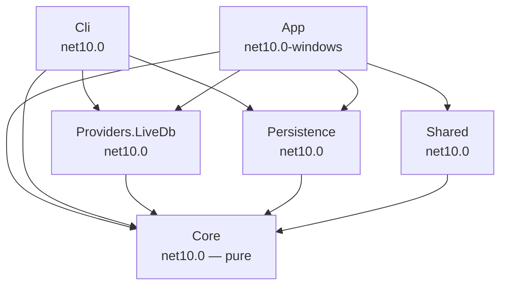
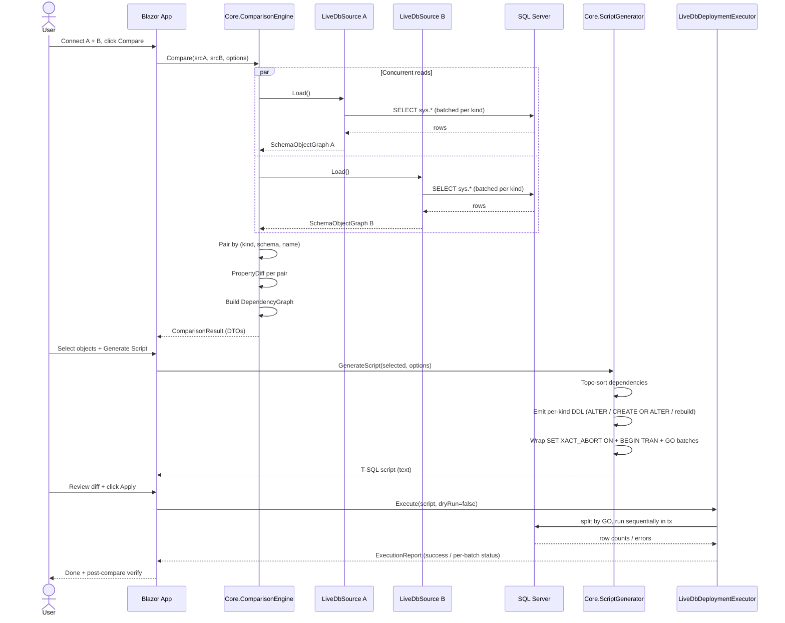

# DbDelta — v1 Design Spec

> **Date:** 2026-05-20
> **Author:** Brainstorming session (Stefano Brunelli + Claude)
> **Status:** Draft — awaiting user review
> **Related research:** `docs/00_overview.md` → `docs/06_tech_stack_and_decisions.md`

A faithful, open-source clone of Redgate SQL Compare, scoped to a deliverable v1. This document captures locked decisions from a structured brainstorming session and serves as the contract for the implementation plan (next phase).

---

## 0. TL;DR

DbDelta v1 is a **Windows-only schema comparison and deployment tool for SQL Server 2016+ and Azure SQL DB**, built on **.NET 10** with a **Blazor Hybrid + WebView2** GUI and a **System.CommandLine** CLI, distributed as a single self-contained `.exe` under **MIT license**. It compares two live databases, computes a structural diff across 13 object kinds (Tier 1 + Tier 2), generates a dependency-ordered T-SQL deployment script, and optionally executes it in a transactional batch. Built using a **hexagonal architecture** with a pure `Core` library and adapters for live DB I/O, CLI, and GUI hosting. Walking-skeleton-first delivery: end-to-end Table comparison in M1, then horizontal expansion to remaining object kinds over ~6 months.

---

## 1. Scope & Guardrails

### 1.1 Product Identity

- **Name:** `DbDelta` — official project brand (locked 2026-05-20)
- **Tagline:** "Diff two SQL Server databases, generate the migration script, apply it."
- **Primary user:** SQL Server developers and DBAs who want an open-source alternative to Redgate SQL Compare.
- **Repo:** https://github.com/GitBakko/db-delta

### 1.2 In Scope for v1

| Area | v1 Includes |
|------|-------------|
| Sources | Live SQL Server 2016+ DB; Azure SQL Database |
| Object kinds (13) | Schema · Table (Columns, Indexes, PK/FK/UNIQUE/CHECK/DEFAULT, Identity, computed cols) · View · Stored Procedure · Function (scalar / inline-TVF / multi-TVF) · Trigger (DML only) · Sequence · Synonym · alias UDT · table-type UDT · User · Role · Permission |
| Comparison | By identity tuple `(kind, schema, name)`; full property diff; line-level T-SQL diff for module bodies |
| Options | ~20 of the most-used comparison options: `IgnoreWhitespace`, `IgnoreComments`, `IgnoreCollations`, `IgnoreFillFactor`, `IgnoreConstraintNames`, `IgnorePermissions`, `IgnoreUserSettings`, `CaseSensitiveObjectDefinition`, `IgnoreIndexes`, `IgnoreKeys`, `IgnoreStatistics`, `IgnoreTriggers`, `IgnoreWithElementOrder`, `IgnoreFileGroups`, `IgnoreIdentitySeed`, `IgnoreUsersPermissionsAndRoleMemberships`, `NoTransactions`, `ForceColumnOrder`, `ThrowOnFileParseFailed`, `DoNotOutputCommentHeader` |
| Script generation | `ALTER` where safe, `CREATE OR ALTER` for modules, `DROP + CREATE` fallback, table-rebuild pattern for destructive column changes |
| Dependency resolution | Kahn topological sort, FK-cycle break via deferred batch |
| Deployment execution | Sequential GO-batched execution, `SET XACT_ABORT ON`, transactional, dry-run mode |
| GUI | Blazor Hybrid + WebView2: connection setup, comparison results tree, side-by-side DDL diff (Monaco editor), script preview, execute dialog |
| CLI | `compare`, `script`, `apply` commands (System.CommandLine); JSON, plain-text, and HTML report formats |
| Persistence | `.dbd` project file (XML); credentials in Windows Credential Manager (DPAPI-backed) |

### 1.3 Out of Scope for v1 (Explicit Non-Goals)

- Scripts Folder, Snapshot, Backup, Source Control providers
- Migration scripts (user-authored override DDL)
- SSMS extension, Visual Studio extension
- Tier-3 object kinds: CLR Assembly, Full-text catalog/index, XML Schema Collection, Service Broker objects, Partition Function/Scheme, Filegroup, DDL/Logon triggers, Sequence-graph, Ledger
- Always Encrypted column awareness, TDE-aware behavior
- Cross-database FK references, three-way merge, conflict resolution UI
- Telemetry, auto-update, licensing server
- Linux / macOS (CLI or GUI)
- Headless containerization (Docker image)

### 1.4 Durable Guardrails

1. **Core has no I/O.** All persistence/network is behind ports (`ISchemaSource`, `IDeploymentExecutor`, `ICredentialStore`). Enforced by `NetArchTest.Rules` in CI.
2. **Latest stable deps only.** All NuGet packages must be at the latest stable as of project start. Renovate-bot keeps them current. Deprecated/abandoned packages are rejected at PR time.
3. **Testcontainers MS SQL integration suite runs on every PR.** No "tested locally" exceptions.
4. **No object kind ships to GUI** until its Core unit tests + Provider integration tests + Script-gen golden tests pass.
5. **Public API documented from day 1.** XML doc comments on all public types; DocFX-rendered API site published to GitHub Pages.

---

## 2. Component Map

### 2.1 Source Tree Layout

```
src/
├─ DbDelta.Core/                  # net10.0, NO I/O deps
│  ├─ ObjectModel/                          # Database, Schema, Table, Column, Index, Constraint, View, ...
│  ├─ Diff/                                 # ComparisonEngine, DifferencePair, PropertyDiff, LineDiff
│  ├─ Dependency/                           # DependencyGraph, KahnTopologicalSort, CycleBreaker
│  ├─ ScriptGen/                            # IScriptEmitter, per-kind emitters, BatchBuilder
│  ├─ Options/                              # ComparisonOptions [Flags], DefaultOptions
│  ├─ Normalization/                        # WhitespaceNormalizer, IdentifierQuoter, CollationResolver
│  └─ Abstractions/                         # ISchemaSource, IDeploymentExecutor, ICredentialStore (ports)
│
├─ DbDelta.Providers.LiveDb/      # net10.0
│  ├─ LiveDbSource.cs                       # implements ISchemaSource
│  ├─ Readers/                              # SysTableReader, SysIndexReader, SysModuleReader, ...
│  ├─ Sql/                                  # Embedded .sql resources (catalog queries)
│  └─ LiveDbDeploymentExecutor.cs           # implements IDeploymentExecutor
│
├─ DbDelta.Persistence/           # net10.0
│  ├─ ProjectFile.cs                        # .dbd XML reader/writer (XmlSerializer)
│  └─ Credentials/                          # Windows Credential Manager via Meziantou.Framework.Win32.CredentialManager
│
├─ DbDelta.Cli/                   # net10.0, console app
│  ├─ Program.cs                            # System.CommandLine root command
│  ├─ Commands/                             # CompareCommand, ScriptCommand, ApplyCommand
│  ├─ Output/                               # JsonFormatter, TextFormatter, HtmlReportBuilder
│  └─ ExitCodes.cs
│
├─ DbDelta.App/                   # net10.0-windows, Blazor Hybrid + WebView2 host
│  ├─ Host/                                 # WinForms shell hosting BlazorWebView
│  ├─ Components/                           # Razor: ConnectionPicker, ResultsTree, DiffViewer, ScriptPreview, ExecuteDialog
│  ├─ State/                                # AppState (per-session), ComparisonSession
│  └─ Services/                             # Wraps Core engine for Blazor consumption
│
└─ DbDelta.Shared/                # net10.0, DTOs for App ↔ Core boundary
   └─ Dtos/                                 # ComparisonResultDto, DifferenceDto, OptionDto, ...

tests/
├─ Core.UnitTests/                          # xUnit v3 + FluentAssertions + AutoFixture
├─ Providers.LiveDb.IntegrationTests/       # Testcontainers MSSQL 2022 image
├─ ScriptGen.GoldenTests/                   # Verify.Xunit (snapshot tests of generated DDL)
├─ Cli.AcceptanceTests/                     # Spawns CLI exe against Testcontainers DB
├─ App.ComponentTests/                      # bUnit for Razor components
└─ Property.Tests/                          # FsCheck for diff/dep-graph invariants
```

### 2.2 Dependency Direction (Strictly Enforced)



Rules:
- `Core` references nothing outside the .NET BCL + `Microsoft.SqlServer.TransactSql.ScriptDom` (parser only, MIT).
- `Providers.LiveDb` references `Microsoft.Data.SqlClient` and `Core`. Nothing else.
- `App` and `Cli` are the only "hosts" — they compose the others.
- Enforced via `NetArchTest.Rules` test that fails CI on any violation.

### 2.3 Key Dependencies (Latest Stable as of May 2026)

| Library | Version (target) | Use |
|---------|------------------|-----|
| .NET 10 SDK | 10.0.x | Runtime + SDK |
| C# | 14 | Language |
| Microsoft.Data.SqlClient | 6.x | ADO.NET driver |
| Microsoft.SqlServer.TransactSql.ScriptDom | 180.x (MIT) | T-SQL parse + format |
| System.CommandLine | 2.x | CLI argument parsing |
| Spectre.Console | 0.49.x | CLI rich output / progress |
| Microsoft.AspNetCore.Components.WebView.WindowsForms | 10.x | Blazor Hybrid host shell |
| Microsoft.Web.WebView2 | 1.0.2x | Chromium embed |
| Serilog (+ Sinks.Console, .File, .Async) | 4.x | Structured logging |
| Polly | 8.x | Retry policies for transient SQL errors |
| Meziantou.Framework.Win32.CredentialManager | latest | Windows Credential Manager API |
| xUnit v3 | 1.x | Unit / integration test runner |
| FluentAssertions | 7.x | Assertions |
| AutoFixture | 4.x | Test data |
| Verify.Xunit | 28.x | Golden / snapshot tests |
| Testcontainers.MsSql | 4.x | Integration test SQL containers |
| bUnit | 1.x | Razor component testing |
| FsCheck.Xunit | 3.x | Property tests |
| BenchmarkDotNet | 0.14.x | Performance benchmarks |
| NetArchTest.Rules | 1.x | Architectural fitness functions |
| WiX Toolset | v5 | MSI installer authoring |

All versions are pinned via `Directory.Packages.props` (Central Package Management). Renovate-bot opens PRs for updates weekly.

---

## 3. Data Flow

### 3.1 Happy Path: GUI Compare → Script → Apply



### 3.2 Threading Model

- **Schema reads:** `Task.WhenAll` for the two sides concurrently. Within one side, parallel `Task` per object kind, bounded by `SemaphoreSlim(maxConcurrency: 4)` to avoid hammering the server.
- **Diff:** single-threaded. CPU work is small after read; threading not worth coordination cost for v1.
- **Script generation:** single-threaded streaming `TextWriter` to minimize allocations on large scripts.
- **Execution:** strictly sequential. DDL ordering is the point.

### 3.3 Cancellation & Progress

- `CancellationToken` plumbed through every public async method on `ComparisonEngine`, `ISchemaSource.LoadAsync`, `IDeploymentExecutor.ExecuteAsync`.
- `IProgress<ComparisonProgress>` reports phase + percentage. App binds to a Blazor reactive store; CLI renders `Spectre.Console` progress bar.

### 3.4 Edge Cases Handled in v1

| Case | Handling |
|------|----------|
| Connection drops mid-read | Fail comparison, surface SQL error to user, no partial result kept |
| Permission denied on object | Skip + warn (not fatal); record in `ComparisonResult.Warnings` |
| Encrypted module (`WITH ENCRYPTION`) | Mark "definition unavailable"; treat as opaque (cannot diff bodies); flag in warning |
| Identity column change | Force table rebuild via temp-table dance |
| Computed column expression change | Drop + recreate column |
| FK cycle across schemas | Break by creating FKs in deferred batch (after both tables exist) |
| `GO N` repetition syntax | ScriptDOM tokenizer handles; verify in CLI batch splitter |
| Mid-execution failure | Transaction rolls back; surface failed batch + SQL error |
| Empty schema diff | Return empty result + success exit code |
| Same DB compared to itself | Allowed, zero diffs, fast path |
| Schema with 0 objects | Allowed |
| Case-only diff in identifier (case-insensitive DB) | Equal unless `CaseSensitiveObjectDefinition` set |
| Schemabinding broken by drop | Detected during dep-graph build; emitted as error before script-gen |

---

## 4. Error Handling

### 4.1 Strategy

Result-oriented at domain boundary, exceptions at infrastructure only.

```csharp
public sealed record Error(ErrorCode Code, string Message, string? Remediation = null);

public enum ErrorCode {
    // Connection
    CannotConnect, AuthFailed, DbNotFound, InsufficientPermissions,
    // Schema read
    UnsupportedSqlServerVersion, EncryptedObjectUnreadable, CatalogQueryFailed,
    // Diff
    NoComparableObjects,
    // Script gen
    UnresolvableDependencyCycle, DataPreservationImpossible, UnsupportedSchemaChange,
    // Execute
    BatchExecutionFailed, TransactionAborted, CancelledByUser,
    // Persistence
    ProjectFileCorrupt, ProjectFileVersionUnsupported,
    // Catch-all
    InternalError,
}
```

### 4.2 Layered Handling

| Layer | Rule |
|-------|------|
| Core | Pure functions return `Result<T, Error>` for expected failures. No `throw` except `ArgumentException` (programmer error). |
| Providers | Catch `SqlException`, map to `Error` with remediation text. Wrap unexpected in `Result.Failure(ErrorCode.InternalError, ex.Message)`. Never let infrastructure exception bubble across the port boundary. |
| Cli | Convert `Error` → exit code + structured stderr (`{ "code": "AUTH_FAILED", "message": "...", "remediation": "..." }`). Top-level `try/catch` catches anything unexpected → exit code 99. |
| App | Convert `Error` → toast notification + diff-tree banner. `ErrorBoundary` Razor component for catastrophic UI failures. |

### 4.3 CLI Exit Codes

| Code | Meaning |
|-----:|---------|
| 0 | Success, no differences |
| 1 | Success, differences found (with `compare` only) |
| 10 | Connection / authentication error |
| 11 | Insufficient permissions |
| 20 | Schema read failure |
| 30 | Script generation failure |
| 31 | Unresolvable dependency cycle |
| 40 | Deployment failure (batch error) |
| 41 | Deployment cancelled by user |
| 60 | Project file / persistence error |
| 99 | Internal error (bug) |

### 4.4 Logging

- Serilog, structured (JSON in CLI/CI mode; console-formatted in dev).
- Levels: `Verbose` (per-object), `Information` (phase milestones), `Warning` (skipped objects, permission gaps), `Error` (failed ops), `Fatal` (process-terminating).
- File sink: `%LOCALAPPDATA%\DbDelta\logs\dbdelta-{Date}.log`, 7-day retention.
- CLI `--log-level` controls verbosity; `--log-file` overrides path.

### 4.5 Retry Policy

| Operation | Policy |
|-----------|--------|
| Connect / transient SQL errors (deadlock 1205, timeout -2) | Polly exponential backoff, 3 retries, 1s/2s/4s |
| Schema reads | NO retry on syntax / permission errors |
| Deployment | NO retry — user must review and resubmit (DDL is not idempotent) |

### 4.6 User-Facing Error UX (GUI)

- Inline error region in the panel that triggered it (connection error → connection dialog; script error → script preview).
- "Copy details to clipboard" button copies structured error JSON for issue reports.
- Never a modal dialog except for confirm-destructive-op.

---

## 5. Testing Strategy

### 5.1 Pyramid

- **70%** Core unit tests (no I/O)
- **20%** Provider integration tests (Testcontainers MSSQL)
- **7%** Script-gen golden tests (Verify.Xunit)
- **2%** CLI acceptance tests
- **1%** UI component tests (bUnit)

### 5.2 Test Catalogue

| Suite | Stack | Goal | Run Frequency |
|-------|-------|------|---------------|
| `Core.UnitTests` | xUnit v3 + FluentAssertions + AutoFixture | Diff engine invariants, dep-graph topo correctness, options bitmap, normalizers. One comparator suite per object kind. | Every PR, < 5s |
| `Providers.LiveDb.IntegrationTests` | Testcontainers MS SQL 2022 | Catalog readers produce the expected `ObjectModel` from known schemas. One test per object kind with a canonical fixture. | Every PR, < 2 min |
| `ScriptGen.GoldenTests` | Verify.Xunit | For each `(object-kind, change-type)` pair, snapshot the emitted DDL. Regression = automatic diff in PR. | Every PR, < 30s |
| `Cli.AcceptanceTests` | xUnit + spawn `DbDelta.Cli.exe` against Testcontainers DB | End-to-end `compare → script → apply → verify`. Exit codes, output formats. | Every PR, < 5 min |
| `App.ComponentTests` | bUnit | Razor component rendering, state transitions, accessibility (aria attributes). | Every PR, < 30s |
| `Property.Tests` | FsCheck | Diff engine invariants (idempotence: `diff(A, apply(A→B, A)) == diff(A, B)`); dep-graph acyclicity. | Every PR, < 1 min |
| `Performance.Bench` | BenchmarkDotNet | 1k / 10k-object schema read + diff + script-gen. Establishes baseline, alerts on regression. | Nightly, ~10 min |
| `Compat.Matrix` | Testcontainers, parametrized image versions | Smoke suite against SQL Server 2016, 2017, 2019, 2022, Azure SQL DB emulator. | Nightly, ~30 min |

### 5.3 Test Data Fixtures

```
tests/Fixtures/
├─ Schemas/
│  ├─ canonical-small.sql          # 5 tables, 2 views, 1 proc — fastest
│  ├─ canonical-medium.sql         # ~50 objects across all 13 kinds
│  ├─ pathological-fks.sql         # FK cycles, self-FKs, cross-schema FKs
│  ├─ identity-changes.sql         # forces table rebuild
│  └─ encrypted-modules.sql        # WITH ENCRYPTION procs / views
└─ ExpectedDiffs/                  # JSON expected ComparisonResult per fixture pair
```

### 5.4 CI Gates (GitHub Actions, Windows Runner)

1. Build (warnings = errors via `TreatWarningsAsErrors`)
2. `dotnet format --verify-no-changes`
3. NetArchTest.Rules (layering enforced)
4. Core.UnitTests + ScriptGen.GoldenTests + App.ComponentTests (no DB)
5. **Concurrent:** Providers + Cli + Property tests (Testcontainers spun up once, shared)
6. Coverage report — target 80% line / 70% branch on `Core`
7. Code scan: GitHub CodeQL + `dotnet list package --vulnerable`
8. Pack: `dotnet pack` for SDK NuGet, MSIX/MSI build for App

### 5.5 TDD Discipline

- Core changes: red → green → refactor (xUnit + watch mode).
- New object kind workflow:
  1. Add fixture SQL to `tests/Fixtures/Schemas/`
  2. Add Provider read test
  3. Add ScriptGen golden test
  4. Add Diff comparator test
  5. Wire into pipeline
  6. Add CLI acceptance scenario
  7. Add App component (if user-visible) + bUnit test
- No code merges without tests.

---

## 6. Performance Budget + Roadmap

### 6.1 Performance Budget (v1)

| Operation | Target | Stretch |
|-----------|-------:|--------:|
| Connect + read schema, 1k objects | < 15s | < 5s |
| Connect + read schema, 10k objects | < 60s | < 30s |
| Diff 10k-pair result | < 3s | < 1s |
| Generate full deployment script (10k diffs) | < 5s | < 2s |
| GUI initial render of results tree | < 500ms after diff complete | < 200ms |
| Apply script (DB-bound) | network/disk-bound | — |
| CLI cold start | < 1s | < 500ms (AOT-compile candidate) |
| `.exe` size (App, self-contained) | < 80 MB | < 50 MB |
| Idle memory (App) | < 200 MB | < 120 MB |

### 6.2 Roadmap

```
M0  Repo bootstrap                       Week 1
    └ csproj scaffolding, NetArchTest gate, CI green

M1  Walking skeleton — Table only        Weeks 2-4
    ├ Core.ObjectModel: Database / Schema / Table / Column
    ├ Providers.LiveDb: read tables from sys.tables / sys.columns
    ├ Diff: pair tables, property compare
    ├ ScriptGen: emit CREATE TABLE, ALTER TABLE ADD COLUMN
    ├ Cli: `compare` command, JSON output
    └ App: connection dialog + results tree showing tables only

M2  Constraints & Indexes                Weeks 5-6
    └ PK, FK, UNIQUE, CHECK, DEFAULT, indexes, identity, computed columns

M3  Views + Stored Procedures            Weeks 7-8

M4  Functions + Triggers                 Weeks 9-10

M5  Sequence + Synonym + UDT             Week 11

M6  User + Role + Permission             Week 12

M7  Dependency resolver (full graph)     Weeks 13-14
    └ Topo sort, cycle break, integration test

M8  Script-gen polish                    Weeks 15-16
    ├ Table rebuild for destructive changes
    ├ Transaction wrapping (XACT_ABORT, BEGIN TRAN)
    └ Golden tests at scale

M9  Deployment executor                  Weeks 17-18

M10 GUI polish                           Weeks 19-20
    ├ Side-by-side diff viewer (Monaco editor in WebView2)
    ├ Script preview with syntax highlighting
    └ Apply dialog with progress

M11 Persistence (.dbd project file)      Week 21

M12 Reports (HTML / JSON)                Week 22

M13 v1.0 RC                              Weeks 23-24
    └ Compat matrix tests, perf benchmarks, docs, public alpha announcement
```

**Total:** ~6 calendar months solo dev + ruflo swarm.

### 6.3 v2 Candidates (Parking Lot)

- Scripts Folder provider
- Snapshot provider (compressed binary format)
- Source Control provider (LibGit2Sharp)
- Migration scripts (user-authored DDL overrides)
- Tier-3 object kinds (CLR Assembly, Full-text, XML schemas, Service Broker, Partition fn/scheme, Filegroup)
- Cross-platform GUI (Avalonia migration)
- SSMS / VS extension
- Telemetry (opt-in OpenTelemetry)
- Auto-update channel
- Linux + macOS support for CLI

### 6.4 Risk Register (Top 5)

| Risk | Likelihood | Impact | Mitigation |
|------|:---------:|:------:|------------|
| Blazor Hybrid + WebView2 instability for diff-heavy UIs | M | H | Spike in M0; fall back to native WinUI if Razor perf is bad |
| ScriptDom missing recent T-SQL features | M | M | Pin to latest; document raw-text passthrough fallback |
| .NET 10 SDK / package ecosystem incomplete for net10.0 | L | M | Verify all critical deps target net10.0 in M0 spike |
| Dependency graph cycles in pathological schemas | M | H | FsCheck property-testing extensively; explicit cycle-break batch |
| Testcontainers MS SQL on Windows runners flaky | L | M | Use SQL Server LocalDB fallback for CI on flaky days |

---

## 7. Decisions Log (Brainstorming Session 2026-05-20)

| # | Decision | Outcome |
|--:|----------|---------|
| 1 | MVP scope cut | Engine + CLI + minimal GUI |
| 2 | Source providers v1 | Live DB ↔ Live DB only |
| 3 | Object kind coverage v1 | Tier 1 + Tier 2 (13 kinds) |
| 4 | SQL Server version target | 2016+ including Azure SQL DB |
| 5 | OS / platform | Windows-only; .NET 10 CLI + GUI |
| 6 | GUI host | Blazor Hybrid + WebView2 (C# everywhere, no JS SPA) |
| 7 | Distribution + license | OSS (MIT / Apache 2.0) |
| 8 | Architecture | Hexagonal + walking-skeleton delivery (Approach A) |
| 9 | Dependency mandate | Latest stable only; Renovate weekly |
| 10 | Implementation runtime | ruflo swarm, hierarchical topology, memory-as-bus |

---

## 8. Open Questions (To Resolve During Implementation)

1. Exact license: MIT or Apache 2.0? (Apache 2.0 has explicit patent grant; recommended.)
2. Code style: edition of `.editorconfig` and Roslyn analyzer ruleset.
3. Whether to enable `<PublishAot>true</PublishAot>` for CLI (stretch perf goal).
4. Whether GUI ships its own embedded Monaco editor or relies on WebView2's bundled Edge.

---

## 9. Next Step

After user review and approval of this spec, invoke the `superpowers:writing-plans` skill to create the implementation plan (PLAN.md). The plan will break each roadmap milestone (M0 → M13) into:
- Concrete tasks with dependencies
- Acceptance criteria (test names that must pass)
- ruflo agent assignments (which agent type handles which task)
- Goal-backward verification: does completing all tasks deliver the milestone goal?

After plan approval, execution moves to ruflo swarm orchestration in the lead-orchestrated phases pattern (per `CLAUDE.md`).
