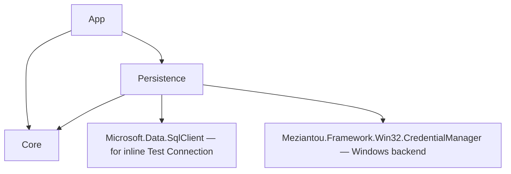

# DbDelta — Connection Management Design (M11-bis)

> **Status:** Approved by user 2026-05-21 — handoff to `superpowers:writing-plans`.
> **Supersedes / extends:** spec §2 (Persistence project), §6.2 milestone **M11 — Persistence (.dbd project file)**.
> **Original M11 scope:** `.dbd` project file XML + Windows Credential Manager DPAPI.
> **This expansion adds:** MRU recent connections, smart picker, presets CRUD, env tagging + colours, inline test connection, autosave on Compare, sidebar quick-switch, cross-platform-ready credential store with three backends, connection-string redaction in UI/log.

---

## 0. TL;DR

DbDelta currently asks the user to paste a raw SQL Server connection string into two text boxes every time they want to compare. M11 in the original roadmap adds project file persistence and DPAPI-backed credentials but does not provide a *connection workspace*: there is no recent list, no preset library, no quick switcher, no test button.

This spec defines that workspace as **M11-bis** — a per-user persistent store for connections with friendly names, environment tags + colours, pinning, and search, plus inline test, plus integration with the existing `.dbd` project file (now formally one XML file per project, distinct from the per-user MRU JSON).

It also formalises the `ICredentialStore` port with three backends (Windows DPAPI shipped, macOS Keychain + Linux Secret Service as placeholders) so the cross-platform Avalonia migration (already underway since M11-bis-prereq) does not need a credential-store rewrite later.

---

## 1. Scope

### 1.1 In scope

| Capability | Notes |
|-----------|-------|
| MRU recent connections | Unlimited, persistent forever, sorted `LastUsedUtc DESC, CreatedUtc DESC` |
| Smart picker | Search-as-you-type combo (matches Name, Server, Database, EnvironmentTag); inline edit form; pin-to-top |
| Environment tag + colour | Free-text tag (`Dev` / `Test` / `Prod` / custom) + user-selectable colour from a DS-curated palette |
| Connection presets CRUD | Create, read, update, delete via UI. Friendly name + masked password reveal-on-hold |
| Inline test connection | "Test" button next to each connection field; opens, queries `SELECT @@VERSION`, closes; 10s timeout |
| Autosave on Compare success | First time a pasted connection completes a Compare, persist as `(auto)` preset; user can rename/edit later |
| Project file `.dbd` | One XML file per project, user-chosen path, contains Name + SourceConnectionId + TargetConnectionId + ComparisonOptions |
| Cross-platform ready credential store | `ICredentialStore` port + 3 implementations; ship Windows DPAPI, the other two raise `NotSupportedException` with `IsAvailable=false` |
| Connection-string redaction | `ConnectionStringRedactor.Redact(s)` used everywhere a string would be shown to the user or written to a log |
| Password masking + reveal-on-hold | `TextBox.PasswordChar='•'` + a "👁 Mostra" button that switches to clear text while pressed |
| Sidebar quick-switch | The M1 sidebar placeholder is finally populated: top 20 MRU + pinned, env-colour stripe on the left, click sets source or target |

### 1.2 Explicitly out of scope (deferred or rejected)

- **Cloud sync** — rejected (per user).
- **Import / export of presets** — rejected for this milestone.
- **Master-password fallback for cross-platform JSON-encrypted credential store** — deferred until Avalonia cross-platform distribution actually activates (today the GUI is Windows-only).
- **Connection-usage telemetry** — not in v1 (would conflict with spec §6.3 telemetry parking-lot).
- **Connection string parsing UI** ("server / database / user fields") — out of scope; user pastes a raw connection string. Parsing for *display* (extracting Server + Database to show in the list) is in scope.

### 1.3 Out-of-scope for the GUI in M11-bis but inside `IProjectStore` shape

The `.dbd` XML schema reserves a `SelectedObjects` element so that later milestones (M10 polish or M12 reports) can persist user selection. The XML reader/writer round-trips the element; the GUI does not yet use it.

---

## 2. Architecture

### 2.1 Component map (additions only)

```
src/
├─ DbDelta.Core/
│  └─ Abstractions/
│     ├─ ICredentialStore.cs        NEW — credential port
│     ├─ IConnectionStore.cs        NEW — MRU + presets port
│     ├─ IProjectStore.cs           NEW — .dbd reader/writer port
│     ├─ ConnectionEntry.cs         NEW — record (no I/O)
│     └─ DbDeltaProject.cs          NEW — record (no I/O)
│
├─ DbDelta.Persistence/
│  ├─ Json/
│  │  └─ JsonConnectionStore.cs     NEW — implements IConnectionStore
│  ├─ Xml/
│  │  └─ XmlProjectStore.cs         NEW — implements IProjectStore
│  ├─ Credentials/
│  │  ├─ CredentialStoreFactory.cs  NEW — runtime selection
│  │  ├─ DpapiCredentialStore.cs    NEW — Windows backend (shipped)
│  │  ├─ KeychainCredentialStore.cs NEW — macOS placeholder
│  │  └─ SecretServiceCredentialStore.cs NEW — Linux placeholder
│  └─ Util/
│     └─ ConnectionStringRedactor.cs NEW — pure static helper
│
└─ DbDelta.App.Avalonia/
   ├─ ViewModels/
   │  ├─ ConnectionStoreViewModel.cs  NEW — MRU + filter + commands
   │  ├─ ConnectionEditViewModel.cs   NEW — edit dialog VM
   │  └─ AppStateViewModel.cs         MODIFIED — consumes ConnectionStore
   └─ Views/
      ├─ ConnectionPickerView.axaml     MODIFIED — combo + edit + test
      ├─ ConnectionEditDialog.axaml     NEW — modal form
      ├─ RecentConnectionsSidebar.axaml NEW — populates M1 placeholder
      └─ EnvironmentBadge.axaml         NEW — small UserControl
```

`DbDelta.Core` stays pure: only abstractions + DTO records, no `Microsoft.Data.SqlClient` or filesystem references — the NetArchTest layering rule continues to pass.

### 2.2 Layering (graph delta)



`Persistence` now references `Microsoft.Data.SqlClient` (it was already a transitive dep of the App, but the dependency becomes formal because the inline `TestConnectionAsync` lives in `Persistence`). The Architecture.Tests rule for Persistence is widened to allow `SqlClient` + `Meziantou` + `System.Text.Json` + `System.Xml`.

### 2.3 Dependency direction stays acyclic

```
Core ← Persistence ← App
Core ← Providers.LiveDb ← App
Core ← Shared ← App
Core ← Cli
```

No new edges into Core from anywhere. `IConnectionStore` / `IProjectStore` / `ICredentialStore` live in `Core.Abstractions` as ports, implemented in `Persistence`.

---

## 3. Component contracts

### 3.1 `ICredentialStore`

```csharp
namespace DbDelta.Core.Abstractions;

public interface ICredentialStore
{
    /// <summary>True when this backend can actually persist secrets on the current host.</summary>
    bool IsAvailable { get; }

    /// <summary>Returns the stored secret, or <c>null</c> when not present.</summary>
    Task<string?> GetSecretAsync(string targetKey, CancellationToken ct);

    /// <summary>Creates or overwrites a secret under <paramref name="targetKey"/>.</summary>
    Task SetSecretAsync(string targetKey, string secret, CancellationToken ct);

    /// <summary>Removes a secret. No-op when absent.</summary>
    Task DeleteSecretAsync(string targetKey, CancellationToken ct);
}
```

`targetKey` convention: `"dbdelta:connection:{ConnectionEntry.Id:D}"`. App code never builds this string by hand — `ConnectionStoreViewModel` does it once.

**Backends:**
- **`DpapiCredentialStore`** wraps `Meziantou.Framework.Win32.CredentialManager` with `CredentialPersistence.LocalMachine = false` (i.e. CurrentUser scope). `IsAvailable => true` on Windows.
- **`KeychainCredentialStore`** + **`SecretServiceCredentialStore`** both return `IsAvailable = false` and throw `NotSupportedException` from Get/Set/Delete in v1. The constructor logs a one-line warning. They exist so the `CredentialStoreFactory` switch is exhaustive today and the v2 cross-platform port is a swap-in, not a refactor.

`CredentialStoreFactory.Create()`:

```csharp
public static ICredentialStore Create() =>
    RuntimeInformation.IsOSPlatform(OSPlatform.Windows) ? new DpapiCredentialStore() :
    RuntimeInformation.IsOSPlatform(OSPlatform.OSX)     ? new KeychainCredentialStore() :
    RuntimeInformation.IsOSPlatform(OSPlatform.Linux)   ? new SecretServiceCredentialStore() :
    throw new PlatformNotSupportedException();
```

### 3.2 `IConnectionStore`

```csharp
public interface IConnectionStore
{
    Task<IReadOnlyList<ConnectionEntry>> LoadAsync(CancellationToken ct);

    /// <summary>Inserts a new entry or updates an existing one by Id.</summary>
    Task<ConnectionEntry> UpsertAsync(ConnectionEntry entry, CancellationToken ct);

    Task DeleteAsync(Guid id, CancellationToken ct);

    /// <summary>Bumps <c>LastUsedUtc</c> on the entry. Used by autosave + sidebar click.</summary>
    Task TouchUsageAsync(Guid id, CancellationToken ct);
}

public sealed record ConnectionEntry(
    Guid Id,
    string Name,
    string ServerName,
    string DatabaseName,
    string ConnectionStringTemplate,
    string EnvironmentTag,
    string EnvironmentColorHex,
    bool IsPinned,
    DateTime CreatedUtc,
    DateTime LastUsedUtc);
```

The **password is not stored on the record**. The store always pairs with an `ICredentialStore` write. `ConnectionStringTemplate` keeps the literal `{PASSWORD}` placeholder so that runtime injection (`MaterialiseAsync`) re-builds the actual connection string.

**Trusted connection / integrated security** (no password): when the parsed connection string contains `Integrated Security=True` or `Trusted_Connection=Yes` and no `Password=`, the template stays as-is (no `{PASSWORD}` token) and `ICredentialStore` is never invoked. The entry is still persisted; `MaterialiseAsync` returns the template unmodified.

**Default sort** (defined by `JsonConnectionStore.LoadAsync` and `ConnectionStoreViewModel`):
1. `IsPinned DESC`
2. `LastUsedUtc DESC`
3. `CreatedUtc DESC`

### 3.3 `IProjectStore`

```csharp
public interface IProjectStore
{
    Task<DbDeltaProject> LoadAsync(string filePath, CancellationToken ct);
    Task SaveAsync(string filePath, DbDeltaProject project, CancellationToken ct);
}

public sealed record DbDeltaProject(
    string Name,
    Guid SourceConnectionId,
    Guid TargetConnectionId,
    ComparisonOptions Options,
    IReadOnlyList<string>? SelectedObjects = null);
```

`.dbd` is canonical XML, UTF-8, `XmlSerializer`-friendly:

```xml
<?xml version="1.0" encoding="utf-8"?>
<DbDeltaProject xmlns="https://schemas.dbdelta.org/project/v1" name="Customer rollout">
  <SourceConnectionId>9f2c…</SourceConnectionId>
  <TargetConnectionId>3a55…</TargetConnectionId>
  <Options>Default</Options>
  <SelectedObjects />
</DbDeltaProject>
```

Round-trip is byte-stable (we always rewrite the whole file). No partial / streaming writes.

### 3.4 `JsonConnectionStore` on-disk format

Path: `%LOCALAPPDATA%\DbDelta\connections.json` (cross-platform: `IConnectionStore.Create()` uses `Environment.GetFolderPath(SpecialFolder.LocalApplicationData)` so macOS/Linux land under `~/.local/share/DbDelta/` automatically).

```json
{
  "schemaVersion": 1,
  "entries": [
    {
      "id": "9f2c1d76-…",
      "name": "PCRM Dev",
      "serverName": "192.168.3.243",
      "databaseName": "PcrmV2Pl_test",
      "connectionStringTemplate": "Server=192.168.3.243;Database=PcrmV2Pl_test;User Id=sa;Password={PASSWORD};TrustServerCertificate=True",
      "environmentTag": "Dev",
      "environmentColorHex": "#6649BE",
      "isPinned": true,
      "createdUtc": "2026-05-21T07:42:00Z",
      "lastUsedUtc": "2026-05-21T08:15:00Z"
    }
  ]
}
```

Writes are **atomic**: write to `connections.json.tmp` → `File.Move(..., overwrite: true)`. Reads tolerate trailing whitespace + missing file.

On JSON-parse failure: rename existing file to `connections.json.broken-{yyyyMMddHHmmss}`, surface a banner notification, start with an empty list (data is never lost — broken file kept for forensics).

### 3.5 `ConnectionStringRedactor`

Pure static helper:

```csharp
public static partial class ConnectionStringRedactor
{
    [GeneratedRegex(@"(?i)(password|pwd)\s*=\s*[^;]+", RegexOptions.CultureInvariant)]
    private static partial Regex PasswordPattern();

    public static string Redact(string? value) =>
        value is null ? string.Empty : PasswordPattern().Replace(value, "$1=***");
}
```

Used in every UI surface that displays a connection string (status footer, error banner, log lines). Already partially adopted by the diagnostic banner shipped in commit `42801b6`; this spec formalises it.

### 3.6 Test Connection

A static helper on `Persistence` exposes:

```csharp
public static class ConnectionTester
{
    public sealed record TestResult(bool Success, string Message, TimeSpan Latency, string? ServerVersion);
    public static async Task<TestResult> TestAsync(string connectionString, CancellationToken ct);
}
```

Implementation: `SqlConnection.OpenAsync` then `SELECT @@VERSION`, 10s timeout via `SqlConnectionStringBuilder.ConnectTimeout = 10`. Errors map to a friendly message + the redacted connection string.

---

## 4. UX flows

### 4.1 First launch (no presets)

1. App opens. `ConnectionStoreViewModel.LoadAsync()` reads `connections.json` (empty list).
2. ConnectionPickerView shows the same two raw-text fields as today plus a small "Salva" link disabled (no entry yet to update).
3. User pastes Source + Target connection strings, clicks **Confronta**.
4. On Compare success, `AppStateViewModel.CompareAsync` calls `ConnectionStoreViewModel.AutosaveAsync(srcCs)` + `AutosaveAsync(tgtCs)` which:
   - Parses the connection string to extract `Server` + `Database` for display.
   - Generates `Name = $"{Server}.{Database}"` + suffix `" (auto)"`.
   - Sets `EnvironmentTag = "(auto)"`, `EnvironmentColorHex = "#9097A0"`.
   - Stores the password via `ICredentialStore.SetSecretAsync`.
   - Saves the entry minus password to `connections.json`.
5. RecentConnectionsSidebar populates with two entries.

### 4.2 Smart picker on subsequent launches

ConnectionPickerView gets a new ComboBox above each raw text field:

```
[ Combo: Recente ▾ ]  [ Edit ]  [ Test ]
[ raw text box (TwoWay bound)               ]
```

- Selecting an entry from the combo materialises the connection string (injects password from credential store) and writes it into the raw box (so the user always sees what will be sent).
- Combo supports search-as-you-type via Avalonia `ComboBox.IsTextSearchEnabled` plus an `ItemTemplate` that exposes Name + Server/Database + env badge.
- A "Vedi tutti" item at the bottom opens a dialog with the full list and full search.

### 4.3 Edit dialog (`ConnectionEditDialog`)

Modal opened by the **Edit** button when a combo selection exists, or by sidebar context menu → "Modifica".

Fields:
- Name (free text, required)
- Server (auto-extracted from conn string, editable for display only)
- Database (same)
- User (extracted, editable for display)
- Password (masked, reveal-on-hold)
- Environment tag (combo "Dev / Test / Prod" + free-text custom)
- Environment colour (palette of 8 swatches sourced from `Styles/Tokens.axaml`):
  - Cobalt `#0054BD` (Primary)
  - Violet `#6649BE` (Secondary)
  - Emerald `#007339` (Success)
  - Amber `#AE5C00` (Warning)
  - Crimson `#B31220` (Danger)
  - Sky `#5BB9D1` (extends DS — keyed `Sky500` in tokens)
  - Rose `#D957A6` (extends DS — keyed `Rose500`)
  - Neutral `#9097A0` (FgFaint, fallback / auto-created presets)
- Pinned (toggle)
- Buttons: **Salva** / **Annulla** / **Elimina** (with confirm)

The dialog binds to `ConnectionEditViewModel` which exposes `[ObservableProperty]`s + a `SaveCommand` + `DeleteCommand` (CommunityToolkit.Mvvm).

### 4.4 Sidebar quick-switch

The M1 240px sidebar (currently an empty `<Border>`) becomes `RecentConnectionsSidebar.axaml`:

```
┌── Pinned (3) ──────────────────┐
│ ▌Dev — PCRM Dev               │   ← left coloured stripe = env colour
│ ▌Prod — PCRM Live             │
│ ▌Test — Customer staging      │
├── Recent ─────────────────────┤
│ ▌Dev — Demo (auto)            │
│ ▌(auto) — Demo                │
│ …                             │
└────────────────────────────────┘
```

Each item: left-click sets `AppState.SourceConnectionString`; right-click opens context menu (Set as source / Set as target / Pin / Edit / Delete).

### 4.5 Saving a project (.dbd)

A new "Salva progetto…" command on the topbar opens a native file dialog (`OpenFileDialog` / `SaveFileDialog` from `Avalonia.Controls.Window.StorageProvider`). The user picks a path; `XmlProjectStore.SaveAsync` writes it.

Open command symmetrically loads a `.dbd`, looks up `SourceConnectionId` + `TargetConnectionId` in the `ConnectionStore`. On missing IDs a modal dialog asks the user to pick a substitute (no auto-fallback to avoid running Compare against the wrong DB).

---

## 5. Security

### 5.1 Threat model

| Threat | Mitigation |
|--------|------------|
| Connection string with embedded password leaks via logs | `ConnectionStringRedactor.Redact` applied at every log/UI surface |
| Connection string visible on screen during demo recording | Password masked by default in edit dialog; reveal is hold-only |
| Per-user JSON file world-readable | File lives in `%LOCALAPPDATA%` (ACL: only the user); never roams, never syncs |
| Credentials persist across user accounts | DPAPI scope = `CurrentUser`; other-user reads fail by design |
| Shared computer scenarios | DPAPI scope ensures encryption is per-user; no master password needed for v1 |
| Process memory contains plaintext password | Out-of-scope for v1; the standard `SqlConnection` flow keeps the string in managed memory — same as every other tool |
| `connections.json` tampered with | Schema-versioned + tolerant parsing; broken file backed up, not deleted |

### 5.2 Logging

A new helper `RedactingLogger` wraps `ILogger.Log` and passes the formatted message through `ConnectionStringRedactor.Redact` before delegating. Used everywhere a Serilog sink or `ILogger` is used inside `Persistence` + `App`. Core stays pure (no logger).

---

## 6. Error handling

| Scenario | Result |
|----------|--------|
| `connections.json` missing | Empty list, no error, first save creates it |
| `connections.json` syntactically invalid JSON | Rename to `.broken-{ts}`, banner notification, empty list |
| `connections.json` schema-versioned future version | Banner: "Versione file futura, non è possibile leggere — la app continua con lista vuota" |
| DPAPI throws on `SetSecret` | Banner: "Impossibile salvare la password — la entry verrà salvata senza credenziali"; entry persisted without password ref |
| DPAPI throws on `GetSecret` | Surface in error banner; user can re-type the password (no auto-prompt) |
| Test Connection fails (network) | Inline ✗ icon + redacted error; no entry mutation |
| Test Connection times out (10s) | Same as above with message "Timeout dopo 10s" |
| `.dbd` references a `ConnectionEntry.Id` that no longer exists | Modal dialog: "La connessione *Source / Target* non esiste più. Selezionane una"; user picks new entry; project file is rewritten on Save |

---

## 7. Testing strategy

### 7.1 Test projects

- `DbDelta.Persistence.UnitTests` — **new** xUnit v3 project.
  - `JsonConnectionStoreTests`: load empty, upsert, duplicate id, delete, touch, atomic write (verify temp file does not leak), corrupted-file rename.
  - `XmlProjectStoreTests`: round-trip schema v1, namespace-strictness, schema-future version surfaces error.
  - `ConnectionStringRedactorTests`: password / Pwd case-insensitive, multiple `;Password=`, no password present, null input.
- `DbDelta.Persistence.IntegrationTests` — **new**, Windows-only.
  - `DpapiCredentialStoreTests` marked `[SkippableFact]` (skip on non-Windows CI runner): set / get / delete round-trip; key isolation across multiple ids.
- `DbDelta.App.HeadlessTests` — **new** Avalonia.Headless.XUnit project.
  - `ConnectionStoreViewModelTests`: filter logic, sort order, Upsert wiring, autosave on Compare success.
  - `ConnectionEditViewModelTests`: validation rules (name required, environment colour valid hex).

### 7.2 Acceptance

The existing `DbDelta.Cli.AcceptanceTests` is **not extended** — the CLI is not getting a connection store in this milestone. The `compare` command still takes raw connection strings. (Future milestone may add `--profile <name>`.)

### 7.3 CI matrix update

`windows-build` job runs the new Persistence.UnitTests + DPAPI integration tests + App.HeadlessTests.
`linux-integration-tests` job ignores Persistence + headless (skipped marker).

---

## 8. Migration path

1. **No data migration needed for v1 users** — DbDelta has no on-disk state today. Anyone running M11-bis for the first time starts empty.
2. The first `autosave on Compare success` writes a `(auto)` preset and a DPAPI credential. The user can rename and tag at leisure.
3. `.dbd` project files are net-new in this milestone.

---

## 9. Risks

| Risk | Likelihood | Impact | Mitigation |
|------|:----------:|:------:|------------|
| DPAPI throws under non-interactive sessions (e.g. service contexts) | L | M | Catch + surface; entry persists without password ref |
| `connections.json` race when two app instances start in parallel | L | L | Atomic write + last-writer-wins is acceptable; instances are user-local |
| Connection-string parser quirks (custom keywords from older SqlClient versions) | M | M | Use `SqlConnectionStringBuilder` for Server/Database extraction; fall back to displaying raw string when parsing fails |
| Sidebar list grows large (> 200 entries) over time | M | L | Avalonia `VirtualizingStackPanel` for ItemsControl; user can delete unused entries; pinning unaffected |
| Future Avalonia cross-platform distribution forces credential-store v2 | M | M | The port + factory pattern means the swap-in is local; spec §6.3 v2 parking-lot still applies |

---

## 10. Open decisions resolved by this spec (the user's preferences)

| # | Topic | Decision |
|--:|-------|----------|
| 1 | MRU retention | Unlimited, sorted `LastUsedUtc DESC, CreatedUtc DESC`, no automatic pruning |
| 2 | Smart picker | Search-as-you-type combo + inline edit form + pinning + environment tag + selectable environment colour from DS palette |
| 3 | Connection presets | Friendly name + connection string template + DPAPI password ref; CRUD via UI; no import/export in this milestone |
| 4 | Inline test connection | Yes; `SqlConnection.Open` + `SELECT @@VERSION` with 10s timeout |
| 5 | Autosave on Compare | Yes; creates `(auto)` preset on Compare success |
| 6 | Project file format | **One** `.dbd` file per project (XML); per-user state lives separately in `connections.json` JSON |
| 7 | Credential store | `ICredentialStore` port + 3 backends; DPAPI shipped; macOS Keychain + Linux Secret Service as placeholders |
| 8 | Security UX | Connection-string redaction in UI + log; password masked with reveal-on-hold |
| 9 | Import / export presets | Out of scope for this milestone |
| 10 | Quick-switch UI | Sidebar list populating the existing M1 placeholder |

---

## 11. Hand-off

Next step: invoke `superpowers:writing-plans` to produce a `docs/superpowers/plans/2026-05-21-m11-bis-connection-management.md` implementation plan that breaks this spec into TDD-sized tasks across:

1. Core ports (ICredentialStore + IConnectionStore + IProjectStore + DTOs).
2. Persistence layer (JsonConnectionStore + XmlProjectStore + DpapiCredentialStore + factory + redactor + ConnectionTester).
3. App.Avalonia ViewModels (ConnectionStoreViewModel + ConnectionEditViewModel + AppStateViewModel wiring + autosave hook).
4. App.Avalonia Views (ConnectionPickerView refit + ConnectionEditDialog + RecentConnectionsSidebar + EnvironmentBadge).
5. Sidebar population (replacing the M1 placeholder).
6. Project file Open/Save commands + missing-connection dialog.
7. Tests (Persistence.UnitTests + Persistence.IntegrationTests + App.HeadlessTests).
8. Architecture.Tests rule update (Persistence allowed deps).
9. Documentation + CHANGELOG entry.

Estimated 18–22 TDD tasks across 5 phases. CI configuration unchanged structurally (existing `windows-build` job grows; `linux-integration-tests` job untouched).
